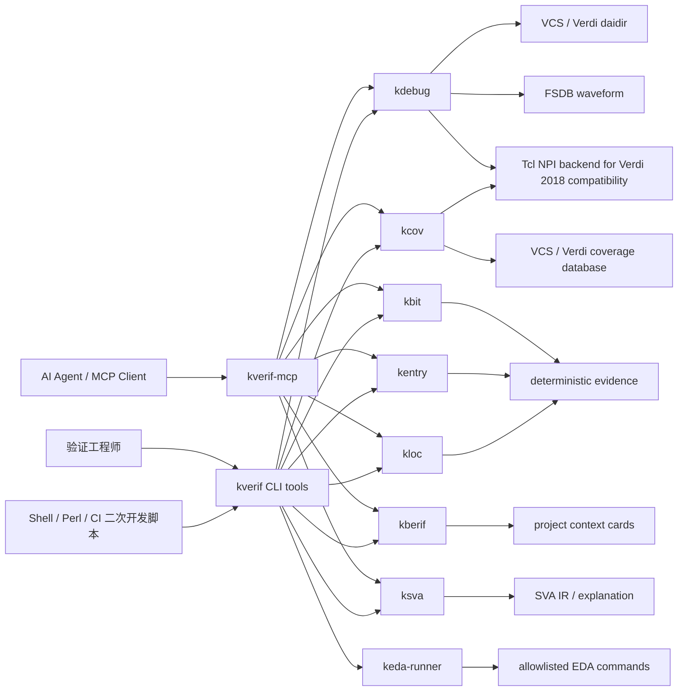
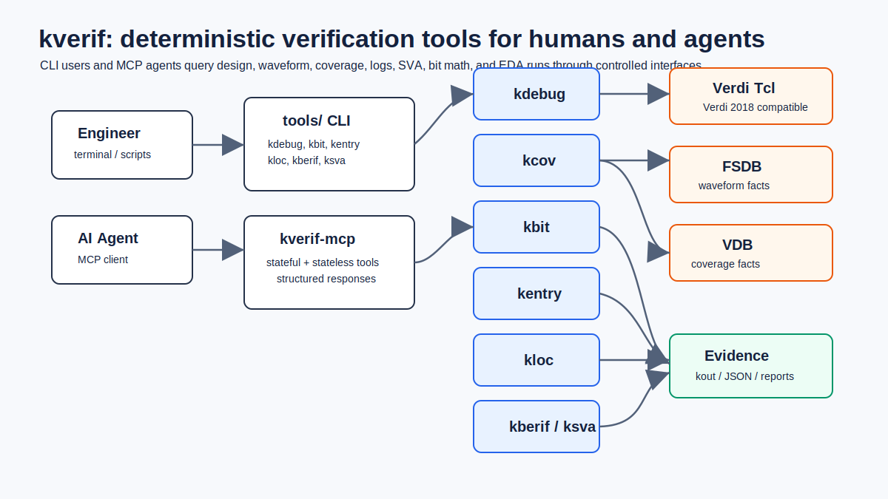
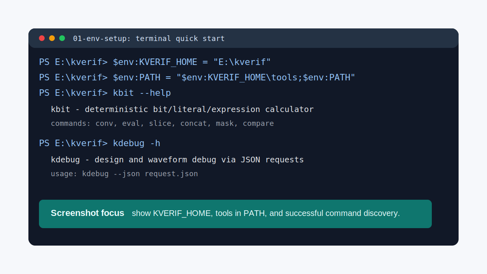
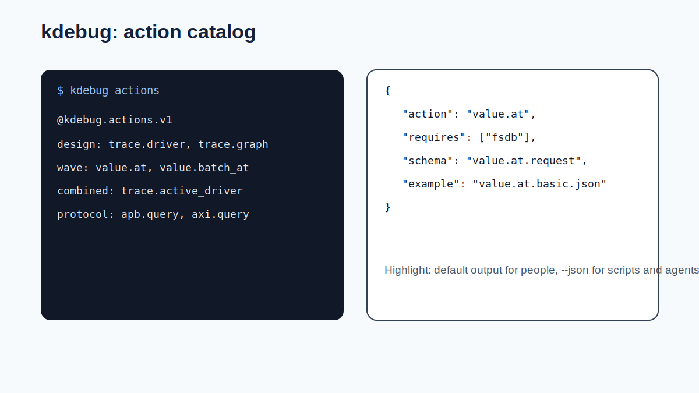
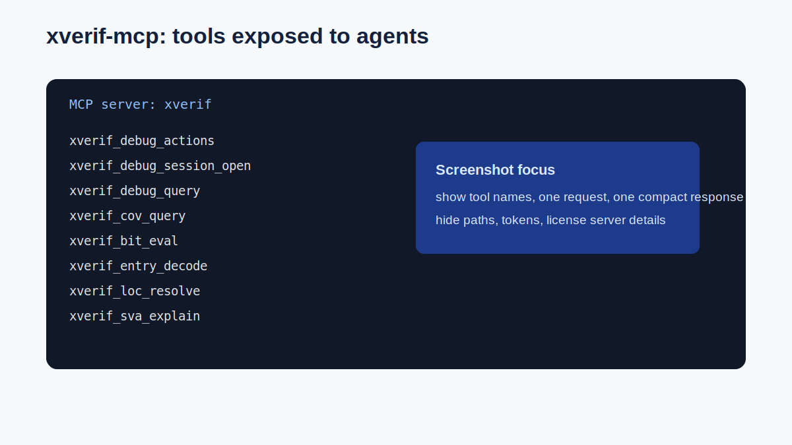
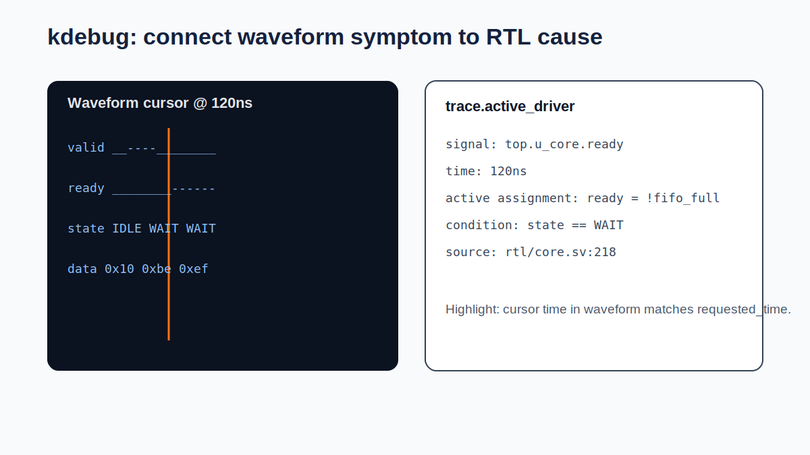
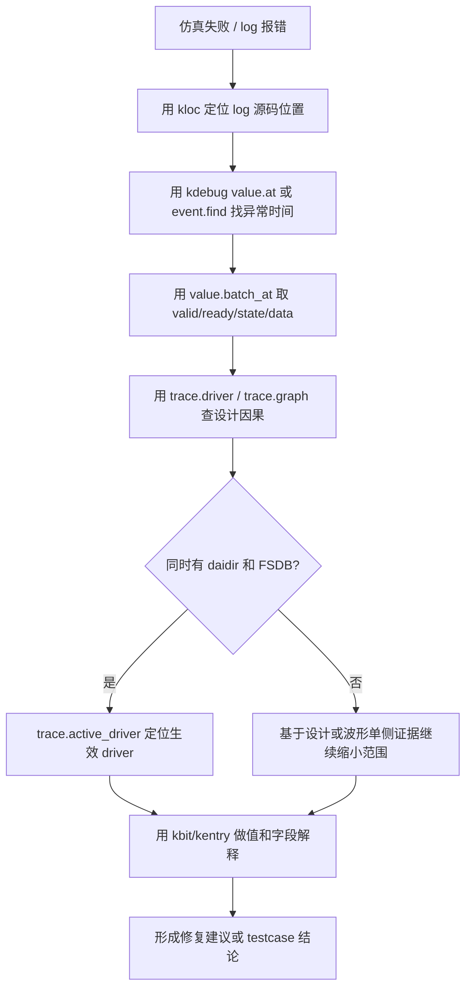
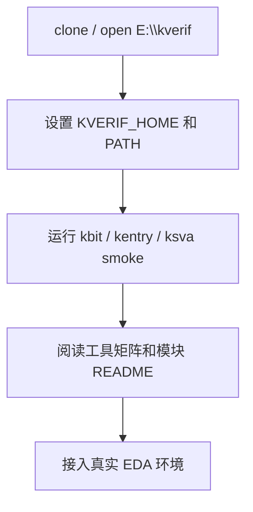
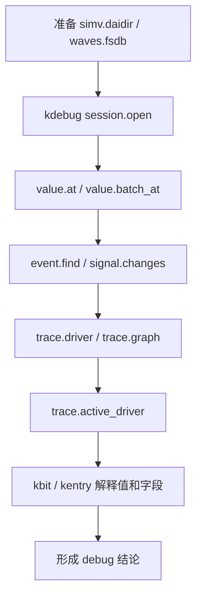
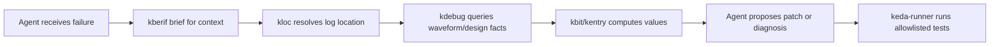

# kverif

`kverif` 是一个面向芯片验证、EDA 调试和 AI Agent 自动化验证的本地工具仓库。它把设计数据库查询、波形取证、bit 计算、entry 解析、UVM 日志定位、SVA 解释、coverage 查询和受控 EDA 命令执行整理成一组稳定 CLI，并通过统一 MCP server 暴露给 AI Agent。

简单说，`kverif` 的目标是让验证 debug 从“人肉翻 Verdi、猜信号、复制日志、靠经验判断”变成“用确定性工具取证，再让人或 Agent 基于证据推理”。

## 目录

- [一图看懂](#一图看懂)
- [适用场景](#适用场景)
- [仓库结构](#仓库结构)
- [工具矩阵](#工具矩阵)
- [快速开始](#快速开始)
- [配图与截图建议](#配图与截图建议)
- [核心概念](#核心概念)
- [kdebug: 设计和波形调试](#kdebug-设计和波形调试)
- [kbit: bit 和表达式计算](#kbit-bit-和表达式计算)
- [kentry: entry 字段解析](#kentry-entry-字段解析)
- [kloc: UVM 日志位置压缩](#kloc-uvm-日志位置压缩)
- [kberif: 项目上下文卡片](#kberif-项目上下文卡片)
- [ksva: SVA 结构化解释](#ksva-sva-结构化解释)
- [kcov: coverage 查询](#kcov-coverage-查询)
- [CLI 二次开发接口](#cli-二次开发接口)
- [二次开发使用指导手册](doc/secondary_development_guide.md)
- [kverif-mcp: AI Agent 统一入口](#kverif-mcp-ai-agent-统一入口)
- [keda-runner: 受控 EDA 命令执行](#keda-runner-受控-eda-命令执行)
- [典型使用流程](#典型使用流程)
- [测试与验证](#测试与验证)
- [常见问题](#常见问题)
- [文档入口](#文档入口)

## 一图看懂



如果当前 Markdown 查看器不渲染 Mermaid，可以直接查看下面的静态架构图：



`kdebug` 负责从 Verdi/VCS/FSDB 中拿事实，`kbit` 负责把值算对，`kentry` 负责按配置切 entry 字段，`kloc` 负责把冗长 UVM log 位置压缩成可恢复 ID，`kberif` 负责给 Agent 提供项目上下文，`ksva` 负责把 assertion 语义结构化，`kcov` 负责查询 coverage database，`keda-runner` 负责在白名单内执行 EDA 命令。

## 适用场景

`kverif` 适合以下场景：

- 验证失败后，需要快速查某个信号的 driver、load、依赖图和源码位置。
- 波形很大，需要用脚本查询某个时间点或时间窗口内的值、事件、握手、APB/AXI transaction。
- 需要让 AI Agent 在真实 EDA 环境里做 debug，但不希望它随意执行 shell 命令。
- UVM log 太长，希望把路径和行号压缩成短 ID，按需恢复上下文。
- 需要精确计算 Verilog/SystemVerilog literal、slice、concat、mask 和 expected value。
- entry、descriptor、packet header 由多拍 byte fragments 组成，需要确定性字段解析。
- 需要查询 VCS/Verdi coverage database，定位 uncovered scope/object/bin。
- 希望把项目背景整理成 summary cards，让 Agent 每次只读取必要上下文。

## 仓库结构

```text
kverif/
  tools/                 # 用户优先使用的统一命令入口和 wrapper
  kdebug/                # 设计数据库和波形数据库调试工具，直接 NPI 访问走 Tcl 后端
  kcov/                  # VCS/Verdi coverage database 查询，直接 NPI 访问走 Tcl 后端
  kbit/                  # bit/literal/slice/expression 计算器
  kentry/                # 多拍 entry / byte fragments 字段解析器
  kloc/                  # UVM log location 压缩和恢复
  kberif/                # 项目 context summary cards/detail 生成与查询
  ksva/                  # SystemVerilog Assertion lowering 和解释
  examples/secondary_development/ # Shell/Perl 直接调用 CLI 的二次开发示例
  kverif_mcp/            # 统一 MCP server
  keda_runner/           # allowlist EDA command runner
  mk/                    # 仓库共享 Makefile 片段和编译参数
  regression/            # 跨工具回归脚本
  skill/                 # Agent 使用说明和工具 reference
  doc/                   # 通用文档、静态配图和格式说明
  benchmark_results/     # 已纳入版本管理的 benchmark 结果快照
```

用户通常不需要直接进入每个工具的内部目录。推荐先把 `tools/` 加入 `PATH`，之后直接使用 `kdebug`、`kbit`、`kentry`、`kloc`、`kberif`、`ksva`、`kcov` 和 `keda-runner`。

当前工作区里还可能出现一些本地实验或缓存目录，例如 `benchmarks/`、`benchmark_artifacts/`、`reports/`、`tmp/` 和 `.pytest_cache/`。这些目录用于实验脚本、压测中间产物、报告草稿、临时文件或测试缓存，通常不作为工具源码的一部分提交，提交前需要按任务要求单独挑选结果产物。

`benchmark_results/` 中已提交报告的工具组、命令、目录和文件名均按当前 `kverif/kdebug` 品牌展示。报告内嵌截图保留采集时的原始像素，属于更名前同一测试版本的历史证据；截图文字不代表当前命令名，实际调用统一使用 `kdebug` 等 `k*` 命令。

| 目录 | 含义 | 用户是否常用 |
| --- | --- | --- |
| `tools/` | 所有工具的稳定命令入口，负责设置必要环境并调用对应模块 | 是，推荐加入 `PATH` |
| `kdebug/` | 设计/波形调试主工具；public CLI 是 C++ 前端，Verdi/FSDB/NPI 查询统一委托给 `tcl_engine/kdebug_npi.tcl` | 是 |
| `kcov/` | coverage 查询工具；Python 负责协议、过滤、导出，真实 VDB/NPI 查询统一委托给 `tcl_engine/kcov_npi.tcl` | 是 |
| `kbit/` | Verilog/SystemVerilog literal、slice、mask、表达式计算 | 是 |
| `kentry/` | entry/descriptor/packet header 的字段切分和 provenance 解释 | 是 |
| `kloc/` | UVM log 路径压缩、短 ID 解析和源码上下文恢复 | 是 |
| `kberif/` | 项目背景卡片生成、brief/query、Agent 上下文管理 | 按需 |
| `ksva/` | SVA property/assertion 列表、lowering、解释和 timeline IR | 按需 |
| `examples/secondary_development/` | Bash/Perl 直接调用工具命令和参数的二次开发示例及 CLI 合约测试 | 二次开发者常用 |
| `kverif_mcp/` | MCP server，把各工具暴露给 AI Agent 或支持 MCP 的客户端 | Agent 场景常用 |
| `keda_runner/` | allowlist 方式执行 EDA 命令，限制 Agent 只能跑可审计动作 | Agent/自动化场景常用 |
| `mk/` | 多个工具共享的 Makefile 片段、编译 flag 和公共规则 | 开发者常用 |
| `regression/` | 仓库级或跨工具回归脚本 | 开发者常用 |
| `skill/` | 面向 Codex/Agent 的工具 skill 与引用文档 | Agent 场景常用 |
| `doc/` | 通用文档、静态 SVG 截图、语法说明和说明性资料 | 是 |
| `benchmark_results/` | 已整理并提交的 benchmark 结果快照 | 查看结果时使用 |
| `benchmarks/` | 本地 benchmark、repair loop、XiangShan/UVM 实验脚本或运行目录 | 实验任务按需 |
| `benchmark_artifacts/` | 本地 benchmark 中间产物、截图、归档包或临时复制结果 | 通常不直接使用 |
| `reports/` | 本地评测报告、Word/Markdown 草稿或导出文件 | 查看/整理报告时使用 |
| `tmp/` | 临时文件、调试 scratch、一次性生成物 | 通常不提交 |
| `.pytest_cache/` | pytest 自动生成的本地测试缓存 | 不需要手动使用 |

## 工具矩阵

| 工具 | 解决的问题 | 主要输入 | 主要输出 | 是否依赖 EDA |
| --- | --- | --- | --- | --- |
| [`kdebug`](kdebug/README.md) | 设计和波形事实查询 | `simv.daidir`、FSDB、参数式查询命令 | driver/load/value/event/trace evidence | 真实查询需要 Verdi/VCS/FSDB |
| [`kbit`](kbit/README.md) | bit、literal、slice、表达式计算 | literal、变量、表达式 | 规范化值、比较结果、解释 | 否 |
| [`kentry`](kentry/README.md) | 多拍 entry 字段解析 | YAML/JSON config、fragments | field slices、provenance | 否 |
| [`kloc`](kloc/README.md) | UVM log 位置压缩/恢复 | log、sidecar JSONL map | `L_XXXXXXXX` 映射、源码上下文 | 否 |
| [`kberif`](kberif/README.md) | 项目上下文卡片 | 项目文档、模板、Agent 输出 | summary cards、detail markdown | 生成时可调用 Agent |
| [`ksva`](ksva/README.md) | SVA 语义结构化 | `.sva/.sv` | Surface IR、Timeline IR、解释 | 否 |
| [`kcov`](kcov/README.md) | coverage database 查询 | `simv.vdb` / `merged.vdb` | coverage summary、holes、evidence | 真实查询需要 Verdi/VCS license |
| [CLI 二次开发](examples/secondary_development/README.md) | 验证脚本二次开发 | 命令参数、JSON、FSDB/daidir/VDB | 原始工具 response 和项目报告 | mock 不需要；真实查询取决于后端 |
| [`kverif-mcp`](kverif_mcp/README.md) | AI Agent 统一工具入口 | MCP requests | tool responses | 取决于后端工具 |
| [`keda-runner`](keda_runner/README.md) | 受控执行 EDA 命令 | allowlist config、action/target | stdout/stderr、exit code、日志 | 取决于命令 |

## 快速开始

### 1. 准备环境

Windows PowerShell：

```powershell
cd E:\kverif
$env:KVERIF_HOME = "E:\kverif"
$env:PATH = "$env:KVERIF_HOME\tools;$env:PATH"
```

Linux / VM / Bash：

```bash
cd /path/to/kverif
export KVERIF_HOME="$PWD"
export PATH="$KVERIF_HOME/tools:$PATH"
```

在已验证的 VM 上，普通用户为 `host`，仓库路径通常是：

```bash
su - host
cd /home/host/kverif
export KVERIF_HOME=/home/host/kverif
export PATH=/home/host/kverif/tools:$PATH
export PYTHON=/home/host/kverif/.venv38/bin/python
```

如果不想依赖 `PATH`，也可以直接使用绝对路径调用：

```bash
/home/host/kverif/tools/kdebug -h
/home/host/kverif/tools/kdebug actions --json
/home/host/kverif/tools/kbit conv "8'shff" --json
/home/host/kverif/tools/kentry explain --config /home/host/kverif/kentry/examples/entry.yaml
/home/host/kverif/tools/kcov cov-holes --vdb fake --fake --metrics line,toggle --max-items 5 --json
```

Tcsh：

```tcsh
cd /path/to/kverif
setenv KVERIF_HOME "$cwd"
setenv PATH "$KVERIF_HOME/tools:$PATH"
```

### 2. 检查命令入口

```bash
kdebug -h
kbit --help
kentry --help
kloc --help
kberif --help
ksva --help
kcov --help
keda-runner --help
```

### 3. 跑几个不依赖 EDA 的 smoke examples

```bash
kbit conv "8'shff" --json
kbit eval "data[15:8] == 8'hbe" --var data=32'hdead_beef
kentry explain --config kentry/examples/entry.yaml
kentry decode --config kentry/examples/entry.yaml --input kentry/examples/fragments.jsonl --json
ksva list --file ksva/tests/golden_ir/simple_impl/input.sva
kcov cov-holes --vdb fake --fake --metrics line,toggle --max-items 3
```

在 VM 普通用户 `host` 下使用绝对路径时，可以直接运行：

```bash
export PYTHON=/home/host/kverif/.venv38/bin/python

/home/host/kverif/tools/kbit conv "8'shff" --json
/home/host/kverif/tools/kbit slice "32'hdead_beef" 15 8
/home/host/kverif/tools/kbit eval "data[15:8] == 8'hbe" --var "data=32'hdead_beef"

/home/host/kverif/tools/kentry explain --config /home/host/kverif/kentry/examples/entry.yaml
/home/host/kverif/tools/kentry decode --config /home/host/kverif/kentry/examples/entry.yaml --input /home/host/kverif/kentry/examples/fragments.jsonl --json

/home/host/kverif/tools/ksva list --file /home/host/kverif/ksva/tests/golden_ir/simple_impl/input.sva
/home/host/kverif/tools/kcov cov-holes --vdb fake --fake --metrics toggle,branch --max-items 2 --json
```

### 4. 查询 kdebug action catalog

Bash：

```bash
kdebug actions
kdebug actions --json
```

PowerShell：

```powershell
kdebug actions --json
```

### 5. 真实 EDA 场景准备

真实 `kdebug` / `kcov` 查询需要 Verdi/VCS 数据库和 license。通常需要在 VM 或 EDA 服务器中设置：

```bash
export VERDI_HOME=/path/to/verdi
export VCS_HOME=/path/to/vcs
export LD_LIBRARY_PATH="$VERDI_HOME/share/NPI/lib/LINUX64:$LD_LIBRARY_PATH"
```

Verdi 2018 VM 上的常用设置示例：

```bash
export VCS_HOME=/home/synopsys/vcs/O-2018.09-SP2
export VERDI_HOME=/home/synopsys/verdi/Verdi_O-2018.09-SP2
export VCS_TARGET_ARCH=linux64
export PATH="$VCS_HOME/bin:$VERDI_HOME/bin:/home/host/kverif/tools:$PATH"
export LM_LICENSE_FILE=27000@IC_EDA
export SNPSLMD_LICENSE_FILE=27000@IC_EDA
```

当前仓库的直接 Verdi/NPI 访问统一走 Tcl 后端，目标是兼容 Verdi 2018 这类较老版本。`kdebug` 使用 `kdebug/tcl_engine/kdebug_npi.tcl`，`kcov` 使用 `kcov/tcl_engine/kcov_npi.tcl`；public CLI、JSON 协议、MCP 协议和测试框架保持稳定。新代码不要新增非 Tcl 的直接 NPI 访问入口，也不要恢复旧私有 engine。

## 配图与截图建议

本 README 已内置 Mermaid 架构图和流程图，GitHub 会自动渲染。为了兼容不能渲染 Mermaid 的 Markdown 查看器，`doc/images/` 下也提供了一组静态 SVG 示意图，可直接显示。如果后续拍摄真实终端、Verdi 或 MCP 客户端截图，可以用同名 PNG 替换或补充。

| 建议文件 | 截图内容 | 建议命令或界面 |
| --- | --- | --- |
| `doc/images/00-kverif-architecture.svg` | kverif 总体架构图 | README 顶部静态图 |
| `doc/images/01-env-setup.svg` | 终端中完成 PATH 设置、`kbit --help`、`kdebug -h` | PowerShell 或 VM terminal |
| `doc/images/06-kdebug-actions.svg` | `kdebug actions` 输出 action catalog 的片段 | `actions` shortcut |
| `doc/images/08-kdebug-value-batch.svg` | 查询 FSDB 某信号值的输出 | `value.at` 或 `value.batch_at` |
| `doc/images/11-mcp-tools.svg` | AI 客户端中列出的 `kverif_*` MCP tools | MCP client 工具列表 |
| `doc/images/04-kloc-resolve-context.svg` | UVM log 中 `L_XXXXXXXX` 和 resolve 结果 | `kloc resolve` |
| `doc/images/10-kcov-holes.svg` | coverage holes 查询结果 | `kcov` 或 MCP coverage query |

当前 README 中已经直接引用静态 SVG，例如：







截图风格建议：

- 终端截图只截取关键命令和关键输出，不要截取 API key、license server 详情或个人路径。
- 真实项目信号路径可以打码，但保留 `top.u_xxx.signal` 这类层次结构，方便读者理解。
- Verdi/nWave 截图建议同时显示 signal list、时间 cursor 和异常时间点。
- MCP 截图建议展示工具名、入参和响应摘要，而不是完整大 JSON。

### 工具使用截图指引

下面给出每个工具推荐截图的“怎么截”。截图不是功能必需品，但放到 README 或项目汇报里会让新用户更快理解工具链。建议所有截图统一放在 `doc/images/` 下。

#### 1. 环境初始化截图

建议文件：

```text
doc/images/01-env-setup.svg
```

截图命令：

```powershell
cd E:\kverif
$env:KVERIF_HOME = "E:\kverif"
$env:PATH = "$env:KVERIF_HOME\tools;$env:PATH"
kbit --help
kdebug -h
```

截图范围：

- PowerShell 或 VM terminal 的命令输入区。
- `kbit --help` 或 `kdebug -h` 的前 20 到 40 行输出。
- 不需要截整个屏幕，只截终端窗口。

需要突出：

- `KVERIF_HOME` 指向仓库根目录。
- `tools/` 已加入 `PATH`。
- 用户可以直接运行 `kbit`、`kdebug` 等命令。

需要隐藏：

- 个人用户名、机器名、私有路径可以按需打码。
- 不要展示 API key、license server 地址或内部项目路径。

插入 README 示例：

```markdown

```

#### 2. kbit 使用截图

建议文件：

```text
doc/images/02-kbit-conv-eval.svg
```

截图命令：

```bash
kbit conv "8'shff"
kbit conv "8'shff" --json
kbit eval "data[15:8] == 8'hbe" --var data=32'hdead_beef
```

截图范围：

- 三条命令和对应输出。
- 如果 JSON 输出太长，只截到 `value`、`width`、`signed`、`ok` 等关键字段。

需要突出：

- `kbit` 可以同时给人类文本输出和 JSON 输出。
- 位宽、符号和 slice 结果由工具确定，不靠人工心算。

推荐配文：

```markdown


`kbit` 用于处理 literal、slice、符号扩展和表达式比较，适合在 debug 中解释波形值。
```

#### 3. kentry 使用截图

建议文件：

```text
doc/images/03-kentry-explain-decode.svg
```

截图命令：

```bash
kentry explain --config kentry/examples/entry.yaml
kentry decode --config kentry/examples/entry.yaml --input kentry/examples/fragments.jsonl --json
```

截图范围：

- 第一部分展示 `explain` 输出中的字段布局。
- 第二部分展示 `decode` 输出中的 field raw value 和 provenance。

需要突出：

- 配置文件定义 entry layout。
- fragments 被拼接后按字段切出。
- provenance 能说明字段来自哪一拍、哪些 bit。

推荐截图布局：

- 左半边放 `entry.yaml` 的字段配置。
- 右半边放 `kentry decode` 输出。
- 如果不方便拼图，直接截 terminal 输出也可以。

#### 4. kloc 使用截图

建议文件：

```text
doc/images/04-kloc-resolve-context.svg
```

截图命令：

```bash
kloc stats out/sim.log
kloc resolve L_00000001 --map out/sim.log.kloc.jsonl
kloc context L_00000001 --map out/sim.log.kloc.jsonl --before 5 --after 5
```

截图范围：

- 一段包含 `L_00000001` 的压缩 log。
- `kloc resolve` 的文件、行号输出。
- `kloc context` 的源码上下文。

需要突出：

- log 中保留短 ID，减少噪声。
- 需要源码时可以反查。
- Agent 不必每次读取长路径和整段源码。

需要隐藏：

- 内部项目绝对路径可以打码，但保留文件名和行号格式。

#### 5. ksva 使用截图

建议文件：

```text
doc/images/05-ksva-list-explain.svg
```

截图命令：

```bash
ksva list --file ksva/tests/golden_ir/simple_impl/input.sva
ksva explain --file ksva/tests/golden_ir/path_expand/input.sva --property p_path
ksva parse --file ksva/tests/golden_ir/ranged_delay/input.sva --property p_ranged --emit timeline-ir
```

截图范围：

- `ksva list` 中列出的 property/assertion。
- `ksva explain` 中对 implication、delay、sequence 的解释。
- `timeline-ir` 可以只截关键片段。

需要突出：

- SVA 原文被转换成结构化解释。
- temporal 语义由工具解析，减少人工误读。

#### 6. kdebug action catalog 截图

建议文件：

```text
doc/images/06-kdebug-actions.svg
```

截图命令：

Bash：

```bash
kdebug actions
kdebug actions --json
```

PowerShell：

```powershell
kdebug actions
kdebug actions --json
```

截图范围：

- 默认 `kout` 输出中的 action 分类。
- JSON 输出中某一个 action 的 schema/example 片段。

需要突出：

- `actions` 是工具能力目录。
- 人看默认输出，脚本和 Agent 用 `--json`。

#### 7. kdebug session-open 截图

建议文件：

```text
doc/images/07-kdebug-session-open.svg
```

截图命令：

```bash
kdebug session-open --name case_a --daidir simv.daidir --fsdb waves.fsdb --json
```

截图范围：

- 命令中的 `--daidir`、`--fsdb`、`--name`。
- 响应中的 `ok`、`session_id`、transport 或 endpoint 摘要。

需要突出：

- 真实 debug 推荐先打开 session。
- 后续 query 使用 `--session case_a` 复用资源。

需要隐藏：

- 真实项目路径、用户目录、license 信息。

#### 8. kdebug value.at / value.batch_at 截图

建议文件：

```text
doc/images/08-kdebug-value-batch.svg
```

截图命令：

```bash
kdebug value-batch \
  --session case_a \
  --signal top.u_core.valid \
  --signal top.u_core.ready \
  --signal top.u_core.bits \
  --time 100ns \
  --format hex
kdebug value-batch \
  --session case_a \
  --signals top.u_core.valid,top.u_core.ready,top.u_core.bits \
  --time 100ns \
  --format hex \
  --json
```

截图范围：

- 命令中的 `--time` 和 `--signal/--signals`。
- 响应中的每个 signal value。
- 如果有 missing signal，截 `missing_by_reason` 或每行 `status/reason`。

需要突出：

- 同一时间点批量取值适合 handshake debug。
- 缺失信号不会让整体信息不可读，工具会解释缺失原因。

#### 9. kdebug trace.driver / active_driver 截图

建议文件：

```text
doc/images/09-kdebug-active-driver.svg
```

截图命令：

```bash
kdebug active-driver \
  --daidir simv.daidir \
  --fsdb waves.fsdb \
  --signal top.u_core.ready \
  --time 120ns \
  --include-control
kdebug active-driver \
  --daidir simv.daidir \
  --fsdb waves.fsdb \
  --signal top.u_core.ready \
  --time 120ns \
  --include-control \
  --json
```

截图范围：

- 左侧展示异常时间点附近的波形，至少包括 `valid`、`ready`、`state`、`data`。
- 右侧展示 `trace.active_driver` 输出的 active assignment、source file、line 和 condition。

需要突出：

- 波形现象和 RTL 因果被连接起来。
- `requested_time` 是截图中的 cursor 时间。

推荐配文：

```markdown


`trace.active_driver` 将波形异常点和当前生效的 RTL driver 关联起来，适合定位 ready/valid、状态机和选择器问题。
```

#### 10. kcov coverage holes 截图

建议文件：

```text
doc/images/10-kcov-holes.svg
```

截图内容：

- coverage session open 成功。
- scope summary 或 holes 查询结果。
- holes 中的 file/line evidence。

示例命令：

```bash
kcov cov-summary --vdb /path/to/simv.vdb --metrics line,toggle,branch
kcov cov-holes --vdb /path/to/simv.vdb --metrics line,toggle,branch --max-items 20
kcov cov-holes --vdb fake --fake --metrics toggle,branch --max-items 3 --json
```

或者通过 MCP 调用：

```text
kverif_cov_session_open
kverif_cov_query
kverif_cov_session_close
```

需要突出：

- 覆盖率查询不只是百分比，而是能定位到 scope、object、bin 和源码行。
- 大结果应导出为文件，不建议截图完整 JSON。

#### 11. kverif-mcp 工具列表截图

建议文件：

```text
doc/images/11-mcp-tools.svg
```

截图内容：

- MCP client 中 `kverif_*` 工具列表。
- 至少包含 debug、coverage、bit、entry、loc、context、sva 中几类工具。
- 一个工具调用示例，例如 `kverif_debug_actions` 或 `kverif_bit_eval`。

需要突出：

- Agent 通过 MCP 调用工具，不需要直接拼 shell。
- stateful 工具和 stateless 工具都在统一入口下。

需要隐藏：

- MCP 配置里的个人路径、token、API key。
- EDA license server 地址。

#### 12. keda-runner dry-run / run 截图

建议文件：

```text
doc/images/12-keda-runner.svg
```

截图命令：

```bash
keda-runner init
keda-runner list-actions
keda-runner describe-action --action sim
keda-runner run --action sim --target compile --option TEST=smoke_test --dry-run
```

截图范围：

- `list-actions` 展示可执行 action。
- `describe-action` 展示 action/target/options。
- `dry-run` 展示将要执行的命令，但不真正运行。

需要突出：

- Agent 只能走 allowlist action。
- `dry-run` 可以审计真实执行前的命令。

### 推荐截图顺序

如果只想放 4 张图，推荐：

1. `01-env-setup.svg`: 用户如何开始。
2. `06-kdebug-actions.svg`: 工具体系能力目录。
3. `08-kdebug-value-batch.svg`: 真实波形查询。
4. `11-mcp-tools.svg`: AI Agent 接入方式。

如果要做完整项目介绍，推荐按下面顺序放图：

```text
01-env-setup.svg
02-kbit-conv-eval.svg
03-kentry-explain-decode.svg
04-kloc-resolve-context.svg
05-ksva-list-explain.svg
06-kdebug-actions.svg
07-kdebug-session-open.svg
08-kdebug-value-batch.svg
09-kdebug-active-driver.svg
10-kcov-holes.svg
11-mcp-tools.svg
12-keda-runner.svg
```

## 核心概念

### 默认输出: kout

多数用户命令默认输出 `kout` 结构化文本，例如：

```text
@kdebug.value.at.v1

target:
  signal: top.clk
  time: 10ns

summary:
  value: 1
  known: true
```

`kout` 比完整 JSON 更适合人和 Agent 快速阅读。需要脚本解析、schema 校验或回归比较时，显式加 `--json`。

```bash
kbit conv "8'shff" --json
kdebug actions --json
kcov cov-holes --vdb fake --fake --metrics toggle,branch --max-items 3 --json
```

### 人用参数，协议用 JSON

所有 k 系列工具都提供面向人的参数式命令。普通用户日常优先使用这种形式：

```bash
kdebug value-at --fsdb /home/host/testdata/clkfreq.fsdb --signal tb_clkfreq.clk --time 0ns --format bin
kdebug trace-driver --daidir /path/to/simv.daidir --signal top.u_core.ready --include-source
kdebug active-driver --daidir /path/to/simv.daidir --fsdb /path/to/waves.fsdb --signal top.u_core.ready --time 120ns --include-control

kcov cov-holes --vdb /path/to/simv.vdb --metrics line,toggle,branch --max-items 20
kbit slice "32'hdead_beef" 15 8
kentry decode --config entry.yaml --input fragments.jsonl --json
kloc context L_00000001 --map sim.log.kloc.jsonl --before 5 --after 5
kberif brief --mode debug
ksva explain --file assertions.sv --property p_ready
keda-runner run --action sim --target compile --option TEST=smoke_test --dry-run
kverif-loop-client debug-query --session case_a --action value.at --arg signal=top.clk --arg time=10ns
```

### `actions --json` 中的 `--json` 是什么意思

在下面这类参数式命令中：

```bash
kdebug actions --json
kcov actions --json
```

`actions` 决定“执行什么操作”，即列出工具支持的 action；`--json` 只决定“结果用什么格式输出”。它不会改变 `actions` 的功能，不会把 FSDB、VDB 或 daidir 转成 JSON，也不表示用户必须提供一个 JSON 请求文件。

不加 `--json` 时，工具返回适合人直接阅读的 kout 文本：

```bash
kdebug actions
```

```text
@kdebug.actions.v1
summary:
  matched_count: 60

data:
  session.open
  value.at
  trace.driver
```

加上 `--json` 后，查询内容相同，但返回完整、可由脚本解析的 JSON：

```bash
kdebug actions --json
```

```json
{
  "ok": true,
  "action": "actions",
  "summary": {
    "matched_count": 60
  },
  "data": {
    "items": [
      {"name": "session.open"},
      {"name": "value.at"},
      {"name": "trace.driver"}
    ]
  }
}
```

同样的输出格式规则适用于 `kdebug`、`kcov` 的参数式子命令，以及 `kentry`、`kbit`、`kloc`、`ksva` 中支持 `--json` 的命令：默认输出给人看，增加 `--json` 后输出给脚本、MCP、Agent 或回归测试解析。

需要特别区分：`kverif-loop-client --json '<object>'` 的 `--json` 是直接发送一条 JSON-RPC 请求；`kberif` 的 `--json` 是全局输出选项，需要放在子命令前，例如 `kberif --json status`。各工具的具体差异见后面的“JSON 参数含义汇总”表。

JSON request 是 `kdebug`、`kcov` 和 MCP/stdio-loop 的稳定控制协议，不是 Verdi、FSDB 或 VDB 生成的原始数据文件。保留 JSON 的原因是脚本、Agent、批处理和 schema 测试需要一个可校验、可扩展、可回放的请求格式；人类命令行会把 `--fsdb/--signal/--time` 这类参数翻译成同一个请求，再进入现有 dispatcher 和 Tcl NPI 后端。

相对只靠命令行参数，JSON 协议的优势在于：

- 复杂查询更容易表达：`target`、`args`、`limits`、`output` 可以稳定承载数组、嵌套过滤条件、导出选项和后续扩展字段，不需要把所有结构都压成一长串 shell 参数。
- 更适合 Agent/MCP 调用：AI 工具调用天然是结构化参数，JSON 能直接表达 action、输入资源、查询条件和输出格式，避免 Agent 拼接脆弱的 shell 字符串。
- 可以做 schema 校验：脚本和回归测试能检查字段缺失、类型错误、版本不兼容等问题，失败时返回统一的 `error.code` 和 `error.message`。
- 便于归档和回放：一次失败查询可以保存成 `request.json`，后续在 VM、CI 或用户本机原样重跑，适合 benchmark、bug report 和 regression。
- 减少 shell quoting 风险：信号名、表达式、数组、glob/filter 和特殊字符在 bash/tcsh/PowerShell 中转义规则不同；JSON 文件或 stdin 更稳定。
- 跨语言接口稳定：C++ 前端、Python wrapper、Tcl backend、MCP server 和外部脚本都能读写 JSON，适合作为内部协议层。

因此本项目推荐的分层是：人类日常使用参数式 CLI；参数 CLI 生成同一份 JSON request；dispatcher 再调用 Tcl NPI、FSDB 或 VDB 后端。直接手写 JSON 主要留给自动化、Agent、批量回归和复杂查询。

也就是说：

- 看波形的真实输入是 FSDB。
- 查静态设计因果的真实输入是 `simv.daidir` / elab 库。
- 查 coverage 的真实输入是 VDB。
- JSON 只是“要执行什么动作、查哪个对象、限制返回多少”的工具协议。

### JSON 参数含义汇总

下面是各工具 JSON/JSON-RPC/`--json` 相关字段的速查表。`kdebug` 和 `kcov` 的 action 级字段以 `schema --action ...` 输出为准；这里列的是跨 action 最常用的公共字段。

| 工具 / 入口 | JSON 使用方式 | 关键字段 | 含义 | 示例 |
| --- | --- | --- | --- | --- |
| `kdebug` | 可从 stdin 或文件读取 JSON request；`--json` 输出完整 JSON response | `api_version`、`request_id`、`action` | 协议版本、请求 ID、要执行的动作名 | `{"api_version":"kdebug.v1","action":"value.at"}` |
| `kdebug` | request `target` | `target.fsdb`、`target.daidir`、`target.session_id` | 波形 FSDB、VCS/Verdi 设计库、已打开 session | `{"target":{"fsdb":"waves.fsdb"}}` |
| `kdebug` | request `args` | `signal`、`signals`、`time`、`requested_time`、`format`、`name` | 查询信号、批量信号、波形时间、active-driver 时间、输出进制、session 名称 | `{"args":{"signal":"top.clk","time":"10ns","format":"bin"}}` |
| `kdebug` | request `limits` / `output` | `max_rows`、`max_results`、`max_depth`、`timeout_ms`、`format`、`verbosity`、`pretty` | 限制返回规模、深度和超时；控制输出 JSON/kout、紧凑度和格式化 | `{"limits":{"max_rows":20},"output":{"format":"json"}}` |
| `kcov` | 可从 stdin 或文件读取 JSON request；`--json` 输出完整 JSON response | `api_version`、`request_id`、`action` | coverage 协议版本、请求 ID、动作名 | `{"api_version":"kcov.v1","action":"cov.holes"}` |
| `kcov` | request `target` | `target.vdb`、`target.session_id` | VCS/Verdi coverage database 或已打开 coverage session | `{"target":{"vdb":"simv.vdb"}}` |
| `kcov` | request `args` | `name`、`fake`、`metrics`、`scope`、`test`、`query`、`file`、`line`、`window` | session 名、fake 数据、coverage 类型、层次范围、test 名、搜索过滤、源码定位窗口 | `{"args":{"metrics":["line","toggle"],"scope":"top.u_dut"}}` |
| `kcov` | request `limits` / `output` | `max_items`、`overflow`、`response_format`、`mode`、`path`、`artifact_format` | 限制 hole/item 数量，控制溢出策略、JSON/kout、文件导出和导出格式 | `{"limits":{"max_items":20},"output":{"response_format":"json"}}` |
| `kentry` | 兼容 JSON request；也可用参数 CLI | `api_version`、`request_id`、`action`、`config`、`config_path`、`fragments`、`input_path`、`output.pretty` | 指定 decode/explain/validate；config 可内联或走文件；fragments 可内联或走 JSONL | `{"api_version":"kentry.v1","action":"decode","config_path":"entry.yaml","input_path":"fragments.jsonl"}` |
| `kbit` | 不需要 JSON request；`--json` 输出结果 JSON | `schema`、`op`、`input`、`result.width`、`result.signed`、`result.known`、`result.hex`、`result.bin`、`result.sv`、`warnings` | 表示执行的 bit 操作、输入、标准化结果和告警 | `kbit conv "8'shff" --json` |
| `kloc` | 不需要 JSON request；`resolve/context/stats --json` 输出结果 JSON；map 是 JSONL | map: `loc_id`、`file`、`line`、`msg_id`；response: `action`、`loc_id`、`context`、`summary` | map 记录 log 位置映射；response 返回还原位置、源码上下文或统计摘要 | `kloc resolve L_00000001 --map sim.log.kloc.jsonl --json` |
| `kberif` | 查询命令可用全局 `--json`；`agent serve --stdio` 使用 JSON RPC | `status`、`topics`、`mode`、`topic`、`detail`、`cards`、`manifest` | 返回项目 context 状态、topic 列表、brief/get/detail 结果；写入协议见 `kberif/README.md` | `kberif --json status` |
| `ksva` | `explain --json` 或 `parse --emit ...` 输出 JSON | `tool`、`command`、`result.schema_version`、`result.property`、`result.kind`、`diagnostics` | 返回 assertion/property 的 timeline IR 或解释诊断 | `ksva explain --file assertions.sv --property p_ready --json` |
| `keda-runner` | 当前不使用 JSON request | `.keda-runner.yaml`、`action`、`target`、`option`、`exit_code` | allowlist 配置来自 YAML；命令行选择 action/target/option；执行结果看 stdout/log | `keda-runner run --action sim --target compile --option TEST=smoke --dry-run` |
| `kverif-loop-client` | `--json` 发送单条 JSON-RPC；参数式子命令会生成同样请求 | `id`、`method`、`params` | 请求 ID、方法名、方法参数 | `{"id":"1","method":"server.ping","params":{}}` |
| `kverif-loop-client` | JSON-RPC `params` | `name`、`fsdb`、`daidir`、`vdb`、`session`、`action`、`args`、`limits`、`output`、`output_format` | 打开 debug/cov session，或向 session 转发 kdebug/kcov action | `{"method":"debug.query","params":{"session":"s0","action":"value.at","args":{"signal":"top.clk","time":"10ns"}}}` |
| `kverif-mcp` | MCP 客户端通过 tool args 传结构化参数，不建议手写底层 JSON-RPC | `session`、`action`、`args`、`limits`、`output`、`output_format`、`kverif_output_path` | MCP 层维护 session 和输出落盘，再转发到 kdebug/kcov 或 stateless CLI | `kverif_debug_query(session="s0", action="value.at", args={"signal":"top.clk"})` |

### 参数式 CLI 传参汇总

这些参数是给人手动调用时用的。它们最终会被转换成上面的结构化请求或结构化响应。

| 工具 | 参数 / 子命令 | 含义 | 示例 |
| --- | --- | --- | --- |
| `kdebug` | `actions`、`schema --action <name> --kind request/response` | 查看 action 目录和 schema | `kdebug schema --action value.at --kind request --json` |
| `kdebug` | `--fsdb <waves.fsdb>` | 指定真实 FSDB 波形输入 | `kdebug value-at --fsdb waves.fsdb --signal top.clk --time 10ns` |
| `kdebug` | `--daidir <simv.daidir>` | 指定 VCS/Verdi elaboration database，driver 查询需要 `-kdb` 生成的 daidir | `kdebug trace-driver --daidir simv.daidir --signal top.valid` |
| `kdebug` | `--session <id>` | 复用已经打开的 debug session，避免反复加载 FSDB/daidir | `kdebug value-batch --session case_a --signals top.valid,top.ready --time 100ns` |
| `kdebug` | `--signal`、`--signals`、`--time`、`--requested-time`、`--format` | 指定信号、批量信号、波形时间、active-driver 时间和返回进制 | `kdebug active-driver --daidir simv.daidir --fsdb waves.fsdb --signal top.ready --time 120ns --format hex` |
| `kdebug` | `--include-source`、`--include-control`、`--max-rows`、`--max-depth` | 控制证据细节和返回规模 | `kdebug trace-driver --daidir simv.daidir --signal top.ready --include-source --max-depth 8` |
| `kdebug` | `action <action> --arg key=value --target key=value --limit key=value` | 通用参数入口，给暂时没有专用子命令的 action 使用 | `kdebug action signal.changes --fsdb waves.fsdb --arg signal=top.clk --arg begin=0ns --arg end=1us --limit max_rows=20` |
| `kcov` | `open/status/close --session <id>` | 打开、检查或关闭 coverage session | `kcov open --vdb simv.vdb --name cov0` |
| `kcov` | `--vdb <simv.vdb>`、`--fake` | 指定真实 coverage database；`--fake` 用内置数据做 smoke test | `kcov cov-holes --vdb fake --fake --metrics line,toggle --max-items 3` |
| `kcov` | `--metrics`、`--scope`、`--test` | 选择 coverage 类型、层次范围和 test | `kcov cov-summary --vdb simv.vdb --metrics line,toggle,branch --scope top.u_dut` |
| `kcov` | `--include`、`--exclude`、`--match-field`、`--case-insensitive` | 搜索和过滤 coverage object/hole | `kcov cov-holes --session cov0 --include "*fifo*" --match-field full_name --max-items 20` |
| `kcov` | `--max-items`、`--overflow`、`--output-path`、`--artifact-format` | 控制返回数量、溢出策略和导出文件格式 | `kcov export-holes --session cov0 --metrics branch --output-path holes.md --artifact-format md` |
| `kcov` | `query <action> --arg key=value --target key=value` | 通用 coverage action 入口 | `kcov query cov.object.search --vdb fake --fake --arg query.match_field=full_name --max-items 1 --json` |
| `kentry` | `decode/explain/validate --config <entry.yaml> --input <fragments.jsonl>` | 使用字段布局 config 和多拍 fragments 解析 entry | `kentry decode --config entry.yaml --input fragments.jsonl --json` |
| `kbit` | `conv/eval/slice/index/concat/repeat/...` | bit literal、表达式、slice、concat 等确定性计算 | `kbit slice "32'hdead_beef" 15 8 --json` |
| `kbit` | `--var name=value`、`--width`、`--signed/--unsigned`、`--state 2/4` | 给表达式传变量，控制宽度、有符号解释和 2/4-state | `kbit eval "data[15:8] == 8'hbe" --var data=32'hdead_beef --json` |
| `kloc` | `resolve/context/stats/annotate` | 还原 loc_id、查看源码上下文、统计热点、给日志加注释 | `kloc context L_00000001 --map sim.log.kloc.jsonl --before 5 --after 5` |
| `kloc` | `--map`、`--before`、`--after`、`--top` | 指定 JSONL map、上下文行数和统计 top 数 | `kloc stats sim.log --map sim.log.kloc.jsonl --top 20 --json` |
| `kberif` | `config init --kind`、`init --model` | 初始化环境模板，或调用 Agent 生成 cards/details | `kberif config init --kind bt` |
| `kberif` | `brief --mode`、`get <topic>`、`detail <topic>`、全局 `--json` | 查询短 context、topic card 或 detail markdown | `kberif --json brief --mode debug` |
| `ksva` | `list/scan/explain/parse --file <file>` | 列出、扫描、解释或解析 SVA property/assertion | `ksva explain --file assertions.sv --property p_ready --json` |
| `ksva` | `--property`、`--emit surface-ir/sequence-ir/timeline-ir`、`--markdown`、`--strict` | 选择 property、IR 层级、Markdown 输出或严格模式 | `ksva parse --file assertions.sv --property p_ready --emit timeline-ir` |
| `keda-runner` | `--config`、`init`、`list-actions`、`describe-action` | 选择 allowlist 配置并审计可执行 action | `keda-runner describe-action --action sim` |
| `keda-runner` | `run --action`、`--target`、`--option K=V`、`--dry-run`、`--quiet` | 运行受控 EDA 命令；`--dry-run` 只预览不执行 | `keda-runner run --action sim --target compile --option TEST=smoke --dry-run` |
| `kverif-loop-client` | `--socket`、`--timeout-sec`、`--pretty` | 指定 UDS socket、请求超时和 JSON pretty print | `kverif-loop-client --socket /tmp/kverif-loop.sock --pretty ping` |
| `kverif-loop-client` | `debug-open/debug-query/debug-close` | 管理 kdebug loop session 并转发 action | `kverif-loop-client debug-query --session s0 --action value.at --arg signal=top.clk --arg time=10ns --output-format json` |
| `kverif-loop-client` | `cov-open/cov-query/cov-close` | 管理 kcov loop session 并转发 coverage action | `kverif-loop-client cov-query --session cov0 --action cov.holes --arg metrics='["line","toggle"]' --limit max_items=5` |

### 各工具命令参数详细速查

下面列出公开 CLI 的具体子命令和参数。参数式命令中的 `key=value` 支持字符串、整数、浮点数、`true`、`false`、`null`；值以 `[` 或 `{` 开头时，会尝试按 JSON 数组或对象解析。

#### kdebug

| 子命令 | 作用 | 主要参数 |
| --- | --- | --- |
| `actions` | 列出所有 action | 可选 `--json` |
| `schema` | 查看 action 的 request/response schema | 必需 `--action`；可选 `--kind request/response`、`--json` |
| `session-open` | 打开可复用 debug session | `--name`、可选 `--daidir`、`--fsdb`、`--transport`、`--host`、`--port` |
| `session-list` | 列出 session | 可选 `--json` |
| `session-close` | 关闭 session | 必需 `--session` |
| `session-doctor` | 诊断 session 和后端状态 | 必需 `--session` |
| `session-kill` | 强制终止 session | 必需 `--session` |
| `session-gc` | 清理失效 session | 可通过 `--arg key=value` 传附加条件 |
| `scope-list` | 查询 FSDB 层次 | `--fsdb` 或 `--session`；可选 `--path/--scope`、`--max-rows` |
| `value-at` | 查询单个信号值 | `--fsdb` 或 `--session`、`--signal`、`--time`；可选 `--format` |
| `value-batch` | 查询多个信号同一时刻的值 | 重复 `--signal` 或使用 `--signals a,b,c`，另需 `--time` |
| `trace-driver` | 查询静态 RTL driver | `--daidir` 或 `--session`、`--signal`；可选 `--include-source` |
| `trace-graph` | 查询设计依赖图 | `--signal`；可选 `--max-depth`、`--include-source` |
| `source-context` | 按源码文件和行号查询上下文 | `--arg file=<path> --arg line=<N>`；可选 `--session`、`--max-rows` |
| `active-driver` | 查询某时刻生效 driver | `--daidir`、`--fsdb`、`--signal`、`--time`；可选 `--include-control` |
| `active-driver-chain` | 连续追踪生效 driver | active-driver 参数，另可传 `--max-depth` |
| `action <name>` | 任意 action 的通用参数入口 | `--arg`、`--target`、`--limit`、`--output` 可重复 |
| `log doctor/tail/bundle` | 诊断、查看或打包 session 日志 | `--session`；tail 可传 `--lines`，bundle 必需 `--out` 并可加 `--redact` |

`kdebug` 通用参数：

| 参数 | 含义 |
| --- | --- |
| `--fsdb <path>` | 指定 FSDB 波形文件 |
| `--daidir <path>` | 指定 VCS/Verdi elaboration database；设计查询通常要求 VCS `-kdb` |
| `--session/--session-id <id>` | 复用已打开 session |
| `--signal <name>` | 单个信号；在 `value-batch` 中可重复 |
| `--signals a,b,c` | 逗号分隔的批量信号 |
| `--time/--at <time>` | 查询时间，如 `10ns` |
| `--requested-time <time>` | active-driver 显式请求时间 |
| `--format/--radix <name>` | 值格式，例如 `bin`、`hex` |
| `--include-source` | 返回源码证据 |
| `--include-trace` | 返回追踪过程 |
| `--include-control` | 返回控制条件 |
| `--include-raw` | 返回原始后端字段 |
| `--max-rows <N>` | 限制最大行数 |
| `--max-results/--max-items <N>` | 限制最大结果项数 |
| `--max-depth <N>` | 限制追踪深度 |
| `--timeout-ms <N>` | 请求超时 |
| `--verbosity <level>` | 输出详细度 |
| `--json` | 输出完整 JSON response |
| `--text/--kout` | 输出 kout 文本 |
| `--arg key=value` | 写入 request `args` |
| `--target key=value` | 写入 request `target` |
| `--limit key=value` | 写入 request `limits` |
| `--output key=value` | 写入 request `output` |

#### kcov

| 子命令 | 作用 | 专用参数 |
| --- | --- | --- |
| `actions` | 列出 coverage action | 可选 `--json` |
| `schema` | 查看 action schema | 必需 `--action`；可选 `--kind request/response` |
| `open` | 打开 coverage session | 必需 `--vdb`；可选 `--name`、`--fake`、`--reuse/--no-reuse`、`--reopen` |
| `status/close` | 查看或关闭 session | 必需 `--session` |
| `tests` | 列出 coverage tests | `--session` 或 `--vdb` |
| `metrics` | 列出 metric | 可选 `--scope`、`--test` |
| `scope-summary` | 层次 coverage 摘要 | `--scope`、`--metrics` |
| `scope-children` | 查询子层次 | `--scope`、可选 `--recursive` |
| `scope-search` | 搜索层次 | include/exclude/match 参数 |
| `cov-summary` | coverage 汇总 | `--metrics`、可选 `--group-by` |
| `cov-holes` | 查询 coverage holes | `--metrics`、过滤参数和限制参数 |
| `object-get` | 获取单个 coverage object | 必需 `--object/--name`；可选 `--include-children`、`--max-children` |
| `object-search` | 搜索 coverage object | 过滤参数 |
| `functional-summary` | functional coverage 汇总 | `--levels`、可选 `--group-by` |
| `functional-holes` | functional holes | `--levels`、过滤和限制参数 |
| `source-map` | 查询源码位置 coverage | 必需 `--file`、`--line`；可选 `--window` |
| `export-summary/export-holes` | 导出 summary 或 holes | 输出路径和格式参数 |
| `export-scope-tree` | 导出层次树 | `--recursive/--no-recursive` 和输出参数 |
| `export-functional` | 导出 functional coverage | `--levels`、`--mode summary/holes` 和输出参数 |
| `query <action>` | 任意 action 通用入口 | `--arg`、`--target` |

`kcov` 通用参数：

| 参数 | 含义 |
| --- | --- |
| `--vdb <path>` | 指定真实 VDB；fake smoke 可传 `--vdb fake --fake` |
| `--session <id>` | 复用 coverage session |
| `--scope <path>` | 限定设计层次 |
| `--test <name>` | 限定 coverage test |
| `--metrics a,b,c` | 选择 `line`、`toggle`、`branch`、`condition`、`functional` 等 |
| `--include <glob>` | 包含匹配，可重复 |
| `--exclude <glob>` | 排除匹配，可重复 |
| `--match-field <field>` | 匹配 `full_name`、`name`、`file` 等字段 |
| `--case-insensitive` | 忽略大小写 |
| `--max-items <N>` | 最大返回项数 |
| `--overflow <mode>` | `truncate`、`error`、`to_file`、`summary_only` |
| `--output-mode <mode>` | `inline`、`file`、`both`、`summary_only` |
| `--output-path <path>` | 导出文件路径 |
| `--artifact-format <fmt>` | `json`、`ndjson`、`csv`、`md` |
| `--allow-absolute-path` | 允许绝对导出路径 |
| `--sort-by/--sort-order` | 排序字段及 `asc/desc` |
| `--json` | 输出 JSON response |
| `--arg/--target key=value` | 通用 action 参数 |

#### kbit

| 子命令 | 参数 | 含义 |
| --- | --- | --- |
| `conv <value>` | 可选 `--width`、`--signed/--unsigned` | 解析和规范化 SV literal |
| `eval <expr>` | 重复 `--var name=value`，可选宽度和符号参数 | 计算常量表达式 |
| `slice <value> <msb> <lsb>` | 三个位置参数 | 位切片 |
| `index <value> <bit>` | value 和 bit | 单 bit 提取 |
| `concat <v1> <v2> ...` | 多个 value | 拼接多个值 |
| `repeat <count> <value>` | 次数和值 | 重复拼接 |
| `trunc/zext/sext <value>` | 必需 `--to <width>` | 截断、零扩展、符号扩展 |
| `reverse <value>` | value | 反转 bit 顺序 |
| `mask` | 必需 `--width`，可选 `--lsb` | 生成连续 mask |
| `align <value>` | 必需 `--to` | 对齐到指定宽度 |
| `popcount/onehot/onehot0` | value | 置位计数或 one-hot 检查 |
| `gray2bin/bin2gray` | value | Gray/Binary 转换 |
| `check` | 必需 `--expr`；可选重复 `--var`、`--values` | 对一组变量检查表达式 |
| `agent serve` | 必需 `--stdio` | 启动 stdio agent |

公共参数 `--state 2/4` 选择 2-state 或 4-state；`--json` 输出 `kbit.result.v1`；`--pretty` 格式化 JSON。

#### kentry

| 子命令 | 参数 | 含义 |
| --- | --- | --- |
| `decode` | 必需 `--config`、`--input` | 拼接 fragments 并切分字段 |
| `explain` | 必需 `--config` | 解释字段布局 |
| `validate` | 必需 `--config`；可选 `--input` | 校验配置和输入 |

公共参数 `--json` 输出 JSON，`--pretty` 格式化 JSON。

#### kloc

| 子命令 | 参数 | 含义 |
| --- | --- | --- |
| `resolve <loc_id>` | `--map`、可选 `--json` | 将 `L_XXXXXXXX` 还原为文件和行号 |
| `context <loc_id>` | `--map`、`--before`、`--after`、可选 `--json` | 查看源码上下文 |
| `stats <log>` | 可选 `--map`、`--top`、`--json` | 统计 loc_id 出现次数 |
| `annotate <log>` | 可选 `--map` | 给日志插入位置提示 |

#### ksva

| 子命令 | 参数 | 含义 |
| --- | --- | --- |
| `list` | 必需 `--file` | 列出 property/assertion |
| `scan` | 必需 `--file` | 统计 SVA 语法构造 |
| `lint` | 必需 `--file`；可选 `--property` | 检查全部或指定 property |
| `explain` | 必需 `--file`、`--property`；可选 `--json`、`--markdown`、`--strict` | 生成人类解释或结构化解释 |
| `parse` | 必需 `--file`、`--property`、`--emit` | 输出 IR JSON |

`parse --emit` 支持 `surface-ir`、`sequence-ir`、`timeline-ir`。`--strict` 表示遇到无法精确 lowering 的高级语法时直接报错。

#### kberif

`kberif` 的全局 `--json` 必须放在子命令前，例如 `kberif --json status`。

| 子命令 | 参数 | 含义 |
| --- | --- | --- |
| `config init` | 必需 `--kind`；可选 `--force`、`--merge`、`--dry-run`、`--output` | 初始化项目模板 |
| `init` | 必需 `--model` | 调用 Agent 生成 cards/details |
| `validate` | 可选 `--all` | 校验状态和所有产物 |
| `status` | 无 | 查询当前状态 |
| `repair-catalog` | 无 | 修复 card catalog |
| `list-topics` | 无 | 列出 topic |
| `get <topic>` | 可选 `--detail` | 查询 topic card，按需返回 detail |
| `detail [topic]` | 可选 `--stdin` | 查询 detail，或从 stdin 写入 detail |
| `brief` | 必需 `--mode` | 按 view 生成短 context |
| `card upsert` | `--stdin` | 从 stdin 写入 card |
| `card append-key-items` | `card_id`、`--stdin` | 追加 key items |
| `agent serve` | `--stdio`、可选 `--write` | 启动 JSON stdio agent；`--write` 开启写权限 |

`kberif` 需要 Python 3.11+ 以及 `typer`、`rich`、`pydantic` 等依赖。

#### keda-runner

全局 `--config` 应放在子命令前，例如 `keda-runner --config /path/to/.keda-runner.yaml list-actions`。

| 子命令 | 参数 | 含义 |
| --- | --- | --- |
| `init` | 可选 `--refresh` | 初始化或刷新环境快照 |
| `env-info` | 无 | 查看环境快照状态 |
| `list-actions` | 无 | 列出 allowlist action |
| `describe-action` | 必需 `--action` | 查看 action 定义 |
| `run` | 必需 `--action`；可选 `--target`、重复 `--option K=V` | 运行受控动作 |
| `run` | `--dry-run` | 只校验并打印最终 argv，不执行 |
| `run` | `--quiet` | 隐藏 runner header |

#### kverif-loop-server / kverif-loop-client

Server 参数：

| 参数 | 含义 |
| --- | --- |
| `--socket <path>` | Unix domain socket 路径 |
| `--backend direct/lsf` | 选择本机或 LSF 后端 |

Client 全局参数必须放在子命令前：

| 参数 | 含义 |
| --- | --- |
| `--socket <path>` | server socket |
| `--timeout-sec <N>` | socket 请求超时秒数；`0` 或负数表示无限等待；未指定时 `cov.*` 默认无限等待，其他方法默认 30 秒 |
| `--pretty` | 格式化 JSON response |
| `--json '<object>'` | 直接发送一条 JSON-RPC 请求 |

| Client 子命令 | 参数 | 含义 |
| --- | --- | --- |
| `ping` | 无 | 检查 server 存活 |
| `debug-open` | 必需 `--name`；可选 `--fsdb`、`--daidir`、`--queue`、`--resource` | 打开 kdebug session |
| `debug-list` | 无 | 列出 kdebug session |
| `debug-close` | 必需 `--session` | 关闭 kdebug session |
| `debug-query` | 必需 `--session`、`--action`；可重复 `--arg`、`--limit`、`--output` | 转发 kdebug action |
| `cov-open` | 必需 `--name`、`--vdb`；可选 `--queue`、`--resource` | 打开 kcov session |
| `cov-list` | 无 | 列出 kcov session |
| `cov-close` | 必需 `--session` | 关闭 kcov session |
| `cov-query` | 必需 `--session`、`--action`；可重复 `--arg`、`--limit`、`--output` | 转发 kcov action |

`debug-query/cov-query --output-format` 支持 `kout`、`json`、`envelope`。

#### kverif-mcp / kverif-lsf-doctor

`kverif-mcp` 主要通过环境变量配置，不是普通查询 CLI。常用变量包括 `KVERIF_MCP_BACKEND=direct/lsf`、`KVERIF_MCP_ENABLE_DEBUG`、`KVERIF_MCP_ENABLE_COV`、`KVERIF_MCP_ENABLE_BIT`、`KVERIF_MCP_ENABLE_ENTRY`、`KVERIF_MCP_ENABLE_LOC`、`KVERIF_MCP_ENABLE_CONTEXT`、`KVERIF_MCP_ENABLE_SVA`、`KVERIF_MCP_TIMEOUT_SEC` 和 `KVERIF_MCP_LOG_DIR`。

```bash
kverif-mcp

PYTHON=/home/host/kverif/.venv38/bin/python \
KVERIF_MCP_FAKE_LSF=1 \
kverif-lsf-doctor --fake
```

随代码更新后的实际帮助始终是最终依据：

```bash
kdebug -h
kcov --help
kbit --help
kentry --help
kloc --help
ksva --help
kberif --help
keda-runner --help
kverif-loop-client --help
```

### JSON request envelope

`kdebug` 和 `kcov` 这类工具使用 JSON request：

```json
{
  "api_version": "kdebug.v1",
  "request_id": "optional-id",
  "action": "value.at",
  "target": {
    "session_id": "case_a"
  },
  "args": {
    "signal": "top.u.valid",
    "time": "100ns",
    "format": "hex"
  },
  "limits": {},
  "output": {
    "verbosity": "compact"
  }
}
```

脚本必须先检查响应中的 `ok` 字段。失败时读取 `error.code` 和 `error.message`，不要解析 stderr 或人类文本。

### Session

真实设计和波形查询通常先打开 session，再复用 session 查询：


同名 session 不会自动覆盖旧 session。如果已有 live session，会返回 `SESSION_ID_EXISTS`；如果已有 stale session，需要显式关闭或 GC。

## kdebug: 设计和波形调试

`kdebug` 是本项目最核心的调试工具，用来查询设计数据库和波形数据库中的事实。它覆盖原先分散的 ktrace/kwave 调试能力，并统一到 JSON API、kout 输出和 MCP wrapper。

### 能做什么

- 查询信号 driver、load、源码位置、候选信号和依赖图。
- 查询 FSDB 中某个时间点或时间窗口的 value、changes、events。
- 分析 valid-ready、APB、AXI 等常见握手和协议行为。
- 在同时有 `daidir` 和 `fsdb` 时，定位某个时间点真正生效的 RTL driver。
- 生成 nWave `signal.rc`，辅助打开一组关键信号。
- 通过 MCP 给 AI Agent 提供 stateful design/wave debug 能力。

### 输入资源

| target | 用途 |
| --- | --- |
| `daidir` | VCS/Verdi 设计数据库，例如 `simv.daidir` |
| `fsdb` | FSDB 波形数据库，例如 `waves.fsdb` |
| `session_id` | 已打开 session 的复用句柄 |

注意区分“被调试数据”和“工具请求”：

- `fsdb` / `daidir` 才是真正的 EDA 原始输入文件或目录。
- JSON request 不是 Verdi 产物，也不是新的设计数据库；它只是 kdebug 的控制协议，用来告诉工具要执行哪个 action、查哪个信号、查哪个时间点。
- JSON request 可以写成临时文件，例如 `value.json`，也可以直接从 stdin 输入。两种方式完全等价。

常见输入组合：

| action 类型 | 需要的真实输入 | 典型 action |
| --- | --- | --- |
| 只看波形 | 只需要 `fsdb` | `scope.list`、`value.at`、`value.batch_at`、`event.find` |
| 静态设计追踪 | 只需要 `daidir` / elab 库 | `trace.driver`、`trace.graph`、`source.context` |
| 某时刻生效 driver | 同时需要 `daidir` 和 `fsdb` | `trace.active_driver`、`trace.active_driver_chain` |
| 已打开会话复用 | 只需要 `session_id` | 多次连续查询同一 case |

因此，如果只是查询 FSDB 中某个信号在某个时间点的值，真实输入只需要 FSDB。下面 JSON 只是“查什么”的请求：

```bash
/home/host/kverif/tools/kdebug value-at \
  --fsdb /home/host/testdata/clkfreq.fsdb \
  --signal tb_clkfreq.clk \
  --time 0ns \
  --format bin \
  --json
```

如果要查静态 driver，使用 Verdi/VCS elab 库即可，不需要 FSDB：

```bash
/home/host/kverif/tools/kdebug trace-driver \
  --daidir /path/to/simv.daidir \
  --signal top.u_core.ready \
  --include-source
```

只有当你要回答“这个时间点哪个 driver 真正生效”时，才同时传入 elab 库和 FSDB：

```bash
/home/host/kverif/tools/kdebug active-driver \
  --daidir /path/to/simv.daidir \
  --fsdb /path/to/waves.fsdb \
  --signal top.u_core.ready \
  --time 120ns \
  --include-control
```

### 查询 action catalog

```bash
kdebug actions
kdebug actions --json
kdebug schema --action value.at --kind request --json
```

### 打开 session

```bash
kdebug session-open --name case_a --daidir simv.daidir --fsdb waves.fsdb
kdebug session-list
kdebug session-close --session case_a
```

### 查某个时间点的信号值

```bash
kdebug value-at --session case_a --signal top.u_core.valid --time 100ns --format hex
```

### 批量取值

```bash
kdebug value-batch \
  --session case_a \
  --signal top.u_core.valid \
  --signal top.u_core.ready \
  --signal top.u_core.bits \
  --time 100ns \
  --format hex
```

### 查 driver

```bash
kdebug trace-driver --daidir simv.daidir --signal top.u_core.ready --include-source
```

### 查当前时间点生效 driver

```bash
kdebug active-driver \
  --daidir simv.daidir \
  --fsdb waves.fsdb \
  --signal top.u_core.ready \
  --time 120ns \
  --include-control
```

### 通用参数入口

如果某个 action 还没有专门子命令，可以用 `kdebug action` 直接传动作名和 `key=value`：

```bash
kdebug action signal.changes \
  --fsdb waves.fsdb \
  --arg signal=top.u_core.valid \
  --arg begin=0ns \
  --arg end=1us \
  --limit max_rows=20
```

### 推荐 debug 顺序



## kbit: bit 和表达式计算

`kbit` 是确定性 bit/value/expression 计算器。它不读取 RTL，也不访问 Verdi，只负责把值算对。

### 典型用途

- Verilog/SystemVerilog literal 转换。
- signed/unsigned 解释。
- slice、index、concat、repeat、mask、popcount、onehot。
- 常量表达式求值。
- 对 `kdebug` 返回的波形值做二次计算。

### 示例

```bash
kbit conv "8'shff"
kbit conv "8'shff" --json
kbit eval "data[15:8] == 8'hbe" --var data=32'hdead_beef
kbit slice 32'hdead_beef 15 8
```

适合 Agent 的用法是：凡是涉及位宽、符号扩展、截断、slice、mask、hex/bin/decimal 转换，都交给 `kbit`，不要靠 LLM 心算。

## kentry: entry 字段解析

`kentry` 用配置文件描述 entry 的字段布局，再把多拍 byte fragments 拼接并切字段。它只输出 raw field slices 和 provenance，不做协议语义脑补。

### 典型用途

- descriptor、metadata、WQE、CQE、packet header、cache entry 解析。
- 多拍总线数据拼成一个 entry。
- 查看字段来自哪一拍、哪几个 bit。
- 给 Agent 提供确定性 field evidence。

### explain 配置

```bash
kentry explain --config kentry/examples/entry.yaml
kentry explain --config kentry/examples/entry.yaml --json
```

### decode fragments

```bash
kentry decode --config kentry/examples/entry.yaml --input kentry/examples/fragments.jsonl --json
```

## kloc: UVM 日志位置压缩

`kloc` 用来把 UVM log 中冗长路径压缩成 `L_XXXXXXXX` ID，并通过 sidecar JSONL 映射文件恢复源码位置。

### 解决的问题

UVM log 里常见路径非常长，例如：

```text
/project/work/very/long/path/env/agent/driver.sv:123
```

直接喂给 Agent 会浪费大量 token。`kloc` 可以把它压成：

```text
L_00000001
```

需要时再恢复：

```bash
kloc resolve L_00000001 --map out/sim.log.kloc.jsonl
kloc context L_00000001 --map out/sim.log.kloc.jsonl --before 5 --after 5
kloc stats out/sim.log
kloc annotate out/sim.log --map out/sim.log.kloc.jsonl
```

### 推荐截图

截图时建议同时展示两部分：左侧是压缩后的 log，右侧是 `kloc resolve` 还原出的文件、行号和上下文。

## kberif: 项目上下文卡片

`kberif` 用来把项目背景整理成可查询的 summary cards 和 detail markdown，给 Agent 提供“刚好够用”的上下文。

### 适合的问题

- 新 Agent 接手项目时，需要快速知道环境、接口、checker、scoreboard、reset/clock、debug 入口。
- 大项目上下文太长，需要按 topic 懒加载细节。
- 希望每次 debug 前读取短 brief，而不是整仓库扫描。

### 初始化

```bash
kberif config init --kind bt
```

常见 `kind`：

- `bt`: block level testbench
- `it`: integration test
- `st`: subsystem test
- `soc`: SoC level

### 生成和查询

```bash
kberif init --model <model-name>
kberif brief --mode debug
kberif query --topic project
```

真实生成 cards/details 时通常需要可用 Agent 命令和显式模型参数。不要把 API key 写入仓库文件、日志或报告。

## ksva: SVA 结构化解释

`ksva` 读取 SystemVerilog Assertion，并将 property/assertion lowering 成结构化 IR，再生成可解释输出。

### 典型用途

- 列出 `.sva/.sv` 里的 property、assert、assume、cover。
- 检查 `|->`、`|=>`、`##N`、`##[m:n]`、range suffix 等 temporal 语义。
- 解释 local variable capture 和 per-attempt binding。
- 为 assertion review 和 Agent debug 提供确定性语义。

### 示例

```bash
ksva list --file ksva/tests/golden_ir/simple_impl/input.sva
ksva parse --file ksva/tests/golden_ir/ranged_delay/input.sva --property p_ranged --emit timeline-ir
ksva explain --file ksva/tests/golden_ir/path_expand/input.sva --property p_path
```

## kcov: coverage 查询

`kcov` 面向 VCS/Verdi coverage database 查询，适合在 AI/MCP 场景下查 coverage summary、holes、scope tree 和 source evidence。

### 能查什么

- line/toggle/branch/condition/fsm/assert/functional coverage。
- scope summary、children ranking、scope search。
- coverage holes 和对应源码位置。
- 按 `file/line/window` 反查 coverage item。
- 导出 JSON、NDJSON、CSV、Markdown。

### fake smoke

```bash
kcov cov-holes --vdb fake --fake --metrics toggle,branch --max-items 3
kcov cov-holes --vdb fake --fake --metrics toggle,branch --max-items 3 --json
```

### 真实 VDB 查询

最简单的用法是直接把 VDB 路径传给查询命令。`kcov` 会在当前进程里临时打开 coverage session，查完后自动关闭：

```bash
kcov cov-summary --vdb /path/to/simv.vdb --metrics line,toggle,branch
kcov cov-holes --vdb /path/to/simv.vdb --scope top.u_dut --metrics line,toggle --max-items 20
kcov scope-children --vdb /path/to/simv.vdb --scope top --recursive --max-items 50
kcov source-map --vdb /path/to/simv.vdb --file rtl/ctrl.sv --line 88 --window 5
```

如果要连续多次查询同一个 VDB，可以显式打开 session，再复用 `--session`：

```bash
kcov open --vdb /path/to/simv.vdb --name cov0
kcov tests --session cov0
kcov metrics --session cov0 --scope top.u_dut
kcov cov-holes --session cov0 --metrics branch,condition --include "*ctrl*" --max-items 20
kcov close --session cov0
```

导出结果时指定输出格式和路径：

```bash
kcov export-holes \
  --vdb /path/to/simv.vdb \
  --metrics line,toggle,branch \
  --output-path holes.md \
  --artifact-format md \
  --output-mode file
```

通用入口可直接运行任意 `kcov.v1` action：

```bash
kcov query cov.object.search --vdb /path/to/simv.vdb --include "*fifo*" --match-field full_name
kcov schema --action cov.holes --kind request --json
kcov actions
```

### stdio loop

```bash
kcov --stdio-loop
```

### kcov 超时策略

`kcov` 的真实 VDB 扫描可能需要较长时间，尤其是 Verdi 2018、较大的层次树或
license server 繁忙时。为避免正常 coverage 查询被误判为失败，kcov 的 Tcl NPI
调用、MCP/loop session 打开与查询现在默认无限等待。`0` 或负数都表示不设置
超时；正数表示重新启用对应的秒数限制：

```bash
# 默认行为：三个变量不设置，或显式设为 0，均为无限等待
unset KVERIF_KCOV_TCL_TIMEOUT_SEC
export KVERIF_KCOV_STARTUP_TIMEOUT_SEC=0
export KVERIF_KCOV_REQUEST_TIMEOUT_SEC=0

# CI 中需要故障保护时，可以显式使用正数
export KVERIF_KCOV_TCL_TIMEOUT_SEC=600
export KVERIF_KCOV_STARTUP_TIMEOUT_SEC=600
export KVERIF_KCOV_REQUEST_TIMEOUT_SEC=900
```

`kverif-loop-client cov-open/cov-query` 未传 `--timeout-sec` 时也会自动无限等待；
`--timeout-sec 0` 可显式表达同样语义。kdebug 仍保留原有默认超时，
`session.close` 和 `bkill` 等清理步骤也仍使用有限超时，避免遗留孤儿进程。

真实 coverage 查询需要可访问 Synopsys license server。`kcov` 和 `kdebug` 是不同工具，但直接 NPI 访问策略一致：都只通过 Tcl backend 调 Verdi/NPI；Python/C++ 层只负责协议、调度、过滤、导出和展示。

## CLI 二次开发接口

kverif 不要求二次开发者安装或导入语言 SDK。Shell、Perl、Python、Go、CI 和
内部平台统一通过 `tools/` 下的命令、命令参数、JSON response 和退出码集成。
独立开发手册的第 9 章给出四个可复用复杂工作流，第 10 章逐工具列出公开参数、
功能、输入输出和每个子命令的绝对路径调用例子：
[`doc/secondary_development_guide.md`](doc/secondary_development_guide.md)。

| 能力 | 稳定调用面 | 二次开发用途 |
| --- | --- | --- |
| 常用查询 | 参数式子命令 | Shell、Makefile、回归脚本直接调用 |
| 复杂查询 | `--json request.json` 或 `--json -` | 可重放、可归档、字段无歧义 |
| 大数据库复用 | `session-open`、`--session`、`session-close` | 多次 FSDB/KDB/VDB 查询 |
| 长期进程 | `--stdio-loop` JSONL | 高频服务或内部 RPC adapter |
| 机器结果 | `--json` + 退出码 | 任意 JSON parser；示例附带进程式标准库校验器 |

调用脚本不应导入 kdebug、kcov、MCP 或 Tcl backend 的内部模块。真实 NPI 查询仍
由工具内部 Tcl backend 完成，调用方只消费稳定 CLI。

### Bash 示例

```bash
export KVERIF_HOME=/home/host/kverif
export KDEBUG_BIN=$KVERIF_HOME/tools/kdebug
export KCOV_BIN=$KVERIF_HOME/tools/kcov

# 1. FSDB 波形窗口与采样点
bash $KVERIF_HOME/examples/secondary_development/sh/waveform_window.sh \
  --fsdb /home/host/testdata/clkfreq.fsdb \
  --signal tb_clkfreq.clk \
  --begin 0ns --end 100ns \
  --time 25ns --time 75ns \
  --min-changes 1 --max-unknown 0 --require-complete \
  --out /home/host/testdata/cli_reports/wave

# 2. XiangShan KDB driver/graph
bash $KVERIF_HOME/examples/secondary_development/sh/module_connectivity.sh \
  --daidir /home/host/testdata/xiangshan_kdb/simv.daidir \
  --signal tb_top.sim.clock \
  --signal tb_top.sim.reset \
  --max-depth 6 --max-items 500 --require-edge --require-complete \
  --out /home/host/testdata/cli_reports/connectivity

# 3. 多轮 coverage 收敛和 CI gate
bash $KVERIF_HOME/examples/secondary_development/sh/coverage_convergence.sh \
  --run base=/regress/001/simv.vdb \
  --run next=/regress/002/simv.vdb \
  --metrics line,toggle,branch \
  --fail-under 95 --max-final-holes 100 \
  --max-regression 0.10 --require-growth \
  --out /home/host/testdata/cli_reports/coverage

# 4. FSDB/KDB/VDB 跨工具回归分诊
bash $KVERIF_HOME/examples/secondary_development/sh/regression_triage.sh \
  --fsdb /regress/fail_104/waves.fsdb \
  --daidir /regress/fail_104/simv.daidir \
  --vdb /regress/fail_104/simv.vdb \
  --signal tb_top.dut.valid --signal tb_top.dut.ready \
  --begin 900ns --end 1300ns --time 1040ns \
  --active-signal tb_top.dut.ready --active-time 1040ns \
  --min-changes 1 --fail-under 95 --max-final-holes 100 \
  --out /home/host/testdata/cli_reports/triage
```

### Perl 示例

```bash
export KDEBUG_BIN=/home/host/kverif/tools/kdebug

perl /home/host/kverif/examples/secondary_development/perl/waveform_window.pl \
  --fsdb /home/host/testdata/clkfreq.fsdb \
  --signal tb_clkfreq.clk \
  --begin 0ns --end 100ns \
  --time 25ns --time 75ns \
  --out /home/host/testdata/cli_reports/wave-perl
```

Perl 示例只使用系统核心模块，并依据工具退出码判断成功；Bash coverage 示例通过
一个独立的 Python 标准库进程汇总 JSON。两者都不导入任何 kverif 包，不使用
`grep` 猜字段，也不要求 VM 安装 `jq` 或 CPAN 模块。四个工作流都会保留原始
response，项目脚本可以在
其上增加自己的 checker 和报告。

KDB 信号必须使用 elaboration 后的完整实例层次名。例如顶层为 `tb_top`、实例名为
`sim` 时，端口应写成 `tb_top.sim.clock`，不能写 RTL module type
`SimTop.clock`。

### 示例合约测试

```bash
cd /home/host/kverif
make secondary-examples-test
```

该测试使用假 CLI 验证 Bash/Perl 参数传递、JSON 解析、session 清理和 coverage
gate，不需要 Verdi、VCS 或 license。详细接口、错误处理、并发约束和绝对路径命令见
[`doc/secondary_development_guide.md`](doc/secondary_development_guide.md)。

## kverif-mcp: AI Agent 统一入口

`kverif-mcp` 是统一 MCP server。它把各工具暴露为 MCP tools：

- `kdebug`、`kcov` 作为 stateful backend。
- `kbit`、`kentry`、`kloc`、`kberif`、`ksva` 作为 stateless CLI adapter。
- 所有工具可以被 AI Agent 以结构化入参调用。

### 直接启动

Windows PowerShell：

```powershell
cd E:\kverif
$env:KVERIF_HOME = "E:\kverif"
$env:PYTHONPATH = "E:\kverif\kverif_mcp\src;E:\kverif"
python -m kverif_mcp.server
```

Linux：

```bash
cd /path/to/kverif
export KVERIF_HOME="$PWD"
export PYTHONPATH="$PWD/kverif_mcp/src:$PWD"
python -m kverif_mcp.server
```

### MCP client 配置示例

Windows 风格：

```json
{
  "mcpServers": {
    "kverif": {
      "command": "python",
      "args": ["-m", "kverif_mcp.server"],
      "env": {
        "KVERIF_HOME": "E:\\kverif",
        "PYTHONPATH": "E:\\kverif\\kverif_mcp\\src;E:\\kverif",
        "KVERIF_MCP_BACKEND": "direct"
      }
    }
  }
}
```

Linux / VM 风格：

```json
{
  "mcpServers": {
    "kverif": {
      "command": "python3",
      "args": ["-m", "kverif_mcp.server"],
      "env": {
        "KVERIF_HOME": "/path/to/kverif",
        "PYTHONPATH": "/path/to/kverif/kverif_mcp/src:/path/to/kverif",
        "KVERIF_MCP_BACKEND": "direct",
        "VERDI_HOME": "/path/to/verdi"
      }
    }
  }
}
```

### LSF / 集群模式

如果 AI 客户端在登录机，但 Verdi/NPI/FSDB 查询必须跑到 LSF 计算节点，可以使用：

```bash
export KVERIF_MCP_BACKEND=lsf
export KVERIF_LSF_SESSION_QUEUE=interactive
```

链路是：

```text
AI MCP client -> kverif-mcp -> LSF launcher -> kdebug --stdio-loop on compute node
```

不同 session 可以并行；同一个 session 内请求串行执行。

## keda-runner: 受控 EDA 命令执行

`keda-runner` 是 allowlist EDA command runner。它不让 Agent 拼任意 shell command，而是通过配置好的 action、target 和 option 执行可审计命令。

### 快速使用

```bash
keda-runner init
keda-runner list-actions
keda-runner describe-action --action sim
keda-runner run --action sim --target compile --option TEST=smoke_test --dry-run
keda-runner run --action sim --target compile --option TEST=smoke_test --option SEED=123
```

### 长任务建议

长任务建议放到 `tmux` 或 `nohup` 中，避免终端断开导致任务中断：

```bash
tmux new -s kverif-run
keda-runner run --action sim --target regression --option TEST=smoke_test
```

## 典型使用流程

### 流程一: 新用户本地体验



命令：

```bash
kbit conv "8'shff" --json
kentry explain --config kentry/examples/entry.yaml
ksva list --file ksva/tests/golden_ir/simple_impl/input.sva
```

### 流程二: 真实波形 debug



推荐策略：

- 先用 compact 输出，证据不够再打开 `include_source`、`include_rows`、`include_trace`。
- 先缩小时间窗口，再查询大结果。
- 对位运算和字段解释使用 `kbit` / `kentry`。
- 对 log 位置使用 `kloc`。

### 流程三: AI Agent 自动 debug



这个流程的关键是：Agent 不直接猜测，也不随意执行命令，而是通过 MCP 工具拿结构化证据。

## 测试与验证

常规测试命令：

```bash
make -C kdebug
make -C kdebug schema-test
make -C kdebug contract-test
make -C kdebug unit-test

make -C kbit test
make -C kentry test
make -C kloc test
make -C kberif test
make -C ksva test
make -C kcov test
make secondary-examples-test

PYTHONPATH=kverif_mcp/src:. python -m pytest kverif_mcp/tests/ -q
python -m pytest keda_runner/tests/ -q
```

仓库级入口：

```bash
make test
make full-test
```

说明：

- `schema-test` 校验 JSON schema 和 examples。
- `contract-test` 校验 runtime action registry、spec、schema 和 examples 是否一致。
- 不依赖 EDA 的工具可以在普通 Python 环境中跑。
- 真实 `kdebug` / `kcov` 回归需要 Verdi/VCS/license/FSDB/daidir。
- VM 上压测时建议记录命令、环境变量、Verdi 版本、suite 路径、结果 CSV、summary 和截图。

## 常见问题

### `kdebug: command not found`

确认 `tools/` 已加入 `PATH`：

```bash
export KVERIF_HOME=/path/to/kverif
export PATH="$KVERIF_HOME/tools:$PATH"
```

PowerShell：

```powershell
$env:KVERIF_HOME = "E:\kverif"
$env:PATH = "$env:KVERIF_HOME\tools;$env:PATH"
```

### Python 找不到 `kverif_mcp`

设置 `PYTHONPATH`：

```bash
export PYTHONPATH="$KVERIF_HOME/kverif_mcp/src:$KVERIF_HOME"
```

PowerShell：

```powershell
$env:PYTHONPATH = "E:\kverif\kverif_mcp\src;E:\kverif"
```

### Verdi 2018 不支持某些旧式 NPI 函数

当前仓库的 NPI 访问路径应使用 Tcl 后端，避免依赖较新 Verdi 才支持的非 Tcl 直接调用。遇到类似问题时，不要补回旧式实现；应在 `kdebug/tcl_engine/kdebug_npi.tcl`、`kcov/tcl_engine/kcov_npi.tcl` 或请求转换层修复兼容性，并在 VM 上用 Verdi 2018 压测。

### 查询信号失败

常见原因：

- 信号层次名不完整或经过 elaboration 后被改名。
- FSDB 没有 dump 该信号。
- 查询的是 slice，但后端只接受 base signal。
- 使用了错误的 session 或过期 session。

建议步骤：

```bash
kdebug actions --json
```

然后使用 `signal.scan`、`trace.driver`、`value.batch_at` 等动作逐步缩小范围。

### coverage 查询失败

确认：

- `vdb` 路径存在。
- Verdi/VCS coverage 相关环境变量正确。
- license server 可访问。
- Python 环境与 Synopsys 工具兼容。

### MCP 工具列表为空

检查：

- `KVERIF_HOME` 是否指向仓库根目录。
- `PYTHONPATH` 是否包含 `kverif_mcp/src` 和仓库根目录。
- MCP client 配置是否使用正确 Python。
- 是否设置了 `KVERIF_MCP_ENABLE_*` 关闭了相关工具组。

## 文档入口

- [`kdebug/README.md`](kdebug/README.md): 设计和波形调试工具说明
- [`kdebug/docs/JSON_API.md`](kdebug/docs/JSON_API.md): kdebug JSON API
- [`kdebug/docs/AGENT_GUIDE.md`](kdebug/docs/AGENT_GUIDE.md): Agent debug 指南
- [`kbit/README.md`](kbit/README.md): bit 计算器
- [`kentry/README.md`](kentry/README.md): entry 解析器
- [`kloc/README.md`](kloc/README.md): UVM log location 工具
- [`kberif/README.md`](kberif/README.md): 项目上下文卡片
- [`ksva/README.md`](ksva/README.md): SVA lowering 和解释
- [`kcov/README.md`](kcov/README.md): coverage 查询
- [`examples/secondary_development/README.md`](examples/secondary_development/README.md): Bash/Perl 直接调用工具命令和参数的完整示例
- [`doc/secondary_development_guide.md`](doc/secondary_development_guide.md): CLI 参数、JSON、Shell/Perl、内部平台接入和新增 action 的完整二次开发手册
- [`kverif_mcp/README.md`](kverif_mcp/README.md): MCP server 配置和工具说明
- [`keda_runner/README.md`](keda_runner/README.md): EDA runner
- [`skill/SKILL.md`](skill/SKILL.md): 面向 Agent 的使用入口
- [`skill/references/`](skill/references/): 各工具的 Agent reference

## 维护建议

- 新增 `kdebug` action 时，同时更新 action spec、request schema、response schema、example request 和 example response。
- 给脚本消费的命令优先提供 `--json`，给人看的默认输出保持 `kout` 简洁。
- 大结果默认 compact，只有显式 `include_*` 或提高 `limits` 时才返回明细。
- 不要把 API key、license server 细节、个人 home 路径或客户项目信息写入 README、日志和报告。
- 涉及 Verdi/NPI 兼容性时，优先在 VM 的实际 Verdi 版本上压测，而不是只跑 mock。
