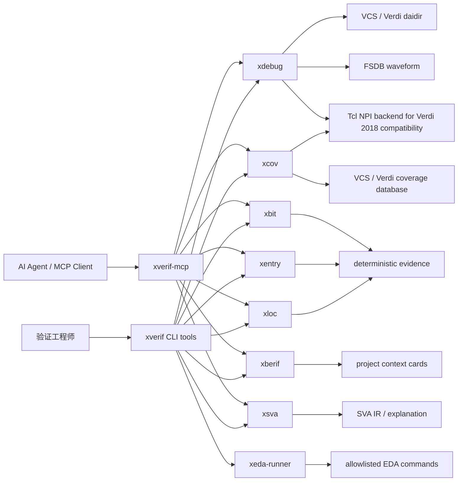
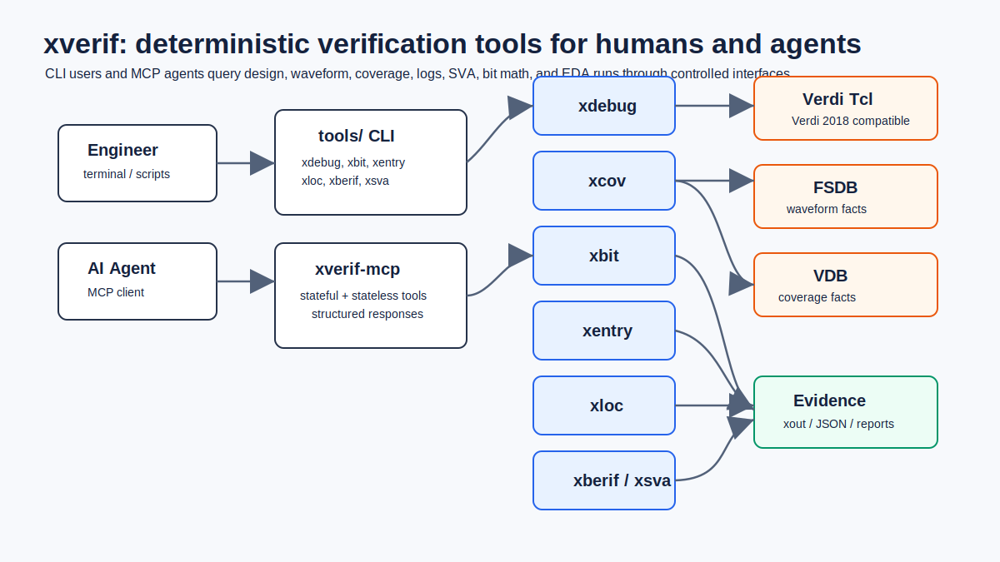
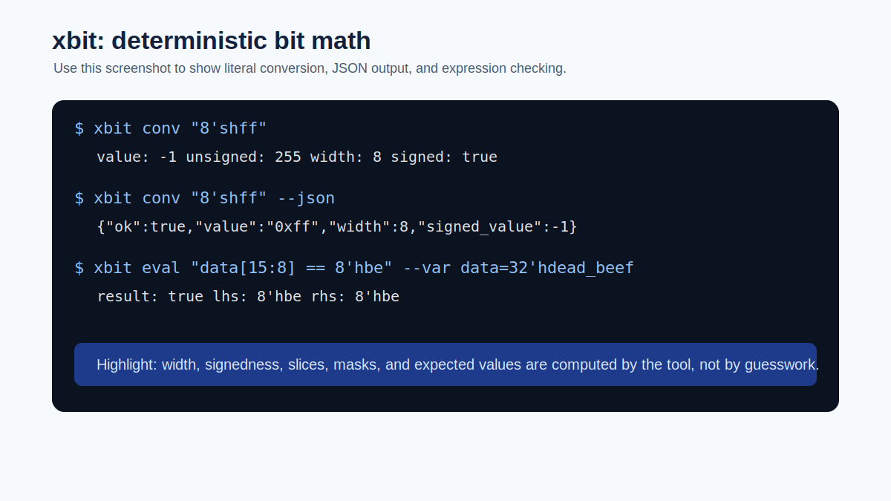
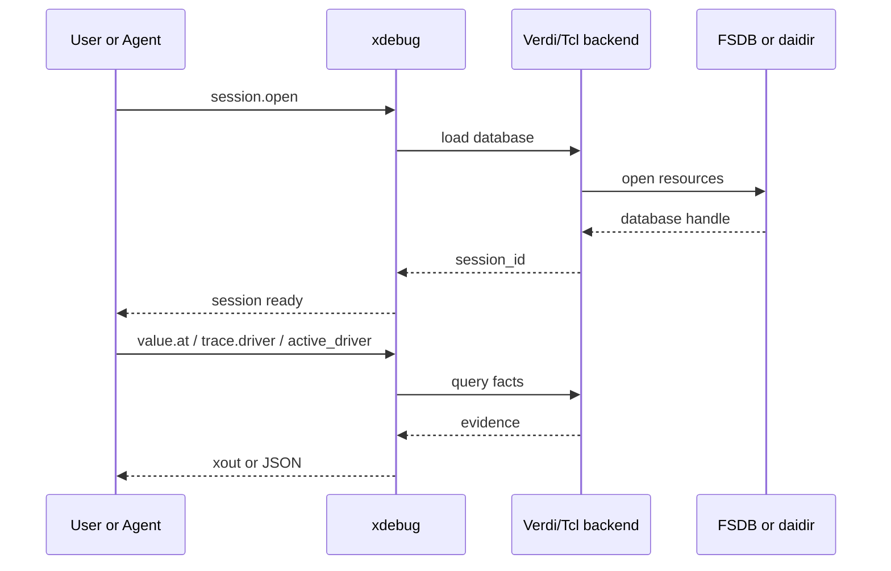
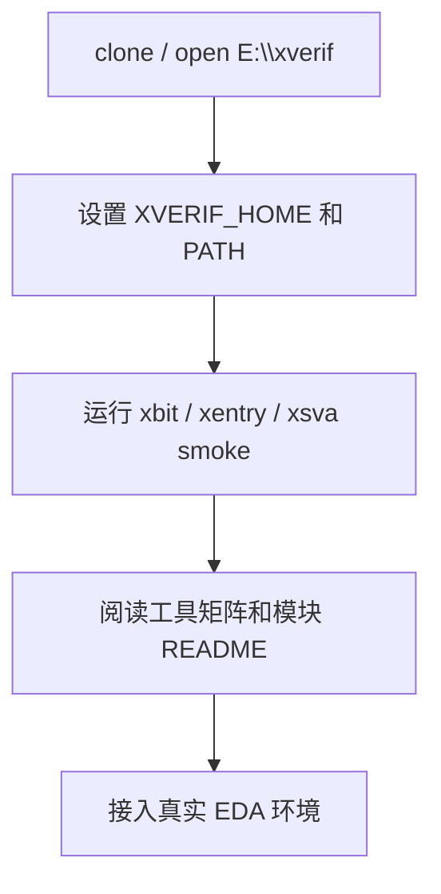
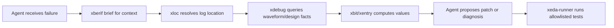

# xverif

`xverif` 是一个面向芯片验证、EDA 调试和 AI Agent 自动化验证的本地工具仓库。它把设计数据库查询、波形取证、bit 计算、entry 解析、UVM 日志定位、SVA 解释、coverage 查询和受控 EDA 命令执行整理成一组稳定 CLI，并通过统一 MCP server 暴露给 AI Agent。

简单说，`xverif` 的目标是让验证 debug 从“人肉翻 Verdi、猜信号、复制日志、靠经验判断”变成“用确定性工具取证，再让人或 Agent 基于证据推理”。

## 目录

- [一图看懂](#一图看懂)
- [适用场景](#适用场景)
- [仓库结构](#仓库结构)
- [工具矩阵](#工具矩阵)
- [快速开始](#快速开始)
- [配图与截图建议](#配图与截图建议)
- [核心概念](#核心概念)
- [xdebug: 设计和波形调试](#xdebug-设计和波形调试)
- [xbit: bit 和表达式计算](#xbit-bit-和表达式计算)
- [xentry: entry 字段解析](#xentry-entry-字段解析)
- [xloc: UVM 日志位置压缩](#xloc-uvm-日志位置压缩)
- [xberif: 项目上下文卡片](#xberif-项目上下文卡片)
- [xsva: SVA 结构化解释](#xsva-sva-结构化解释)
- [xcov: coverage 查询](#xcov-coverage-查询)
- [xverif-mcp: AI Agent 统一入口](#xverif-mcp-ai-agent-统一入口)
- [xeda-runner: 受控 EDA 命令执行](#xeda-runner-受控-eda-命令执行)
- [典型使用流程](#典型使用流程)
- [测试与验证](#测试与验证)
- [常见问题](#常见问题)
- [文档入口](#文档入口)

## 一图看懂



如果当前 Markdown 查看器不渲染 Mermaid，可以直接查看下面的静态架构图：



`xdebug` 负责从 Verdi/VCS/FSDB 中拿事实，`xbit` 负责把值算对，`xentry` 负责按配置切 entry 字段，`xloc` 负责把冗长 UVM log 位置压缩成可恢复 ID，`xberif` 负责给 Agent 提供项目上下文，`xsva` 负责把 assertion 语义结构化，`xcov` 负责查询 coverage database，`xeda-runner` 负责在白名单内执行 EDA 命令。

## 适用场景

`xverif` 适合以下场景：

- 验证失败后，需要快速查某个信号的 driver、load、依赖图和源码位置。
- 波形很大，需要用脚本查询某个时间点或时间窗口内的值、事件、握手、APB/AXI transaction。
- 需要让 AI Agent 在真实 EDA 环境里做 debug，但不希望它随意执行 shell 命令。
- UVM log 太长，希望把路径和行号压缩成短 ID，按需恢复上下文。
- 需要精确计算 Verilog/SystemVerilog literal、slice、concat、mask 和 expected value。
- entry、descriptor、packet header 由多拍 byte fragments 组成，需要确定性字段解析。
- 需要查询 VCS/Verdi coverage database，定位 uncovered scope/object/bin。
- 希望把项目背景整理成 summary cards，让 Agent 每次只读取必要上下文。

## 仓库结构

```text
xverif/
  tools/                 # 用户优先使用的统一命令入口和 wrapper
  xdebug/                # 设计数据库和波形数据库调试工具，直接 NPI 访问走 Tcl 后端
  xcov/                  # VCS/Verdi coverage database 查询，直接 NPI 访问走 Tcl 后端
  xbit/                  # bit/literal/slice/expression 计算器
  xentry/                # 多拍 entry / byte fragments 字段解析器
  xloc/                  # UVM log location 压缩和恢复
  xberif/                # 项目 context summary cards/detail 生成与查询
  xsva/                  # SystemVerilog Assertion lowering 和解释
  xverif_mcp/            # 统一 MCP server
  xeda_runner/           # allowlist EDA command runner
  mk/                    # 仓库共享 Makefile 片段和编译参数
  regression/            # 跨工具回归脚本
  skill/                 # Agent 使用说明和工具 reference
  doc/                   # 通用文档、静态配图和格式说明
  benchmark_results/     # 已纳入版本管理的 benchmark 结果快照
```

用户通常不需要直接进入每个工具的内部目录。推荐先把 `tools/` 加入 `PATH`，之后直接使用 `xdebug`、`xbit`、`xentry`、`xloc`、`xberif`、`xsva`、`xcov` 和 `xeda-runner`。

当前工作区里还可能出现一些本地实验或缓存目录，例如 `benchmarks/`、`benchmark_artifacts/`、`reports/`、`tmp/` 和 `.pytest_cache/`。这些目录用于实验脚本、压测中间产物、报告草稿、临时文件或测试缓存，通常不作为工具源码的一部分提交，提交前需要按任务要求单独挑选结果产物。

| 目录 | 含义 | 用户是否常用 |
| --- | --- | --- |
| `tools/` | 所有工具的稳定命令入口，负责设置必要环境并调用对应模块 | 是，推荐加入 `PATH` |
| `xdebug/` | 设计/波形调试主工具；public CLI 是 C++ 前端，Verdi/FSDB/NPI 查询统一委托给 `tcl_engine/xdebug_npi.tcl` | 是 |
| `xcov/` | coverage 查询工具；Python 负责协议、过滤、导出，真实 VDB/NPI 查询统一委托给 `tcl_engine/xcov_npi.tcl` | 是 |
| `xbit/` | Verilog/SystemVerilog literal、slice、mask、表达式计算 | 是 |
| `xentry/` | entry/descriptor/packet header 的字段切分和 provenance 解释 | 是 |
| `xloc/` | UVM log 路径压缩、短 ID 解析和源码上下文恢复 | 是 |
| `xberif/` | 项目背景卡片生成、brief/query、Agent 上下文管理 | 按需 |
| `xsva/` | SVA property/assertion 列表、lowering、解释和 timeline IR | 按需 |
| `xverif_mcp/` | MCP server，把各工具暴露给 AI Agent 或支持 MCP 的客户端 | Agent 场景常用 |
| `xeda_runner/` | allowlist 方式执行 EDA 命令，限制 Agent 只能跑可审计动作 | Agent/自动化场景常用 |
| `mk/` | 多个工具共享的 Makefile 片段、编译 flag 和公共规则 | 开发者常用 |
| `regression/` | 仓库级或跨工具回归脚本 | 开发者常用 |
| `skill/` | 面向 Codex/Agent 的工具 skill 与引用文档 | Agent 场景常用 |
| `doc/` | 通用文档、静态 SVG 截图、语法说明和说明性资料 | 是 |
| `benchmark_results/` | 已整理并提交的 benchmark 结果快照 | 查看结果时使用 |
| `benchmarks/` | 本地 benchmark、repair loop、XiangShan/UVM 实验脚本或运行目录 | 实验任务按需 |
| `benchmark_artifacts/` | 本地 benchmark 中间产物、截图、归档包或临时复制结果 | 通常不直接使用 |
| `reports/` | 本地评测报告、Word/Markdown 草稿或导出文件 | 查看/整理报告时使用 |
| `tmp/` | 临时文件、调试 scratch、一次性生成物 | 通常不提交 |
| `.pytest_cache/` | pytest 自动生成的本地测试缓存 | 不需要手动使用 |

## 工具矩阵

| 工具 | 解决的问题 | 主要输入 | 主要输出 | 是否依赖 EDA |
| --- | --- | --- | --- | --- |
| [`xdebug`](xdebug/README.md) | 设计和波形事实查询 | `simv.daidir`、FSDB、JSON request | driver/load/value/event/trace evidence | 真实查询需要 Verdi/VCS/FSDB |
| [`xbit`](xbit/README.md) | bit、literal、slice、表达式计算 | literal、变量、表达式 | 规范化值、比较结果、解释 | 否 |
| [`xentry`](xentry/README.md) | 多拍 entry 字段解析 | YAML/JSON config、fragments | field slices、provenance | 否 |
| [`xloc`](xloc/README.md) | UVM log 位置压缩/恢复 | log、sidecar JSONL map | `L_XXXXXXXX` 映射、源码上下文 | 否 |
| [`xberif`](xberif/README.md) | 项目上下文卡片 | 项目文档、模板、Agent 输出 | summary cards、detail markdown | 生成时可调用 Agent |
| [`xsva`](xsva/README.md) | SVA 语义结构化 | `.sva/.sv` | Surface IR、Timeline IR、解释 | 否 |
| [`xcov`](xcov/README.md) | coverage database 查询 | `simv.vdb` / `merged.vdb` | coverage summary、holes、evidence | 真实查询需要 Verdi/VCS license |
| [`xverif-mcp`](xverif_mcp/README.md) | AI Agent 统一工具入口 | MCP requests | tool responses | 取决于后端工具 |
| [`xeda-runner`](xeda_runner/README.md) | 受控执行 EDA 命令 | allowlist config、action/target | stdout/stderr、exit code、日志 | 取决于命令 |

## 快速开始

### 1. 准备环境

Windows PowerShell：

```powershell
cd E:\xverif
$env:XVERIF_HOME = "E:\xverif"
$env:PATH = "$env:XVERIF_HOME\tools;$env:PATH"
```

Linux / VM / Bash：

```bash
cd /path/to/xverif
export XVERIF_HOME="$PWD"
export PATH="$XVERIF_HOME/tools:$PATH"
```

Tcsh：

```tcsh
cd /path/to/xverif
setenv XVERIF_HOME "$cwd"
setenv PATH "$XVERIF_HOME/tools:$PATH"
```

### 2. 检查命令入口

```bash
xdebug -h
xbit --help
xentry --help
xloc --help
xberif --help
xsva --help
xcov --help
xeda-runner --help
```

### 3. 跑几个不依赖 EDA 的 smoke examples

```bash
xbit conv "8'shff" --json
xbit eval "data[15:8] == 8'hbe" --var data=32'hdead_beef
xentry '{"api_version":"xentry.v1","action":"explain","config_path":"xentry/examples/entry.yaml"}'
xsva list --file xsva/tests/golden_ir/simple_impl/input.sva
```

### 4. 查询 xdebug action catalog

Bash：

```bash
printf '%s\n' '{"api_version":"xdebug.v1","action":"actions"}' | xdebug --json -
```

PowerShell：

```powershell
'{"api_version":"xdebug.v1","action":"actions"}' | xdebug --json -
```

### 5. 真实 EDA 场景准备

真实 `xdebug` / `xcov` 查询需要 Verdi/VCS 数据库和 license。通常需要在 VM 或 EDA 服务器中设置：

```bash
export VERDI_HOME=/path/to/verdi
export VCS_HOME=/path/to/vcs
export LD_LIBRARY_PATH="$VERDI_HOME/share/NPI/lib/LINUX64:$LD_LIBRARY_PATH"
```

当前仓库的直接 Verdi/NPI 访问统一走 Tcl 后端，目标是兼容 Verdi 2018 这类较老版本。`xdebug` 使用 `xdebug/tcl_engine/xdebug_npi.tcl`，`xcov` 使用 `xcov/tcl_engine/xcov_npi.tcl`；public CLI、JSON 协议、MCP 协议和测试框架保持稳定。新代码不要新增非 Tcl 的直接 NPI 访问入口，也不要恢复旧私有 engine。

## 配图与截图建议

本 README 已内置 Mermaid 架构图和流程图，GitHub 会自动渲染。为了兼容不能渲染 Mermaid 的 Markdown 查看器，`doc/images/` 下也提供了一组静态 SVG 示意图，可直接显示。如果后续拍摄真实终端、Verdi 或 MCP 客户端截图，可以用同名 PNG 替换或补充。

| 建议文件 | 截图内容 | 建议命令或界面 |
| --- | --- | --- |
| `doc/images/00-xverif-architecture.svg` | xverif 总体架构图 | README 顶部静态图 |
| `doc/images/01-env-setup.svg` | 终端中完成 PATH 设置、`xbit --help`、`xdebug -h` | PowerShell 或 VM terminal |
| `doc/images/06-xdebug-actions.svg` | `xdebug --json -` 输出 action catalog 的片段 | `actions` request |
| `doc/images/08-xdebug-value-batch.svg` | 查询 FSDB 某信号值的输出 | `value.at` 或 `value.batch_at` |
| `doc/images/11-mcp-tools.svg` | AI 客户端中列出的 `xverif_*` MCP tools | MCP client 工具列表 |
| `doc/images/04-xloc-resolve-context.svg` | UVM log 中 `L_XXXXXXXX` 和 resolve 结果 | `xloc resolve` |
| `doc/images/10-xcov-holes.svg` | coverage holes 查询结果 | `xcov` 或 MCP coverage query |

当前 README 中已经直接引用静态 SVG，例如：


截图风格建议：

- 终端截图只截取关键命令和关键输出，不要截取 API key、license server 详情或个人路径。
- 真实项目信号路径可以打码，但保留 `top.u_xxx.signal` 这类层次结构，方便读者理解。
- Verdi/nWave 截图建议同时显示 signal list、时间 cursor 和异常时间点。
- MCP 截图建议展示工具名、入参和响应摘要，而不是完整大 JSON。

### 工具使用截图指引

下面给出每个工具推荐截图的“怎么截”。截图不是功能必需品，但放到 README 或项目汇报里会让新用户更快理解工具链。建议所有截图统一放在 `doc/images/` 下。

#### 1. 环境初始化截图

建议文件：

```text
doc/images/01-env-setup.svg
```

截图命令：

```powershell
cd E:\xverif
$env:XVERIF_HOME = "E:\xverif"
$env:PATH = "$env:XVERIF_HOME\tools;$env:PATH"
xbit --help
xdebug -h
```

截图范围：

- PowerShell 或 VM terminal 的命令输入区。
- `xbit --help` 或 `xdebug -h` 的前 20 到 40 行输出。
- 不需要截整个屏幕，只截终端窗口。

需要突出：

- `XVERIF_HOME` 指向仓库根目录。
- `tools/` 已加入 `PATH`。
- 用户可以直接运行 `xbit`、`xdebug` 等命令。

需要隐藏：

- 个人用户名、机器名、私有路径可以按需打码。
- 不要展示 API key、license server 地址或内部项目路径。

插入 README 示例：

```markdown

```

#### 2. xbit 使用截图

建议文件：

```text
doc/images/02-xbit-conv-eval.svg
```

截图命令：

```bash
xbit conv "8'shff"
xbit conv "8'shff" --json
xbit eval "data[15:8] == 8'hbe" --var data=32'hdead_beef
```

截图范围：

- 三条命令和对应输出。
- 如果 JSON 输出太长，只截到 `value`、`width`、`signed`、`ok` 等关键字段。

需要突出：

- `xbit` 可以同时给人类文本输出和 JSON 输出。
- 位宽、符号和 slice 结果由工具确定，不靠人工心算。

推荐配文：

```markdown


`xbit` 用于处理 literal、slice、符号扩展和表达式比较，适合在 debug 中解释波形值。
```

#### 3. xentry 使用截图

建议文件：

```text
doc/images/03-xentry-explain-decode.svg
```

截图命令：

```bash
xentry '{"api_version":"xentry.v1","action":"explain","config_path":"xentry/examples/entry.yaml"}'
printf '%s\n' '{"api_version":"xentry.v1","action":"decode","config_path":"xentry/examples/entry.yaml","input_path":"xentry/examples/fragments.jsonl"}' | xentry -
```

截图范围：

- 第一部分展示 `explain` 输出中的字段布局。
- 第二部分展示 `decode` 输出中的 field raw value 和 provenance。

需要突出：

- 配置文件定义 entry layout。
- fragments 被拼接后按字段切出。
- provenance 能说明字段来自哪一拍、哪些 bit。

推荐截图布局：

- 左半边放 `entry.yaml` 的字段配置。
- 右半边放 `xentry decode` 输出。
- 如果不方便拼图，直接截 terminal 输出也可以。

#### 4. xloc 使用截图

建议文件：

```text
doc/images/04-xloc-resolve-context.svg
```

截图命令：

```bash
xloc stats out/sim.log
xloc resolve L_00000001 --map out/sim.log.xloc.jsonl
xloc context L_00000001 --map out/sim.log.xloc.jsonl --lines 5
```

截图范围：

- 一段包含 `L_00000001` 的压缩 log。
- `xloc resolve` 的文件、行号输出。
- `xloc context` 的源码上下文。

需要突出：

- log 中保留短 ID，减少噪声。
- 需要源码时可以反查。
- Agent 不必每次读取长路径和整段源码。

需要隐藏：

- 内部项目绝对路径可以打码，但保留文件名和行号格式。

#### 5. xsva 使用截图

建议文件：

```text
doc/images/05-xsva-list-explain.svg
```

截图命令：

```bash
xsva list --file xsva/tests/golden_ir/simple_impl/input.sva
xsva explain --file xsva/tests/golden_ir/path_expand/input.sva --property p_path
xsva parse --file xsva/tests/golden_ir/ranged_delay/input.sva --property p_ranged --emit timeline-ir
```

截图范围：

- `xsva list` 中列出的 property/assertion。
- `xsva explain` 中对 implication、delay、sequence 的解释。
- `timeline-ir` 可以只截关键片段。

需要突出：

- SVA 原文被转换成结构化解释。
- temporal 语义由工具解析，减少人工误读。

#### 6. xdebug action catalog 截图

建议文件：

```text
doc/images/06-xdebug-actions.svg
```

截图命令：

Bash：

```bash
printf '%s\n' '{"api_version":"xdebug.v1","action":"actions"}' | xdebug -
printf '%s\n' '{"api_version":"xdebug.v1","action":"actions"}' | xdebug --json -
```

PowerShell：

```powershell
'{"api_version":"xdebug.v1","action":"actions"}' | xdebug -
'{"api_version":"xdebug.v1","action":"actions"}' | xdebug --json -
```

截图范围：

- 默认 `xout` 输出中的 action 分类。
- JSON 输出中某一个 action 的 schema/example 片段。

需要突出：

- `actions` 是工具能力目录。
- 人看默认输出，脚本和 Agent 用 `--json`。

#### 7. xdebug session.open 截图

建议文件：

```text
doc/images/07-xdebug-session-open.svg
```

建议准备一个请求文件：

```json
{
  "api_version": "xdebug.v1",
  "action": "session.open",
  "target": {
    "daidir": "simv.daidir",
    "fsdb": "waves.fsdb"
  },
  "args": {
    "name": "case_a"
  }
}
```

截图命令：

```bash
xdebug --json open_session.json
```

截图范围：

- 请求文件中的 `target.daidir`、`target.fsdb`、`args.name`。
- 响应中的 `ok`、`session_id`、transport 或 endpoint 摘要。

需要突出：

- 真实 debug 推荐先打开 session。
- 后续 query 使用 `target.session_id` 复用资源。

需要隐藏：

- 真实项目路径、用户目录、license 信息。

#### 8. xdebug value.at / value.batch_at 截图

建议文件：

```text
doc/images/08-xdebug-value-batch.svg
```

截图请求：

```json
{
  "api_version": "xdebug.v1",
  "action": "value.batch_at",
  "target": {
    "session_id": "case_a"
  },
  "args": {
    "time": "100ns",
    "signals": [
      "top.u_core.valid",
      "top.u_core.ready",
      "top.u_core.bits"
    ],
    "format": "hex"
  }
}
```

截图命令：

```bash
xdebug batch_value.json
xdebug --json batch_value.json
```

截图范围：

- 请求中的 `time` 和 `signals`。
- 响应中的每个 signal value。
- 如果有 missing signal，截 `missing_by_reason` 或每行 `status/reason`。

需要突出：

- 同一时间点批量取值适合 handshake debug。
- 缺失信号不会让整体信息不可读，工具会解释缺失原因。

#### 9. xdebug trace.driver / active_driver 截图

建议文件：

```text
doc/images/09-xdebug-active-driver.svg
```

截图请求：

```json
{
  "api_version": "xdebug.v1",
  "action": "trace.active_driver",
  "target": {
    "daidir": "simv.daidir",
    "fsdb": "waves.fsdb"
  },
  "args": {
    "signal": "top.u_core.ready",
    "requested_time": "120ns",
    "include_control": true
  }
}
```

截图范围：

- 左侧展示异常时间点附近的波形，至少包括 `valid`、`ready`、`state`、`data`。
- 右侧展示 `trace.active_driver` 输出的 active assignment、source file、line 和 condition。

需要突出：

- 波形现象和 RTL 因果被连接起来。
- `requested_time` 是截图中的 cursor 时间。

推荐配文：

```markdown


`trace.active_driver` 将波形异常点和当前生效的 RTL driver 关联起来，适合定位 ready/valid、状态机和选择器问题。
```

#### 10. xcov coverage holes 截图

建议文件：

```text
doc/images/10-xcov-holes.svg
```

截图内容：

- coverage session open 成功。
- scope summary 或 holes 查询结果。
- holes 中的 file/line evidence。

示例命令：

```bash
xcov --stdio-loop
```

或者通过 MCP 调用：

```text
xverif_cov_session_open
xverif_cov_query
xverif_cov_session_close
```

需要突出：

- 覆盖率查询不只是百分比，而是能定位到 scope、object、bin 和源码行。
- 大结果应导出为文件，不建议截图完整 JSON。

#### 11. xverif-mcp 工具列表截图

建议文件：

```text
doc/images/11-mcp-tools.svg
```

截图内容：

- MCP client 中 `xverif_*` 工具列表。
- 至少包含 debug、coverage、bit、entry、loc、context、sva 中几类工具。
- 一个工具调用示例，例如 `xverif_debug_actions` 或 `xverif_bit_eval`。

需要突出：

- Agent 通过 MCP 调用工具，不需要直接拼 shell。
- stateful 工具和 stateless 工具都在统一入口下。

需要隐藏：

- MCP 配置里的个人路径、token、API key。
- EDA license server 地址。

#### 12. xeda-runner dry-run / run 截图

建议文件：

```text
doc/images/12-xeda-runner.svg
```

截图命令：

```bash
xeda-runner init
xeda-runner list-actions
xeda-runner describe-action --action sim
xeda-runner run --action sim --target compile --option TEST=smoke_test --dry-run
```

截图范围：

- `list-actions` 展示可执行 action。
- `describe-action` 展示 action/target/options。
- `dry-run` 展示将要执行的命令，但不真正运行。

需要突出：

- Agent 只能走 allowlist action。
- `dry-run` 可以审计真实执行前的命令。

### 推荐截图顺序

如果只想放 4 张图，推荐：

1. `01-env-setup.svg`: 用户如何开始。
2. `06-xdebug-actions.svg`: 工具体系能力目录。
3. `08-xdebug-value-batch.svg`: 真实波形查询。
4. `11-mcp-tools.svg`: AI Agent 接入方式。

如果要做完整项目介绍，推荐按下面顺序放图：

```text
01-env-setup.svg
02-xbit-conv-eval.svg
03-xentry-explain-decode.svg
04-xloc-resolve-context.svg
05-xsva-list-explain.svg
06-xdebug-actions.svg
07-xdebug-session-open.svg
08-xdebug-value-batch.svg
09-xdebug-active-driver.svg
10-xcov-holes.svg
11-mcp-tools.svg
12-xeda-runner.svg
```

## 核心概念

### 默认输出: xout

多数用户命令默认输出 `xout` 结构化文本，例如：

```text
@xdebug.value.at.v1

target:
  signal: top.clk
  time: 10ns

summary:
  value: 1
  known: true
```

`xout` 比完整 JSON 更适合人和 Agent 快速阅读。需要脚本解析、schema 校验或回归比较时，显式加 `--json`。

```bash
xbit conv "8'shff" --json
printf '%s\n' '{"api_version":"xdebug.v1","action":"actions"}' | xdebug --json -
```

### JSON request envelope

`xdebug` 和 `xcov` 这类工具使用 JSON request：

```json
{
  "api_version": "xdebug.v1",
  "request_id": "optional-id",
  "action": "value.at",
  "target": {
    "session_id": "case_a"
  },
  "args": {
    "signal": "top.u.valid",
    "time": "100ns",
    "format": "hex"
  },
  "limits": {},
  "output": {
    "verbosity": "compact"
  }
}
```

脚本必须先检查响应中的 `ok` 字段。失败时读取 `error.code` 和 `error.message`，不要解析 stderr 或人类文本。

### Session

真实设计和波形查询通常先打开 session，再复用 session 查询：



同名 session 不会自动覆盖旧 session。如果已有 live session，会返回 `SESSION_ID_EXISTS`；如果已有 stale session，需要显式关闭或 GC。

## xdebug: 设计和波形调试

`xdebug` 是本项目最核心的调试工具，用来查询设计数据库和波形数据库中的事实。它覆盖原先分散的 xtrace/xwave 调试能力，并统一到 JSON API、xout 输出和 MCP wrapper。

### 能做什么

- 查询信号 driver、load、源码位置、候选信号和依赖图。
- 查询 FSDB 中某个时间点或时间窗口的 value、changes、events。
- 分析 valid-ready、APB、AXI 等常见握手和协议行为。
- 在同时有 `daidir` 和 `fsdb` 时，定位某个时间点真正生效的 RTL driver。
- 生成 nWave `signal.rc`，辅助打开一组关键信号。
- 通过 MCP 给 AI Agent 提供 stateful design/wave debug 能力。

### 输入资源

| target | 用途 |
| --- | --- |
| `daidir` | VCS/Verdi 设计数据库，例如 `simv.daidir` |
| `fsdb` | FSDB 波形数据库，例如 `waves.fsdb` |
| `session_id` | 已打开 session 的复用句柄 |

### 查询 action catalog

```bash
printf '%s\n' '{"api_version":"xdebug.v1","action":"actions"}' | xdebug -
printf '%s\n' '{"api_version":"xdebug.v1","action":"actions"}' | xdebug --json -
```

### 打开 session

```json
{
  "api_version": "xdebug.v1",
  "action": "session.open",
  "target": {
    "daidir": "simv.daidir",
    "fsdb": "waves.fsdb"
  },
  "args": {
    "name": "case_a"
  }
}
```

保存为 `open_session.json` 后执行：

```bash
xdebug --json open_session.json
```

### 查某个时间点的信号值

```json
{
  "api_version": "xdebug.v1",
  "action": "value.at",
  "target": {
    "session_id": "case_a"
  },
  "args": {
    "signal": "top.u_core.valid",
    "time": "100ns",
    "format": "hex"
  }
}
```

### 批量取值

```json
{
  "api_version": "xdebug.v1",
  "action": "value.batch_at",
  "target": {
    "session_id": "case_a"
  },
  "args": {
    "time": "100ns",
    "signals": [
      "top.u_core.valid",
      "top.u_core.ready",
      "top.u_core.bits"
    ],
    "format": "hex"
  }
}
```

### 查 driver

```json
{
  "api_version": "xdebug.v1",
  "action": "trace.driver",
  "target": {
    "daidir": "simv.daidir"
  },
  "args": {
    "signal": "top.u_core.ready",
    "include_source": true
  }
}
```

### 查当前时间点生效 driver

```json
{
  "api_version": "xdebug.v1",
  "action": "trace.active_driver",
  "target": {
    "daidir": "simv.daidir",
    "fsdb": "waves.fsdb"
  },
  "args": {
    "signal": "top.u_core.ready",
    "requested_time": "120ns",
    "include_control": true
  }
}
```

### 推荐 debug 顺序


## xbit: bit 和表达式计算

`xbit` 是确定性 bit/value/expression 计算器。它不读取 RTL，也不访问 Verdi，只负责把值算对。

### 典型用途

- Verilog/SystemVerilog literal 转换。
- signed/unsigned 解释。
- slice、index、concat、repeat、mask、popcount、onehot。
- 常量表达式求值。
- 对 `xdebug` 返回的波形值做二次计算。

### 示例

```bash
xbit conv "8'shff"
xbit conv "8'shff" --json
xbit eval "data[15:8] == 8'hbe" --var data=32'hdead_beef
xbit slice 32'hdead_beef 15 8
```

适合 Agent 的用法是：凡是涉及位宽、符号扩展、截断、slice、mask、hex/bin/decimal 转换，都交给 `xbit`，不要靠 LLM 心算。

## xentry: entry 字段解析

`xentry` 用配置文件描述 entry 的字段布局，再把多拍 byte fragments 拼接并切字段。它只输出 raw field slices 和 provenance，不做协议语义脑补。

### 典型用途

- descriptor、metadata、WQE、CQE、packet header、cache entry 解析。
- 多拍总线数据拼成一个 entry。
- 查看字段来自哪一拍、哪几个 bit。
- 给 Agent 提供确定性 field evidence。

### explain 配置

```bash
xentry '{"api_version":"xentry.v1","action":"explain","config_path":"xentry/examples/entry.yaml"}'
xentry --json '{"api_version":"xentry.v1","action":"explain","config_path":"xentry/examples/entry.yaml"}'
```

### decode fragments

```bash
printf '%s\n' '{"api_version":"xentry.v1","action":"decode","config_path":"xentry/examples/entry.yaml","input_path":"xentry/examples/fragments.jsonl"}' | xentry -
```

## xloc: UVM 日志位置压缩

`xloc` 用来把 UVM log 中冗长路径压缩成 `L_XXXXXXXX` ID，并通过 sidecar JSONL 映射文件恢复源码位置。

### 解决的问题

UVM log 里常见路径非常长，例如：

```text
/project/work/very/long/path/env/agent/driver.sv:123
```

直接喂给 Agent 会浪费大量 token。`xloc` 可以把它压成：

```text
L_00000001
```

需要时再恢复：

```bash
xloc resolve L_00000001 --map out/sim.log.xloc.jsonl
xloc context L_00000001 --map out/sim.log.xloc.jsonl --lines 5
xloc stats out/sim.log
xloc annotate out/sim.log --map out/sim.log.xloc.jsonl
```

### 推荐截图

截图时建议同时展示两部分：左侧是压缩后的 log，右侧是 `xloc resolve` 还原出的文件、行号和上下文。

## xberif: 项目上下文卡片

`xberif` 用来把项目背景整理成可查询的 summary cards 和 detail markdown，给 Agent 提供“刚好够用”的上下文。

### 适合的问题

- 新 Agent 接手项目时，需要快速知道环境、接口、checker、scoreboard、reset/clock、debug 入口。
- 大项目上下文太长，需要按 topic 懒加载细节。
- 希望每次 debug 前读取短 brief，而不是整仓库扫描。

### 初始化

```bash
xberif config init --kind bt
```

常见 `kind`：

- `bt`: block level testbench
- `it`: integration test
- `st`: subsystem test
- `soc`: SoC level

### 生成和查询

```bash
xberif init --model <model-name>
xberif brief --mode debug
xberif query --topic project
```

真实生成 cards/details 时通常需要可用 Agent 命令和显式模型参数。不要把 API key 写入仓库文件、日志或报告。

## xsva: SVA 结构化解释

`xsva` 读取 SystemVerilog Assertion，并将 property/assertion lowering 成结构化 IR，再生成可解释输出。

### 典型用途

- 列出 `.sva/.sv` 里的 property、assert、assume、cover。
- 检查 `|->`、`|=>`、`##N`、`##[m:n]`、range suffix 等 temporal 语义。
- 解释 local variable capture 和 per-attempt binding。
- 为 assertion review 和 Agent debug 提供确定性语义。

### 示例

```bash
xsva list --file xsva/tests/golden_ir/simple_impl/input.sva
xsva parse --file xsva/tests/golden_ir/ranged_delay/input.sva --property p_ranged --emit timeline-ir
xsva explain --file xsva/tests/golden_ir/path_expand/input.sva --property p_path
```

## xcov: coverage 查询

`xcov` 面向 VCS/Verdi coverage database 查询，适合在 AI/MCP 场景下查 coverage summary、holes、scope tree 和 source evidence。

### 能查什么

- line/toggle/branch/condition/fsm/assert/functional coverage。
- scope summary、children ranking、scope search。
- coverage holes 和对应源码位置。
- 按 `file/line/window` 反查 coverage item。
- 导出 JSON、NDJSON、CSV、Markdown。

### fake smoke

```bash
printf '%s\n' '{"api_version":"xcov.v1","action":"session.open","target":{"vdb":"fake"},"args":{"name":"cov0","fake":true}}' | xcov --json -
```

### stdio loop

```bash
xcov --stdio-loop
```

真实 coverage 查询需要可访问 Synopsys license server。`xcov` 和 `xdebug` 是不同工具，但直接 NPI 访问策略一致：都只通过 Tcl backend 调 Verdi/NPI；Python/C++ 层只负责协议、调度、过滤、导出和展示。

## xverif-mcp: AI Agent 统一入口

`xverif-mcp` 是统一 MCP server。它把各工具暴露为 MCP tools：

- `xdebug`、`xcov` 作为 stateful backend。
- `xbit`、`xentry`、`xloc`、`xberif`、`xsva` 作为 stateless CLI adapter。
- 所有工具可以被 AI Agent 以结构化入参调用。

### 直接启动

Windows PowerShell：

```powershell
cd E:\xverif
$env:XVERIF_HOME = "E:\xverif"
$env:PYTHONPATH = "E:\xverif\xverif_mcp\src;E:\xverif"
python -m xverif_mcp.server
```

Linux：

```bash
cd /path/to/xverif
export XVERIF_HOME="$PWD"
export PYTHONPATH="$PWD/xverif_mcp/src:$PWD"
python -m xverif_mcp.server
```

### MCP client 配置示例

Windows 风格：

```json
{
  "mcpServers": {
    "xverif": {
      "command": "python",
      "args": ["-m", "xverif_mcp.server"],
      "env": {
        "XVERIF_HOME": "E:\\xverif",
        "PYTHONPATH": "E:\\xverif\\xverif_mcp\\src;E:\\xverif",
        "XVERIF_MCP_BACKEND": "direct"
      }
    }
  }
}
```

Linux / VM 风格：

```json
{
  "mcpServers": {
    "xverif": {
      "command": "python3",
      "args": ["-m", "xverif_mcp.server"],
      "env": {
        "XVERIF_HOME": "/path/to/xverif",
        "PYTHONPATH": "/path/to/xverif/xverif_mcp/src:/path/to/xverif",
        "XVERIF_MCP_BACKEND": "direct",
        "VERDI_HOME": "/path/to/verdi"
      }
    }
  }
}
```

### LSF / 集群模式

如果 AI 客户端在登录机，但 Verdi/NPI/FSDB 查询必须跑到 LSF 计算节点，可以使用：

```bash
export XVERIF_MCP_BACKEND=lsf
export XVERIF_LSF_SESSION_QUEUE=interactive
```

链路是：

```text
AI MCP client -> xverif-mcp -> LSF launcher -> xdebug --stdio-loop on compute node
```

不同 session 可以并行；同一个 session 内请求串行执行。

## xeda-runner: 受控 EDA 命令执行

`xeda-runner` 是 allowlist EDA command runner。它不让 Agent 拼任意 shell command，而是通过配置好的 action、target 和 option 执行可审计命令。

### 快速使用

```bash
xeda-runner init
xeda-runner list-actions
xeda-runner describe-action --action sim
xeda-runner run --action sim --target compile --option TEST=smoke_test --dry-run
xeda-runner run --action sim --target compile --option TEST=smoke_test --option SEED=123
```

### 长任务建议

长任务建议放到 `tmux` 或 `nohup` 中，避免终端断开导致任务中断：

```bash
tmux new -s xverif-run
xeda-runner run --action sim --target regression --option TEST=smoke_test
```

## 典型使用流程

### 流程一: 新用户本地体验



命令：

```bash
xbit conv "8'shff" --json
xentry '{"api_version":"xentry.v1","action":"explain","config_path":"xentry/examples/entry.yaml"}'
xsva list --file xsva/tests/golden_ir/simple_impl/input.sva
```

### 流程二: 真实波形 debug


推荐策略：

- 先用 compact 输出，证据不够再打开 `include_source`、`include_rows`、`include_trace`。
- 先缩小时间窗口，再查询大结果。
- 对位运算和字段解释使用 `xbit` / `xentry`。
- 对 log 位置使用 `xloc`。

### 流程三: AI Agent 自动 debug



这个流程的关键是：Agent 不直接猜测，也不随意执行命令，而是通过 MCP 工具拿结构化证据。

## 测试与验证

常规测试命令：

```bash
make -C xdebug
make -C xdebug schema-test
make -C xdebug contract-test
make -C xdebug unit-test

make -C xbit test
make -C xentry test
make -C xloc test
make -C xberif test
make -C xsva test
make -C xcov test

PYTHONPATH=xverif_mcp/src:. python -m pytest xverif_mcp/tests/ -q
python -m pytest xeda_runner/tests/ -q
```

仓库级入口：

```bash
make test
make full-test
```

说明：

- `schema-test` 校验 JSON schema 和 examples。
- `contract-test` 校验 runtime action registry、spec、schema 和 examples 是否一致。
- 不依赖 EDA 的工具可以在普通 Python 环境中跑。
- 真实 `xdebug` / `xcov` 回归需要 Verdi/VCS/license/FSDB/daidir。
- VM 上压测时建议记录命令、环境变量、Verdi 版本、suite 路径、结果 CSV、summary 和截图。

## 常见问题

### `xdebug: command not found`

确认 `tools/` 已加入 `PATH`：

```bash
export XVERIF_HOME=/path/to/xverif
export PATH="$XVERIF_HOME/tools:$PATH"
```

PowerShell：

```powershell
$env:XVERIF_HOME = "E:\xverif"
$env:PATH = "$env:XVERIF_HOME\tools;$env:PATH"
```

### Python 找不到 `xverif_mcp`

设置 `PYTHONPATH`：

```bash
export PYTHONPATH="$XVERIF_HOME/xverif_mcp/src:$XVERIF_HOME"
```

PowerShell：

```powershell
$env:PYTHONPATH = "E:\xverif\xverif_mcp\src;E:\xverif"
```

### Verdi 2018 不支持某些旧式 NPI 函数

当前仓库的 NPI 访问路径应使用 Tcl 后端，避免依赖较新 Verdi 才支持的非 Tcl 直接调用。遇到类似问题时，不要补回旧式实现；应在 `xdebug/tcl_engine/xdebug_npi.tcl`、`xcov/tcl_engine/xcov_npi.tcl` 或请求转换层修复兼容性，并在 VM 上用 Verdi 2018 压测。

### 查询信号失败

常见原因：

- 信号层次名不完整或经过 elaboration 后被改名。
- FSDB 没有 dump 该信号。
- 查询的是 slice，但后端只接受 base signal。
- 使用了错误的 session 或过期 session。

建议步骤：

```bash
printf '%s\n' '{"api_version":"xdebug.v1","action":"actions"}' | xdebug --json -
```

然后使用 `signal.scan`、`trace.driver`、`value.batch_at` 等动作逐步缩小范围。

### coverage 查询失败

确认：

- `vdb` 路径存在。
- Verdi/VCS coverage 相关环境变量正确。
- license server 可访问。
- Python 环境与 Synopsys 工具兼容。

### MCP 工具列表为空

检查：

- `XVERIF_HOME` 是否指向仓库根目录。
- `PYTHONPATH` 是否包含 `xverif_mcp/src` 和仓库根目录。
- MCP client 配置是否使用正确 Python。
- 是否设置了 `XVERIF_MCP_ENABLE_*` 关闭了相关工具组。

## 文档入口

- [`xdebug/README.md`](xdebug/README.md): 设计和波形调试工具说明
- [`xdebug/docs/JSON_API.md`](xdebug/docs/JSON_API.md): xdebug JSON API
- [`xdebug/docs/AGENT_GUIDE.md`](xdebug/docs/AGENT_GUIDE.md): Agent debug 指南
- [`xbit/README.md`](xbit/README.md): bit 计算器
- [`xentry/README.md`](xentry/README.md): entry 解析器
- [`xloc/README.md`](xloc/README.md): UVM log location 工具
- [`xberif/README.md`](xberif/README.md): 项目上下文卡片
- [`xsva/README.md`](xsva/README.md): SVA lowering 和解释
- [`xcov/README.md`](xcov/README.md): coverage 查询
- [`xverif_mcp/README.md`](xverif_mcp/README.md): MCP server 配置和工具说明
- [`xeda_runner/README.md`](xeda_runner/README.md): EDA runner
- [`skill/SKILL.md`](skill/SKILL.md): 面向 Agent 的使用入口
- [`skill/references/`](skill/references/): 各工具的 Agent reference

## 维护建议

- 新增 `xdebug` action 时，同时更新 action spec、request schema、response schema、example request 和 example response。
- 给脚本消费的命令优先提供 `--json`，给人看的默认输出保持 `xout` 简洁。
- 大结果默认 compact，只有显式 `include_*` 或提高 `limits` 时才返回明细。
- 不要把 API key、license server 细节、个人 home 路径或客户项目信息写入 README、日志和报告。
- 涉及 Verdi/NPI 兼容性时，优先在 VM 的实际 Verdi 版本上压测，而不是只跑 mock。
