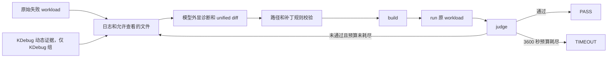

# KDebug XiangShan Benchmark 逐 Case 模型修复分析

> 公开性警告：本文结合真实注错代码和模型修复轨迹，披露了历史 suite 的答案与
> 典型错误路径。这 16 个 case 已不适合作为答案对模型不可见的盲测集。后续正式
> benchmark 应重新生成匿名 case，并把新 answer key 与模型可访问目录隔离。

## 1. 文档目的

本文回答三个问题：

1. GPT-5.5、Qwen3.6-35B 和 GLM-4.7 在每个 case 中公开表达了什么诊断？
2. 模型实际修改了什么方向，是否随着 build/run/judge 反馈改变判断？
3. 模型的口头诊断、实际补丁和最终 PASS/TIMEOUT 是否一致？

本文不是模型隐藏思维链的转录。报告只使用 API 响应中模型主动输出的
`message.content`、模型提交的 unified diff，以及 runner 返回的 build、run、judge
结果。内部推理字段、原始 API payload、请求标识和鉴权信息均不纳入本文。

配套资料：

- [16 个 case 的真实注错代码审计](benchmark_fault_injection_audit.md)
- [最终 benchmark 汇总](../benchmark_results/kdebug_xiangshan_v2_run_20260630_025641_20260704_qwen_final/summary.md)
- [最终逐 trial CSV](../benchmark_results/kdebug_xiangshan_v2_run_20260630_025641_20260704_qwen_final/results.csv)
- [终态截图目录](../benchmark_results/kdebug_xiangshan_v2_run_20260630_025641_20260704_qwen_final/screenshots/)

## 2. 数据范围与术语

历史 suite 位于 VM：

```text
/root/XiangShan-build/build/xverif_benchmark/v2_run_20260630_025641
```

模型逐轮输出位于：

```text
repair/<model>/<with_xdebug|without_xdebug>/<case>/agent_logs/<model>_transcript.jsonl
```

发生 API 限流、中断或竞争时，部分 transcript 被归档到：

```text
repair/_retry_later_archive/...
repair/_interrupted_race/...
```

当前工具名是 KDebug。suite 在更名前创建，因此 VM 历史目录仍使用
`with_xdebug`、`without_xdebug`：

| 本文名称 | 历史目录 | 含义 |
| --- | --- | --- |
| KDebug 组 | `with_xdebug` | 模型可读取预先采集的动态设计、波形或运行审计证据 |
| 基线组 | `without_xdebug` | 模型只能使用日志、静态 RTL、脚本、设计约束和迭代反馈 |

每个 repair loop 的基本流程如下：



## 3. 判读规则

本文把模型行为拆成三个独立层次：

| 层次 | 判断依据 | 为什么必须分开 |
| --- | --- | --- |
| 外显诊断 | transcript 中模型明确写出的根因、证据和请求文件 | 模型可能说对，也可能被日志或公开标签带偏 |
| 实际修改 | unified diff、命令 patch 和 `modified_files` | 诊断正确不代表补丁能应用，也不代表补丁修的是同一问题 |
| 最终结果 | 原 workload 重新 build/run 后的 judge 结果 | 只有 judge PASS 才说明功能修复闭环完成 |

还需要注意：

- `no_patch`、`build_fail`、`run_fail`、`judge_fail` 是 repair loop 的中间反馈，不是
  单独的模型终态。
- 同一模型、分组、case 在累计 3600 秒预算内仍未 PASS，最终记为 `TIMEOUT`。
- 多次 API 限流或接口超时的累计预算超过 3600 秒，也会聚合为 `TIMEOUT`。
- `evidence_used=true` 表示该 trial 属于 KDebug 证据组，不证明模型在语义上正确利用了
  每一条证据。
- `locate_sec` 是首个非空模型响应的时间，不代表已经定位到真实注错代码。
- 最终 PASS 的补丁比模型的自然语言解释更可靠；自然语言判断正确但补丁未应用时，仍然
  不能算修复成功。

## 4. 覆盖范围和结果总览

### 4.1 Transcript 覆盖

| 模型 | KDebug 组 | 基线组 | 说明 |
| --- | --- | --- | --- |
| GPT-5.5 | 16/16 | 16/16 | 两组全部有主 transcript |
| Qwen3.6-35B | 16/16 | 16/16 | 少数基线 transcript 位于重试归档 |
| GLM-4.7 | `001-006` 完整终态，`007` 仅部分限流记录 | `001-006` 完整终态 | `008-016` 按用户要求停止补测 |

按“模型 + 分组 + case”去重后，共有 77/96 个组合具有可见 transcript。GLM 缺失项
必须标记为“无数据”，不能据此推断成功或失败。

### 4.2 最终结果

| 模型 | KDebug 组 | 基线组 | 合计 PASS |
| --- | ---: | ---: | ---: |
| GPT-5.5 | 12/16，75.0% | 11/16，68.8% | 23/32 |
| Qwen3.6-35B | 7/16，43.8% | 5/16，31.2% | 12/32 |
| GLM-4.7 | 已完成项 0 PASS；`007` 为限流未完成 | 已完成项 0 PASS | 不具备完整横向可比性 |

下表中 `PASS/3` 表示第 3 轮达到 PASS，`TIMEOUT/20` 表示记录了 20 轮后预算耗尽。
GLM 的 `case_007` 有归档响应，但最终是 API 限流待重试，不是有效模型终态。

| Case | 真实注错摘要 | GPT KDebug | GPT 基线 | Qwen KDebug | Qwen 基线 | GLM KDebug | GLM 基线 |
| --- | --- | --- | --- | --- | --- | --- | --- |
| `001` | 多 beat AW 地址 bit 3 翻转 | PASS/3 | PASS/1 | PASS/1 | PASS/1 | TIMEOUT/125 | TIMEOUT/231 |
| `002` | 四 beat error 被改成 OK | PASS/8 | PASS/7 | PASS/2 | TIMEOUT/447 | TIMEOUT/246 | TIMEOUT/111 |
| `003` | 非首 beat 清除 `strb[0]` | PASS/2 | PASS/1 | TIMEOUT/268 | TIMEOUT/209 | TIMEOUT/117 | TIMEOUT/296 |
| `004` | `0x1bad_0000` 被误判为 UART | PASS/19 | PASS/28 | PASS/1 | PASS/1 | TIMEOUT/83 | TIMEOUT/177 |
| `005` | 地址 bit 5 触发错误状态吞噬 | PASS/5 | PASS/2 | PASS/2 | TIMEOUT/220 | TIMEOUT/199 | TIMEOUT/118 |
| `006` | `Alu_3` 结果 LSB 延迟翻转 | PASS/2 | TIMEOUT/74 | TIMEOUT/273 | TIMEOUT/20 | TIMEOUT/56 | TIMEOUT/76 |
| `007` | `Alu_3` 延迟清除 `rfWen` | TIMEOUT/20 | TIMEOUT/17 | TIMEOUT/278 | TIMEOUT/243 | RETRY_LATER | 无数据 |
| `008` | load 写回数据 LSB 翻转 | TIMEOUT/27 | TIMEOUT/37 | TIMEOUT/161 | TIMEOUT/177 | 无数据 | 无数据 |
| `009` | redirect target bit 1 翻转 | PASS/2 | PASS/2 | TIMEOUT/404 | TIMEOUT/260 | 无数据 | 无数据 |
| `010` | 与 `006` 相同的 ALU 注错 | TIMEOUT/22 | TIMEOUT/11 | TIMEOUT/72 | TIMEOUT/177 | 无数据 | 无数据 |
| `011` | Difftest plusarg 被删除 | PASS/2 | PASS/10 | PASS/5 | PASS/4 | 无数据 | 无数据 |
| `012` | 运行了错误 UVM case | PASS/2 | PASS/2 | PASS/1 | PASS/1 | 无数据 | 无数据 |
| `013` | 运行假 `stale_simv` | PASS/1 | PASS/1 | PASS/1 | PASS/1 | 无数据 | 无数据 |
| `014` | `003` RTL + 错误 case dispatch | PASS/2 | PASS/2 | TIMEOUT/281 | TIMEOUT/298 | 无数据 | 无数据 |
| `015` | `009` RTL + Difftest 缺失 | PASS/3 | PASS/3 | TIMEOUT/281 | TIMEOUT/467 | 无数据 | 无数据 |
| `016` | `006` RTL + 运行超时为 1 秒 | TIMEOUT/23 | TIMEOUT/14 | TIMEOUT/297 | TIMEOUT/15 | 无数据 | 无数据 |

## 5. 逐 Case 模型分析轨迹

### 5.1 case_001：多 beat AW 地址 bit 3 翻转

**真实注错**

`rtl/xs_generated_rtl_bridge.sv` 在多 beat 写事务上把 AW 地址改成
`addr_q[30:0] ^ 31'h8`。正确修复是恢复原始地址，不是修改 read burst 状态机。

**GPT-5.5**

- KDebug 组第一轮直接提交了正确补丁，把 RAM 的 AW 地址恢复为 `addr_q[30:0]`。
  后续轮次还尝试调整 AXI 合法 beat 判断，但最终 judge 在第 3 轮 PASS。
- 基线组从静态 RTL 中直接识别出“仅多 beat 写地址额外 XOR 8”的异常表达式，第 1 轮
  修复并 PASS。

**Qwen3.6-35B**

- KDebug 组的自然语言开头先讨论 `S_R` read burst 终止条件，文字解释与真实根因不完全
  一致；但同一轮实际补丁恢复了 AW 地址，原 workload 第 1 轮 PASS。
- 基线组明确比较写地址和 reference 地址索引，指出多 beat 路径多出的 XOR，第 1 轮 PASS。

**GLM-4.7**

- KDebug 组持续围绕 `S_R`、`axi_rvalid` 和 intermediate beat 修改，125 轮后 TIMEOUT。
- 基线组观察到了 write/read 地址不对称，但倾向于给 read 端加入相同地址变换，而不是
  删除写端注错，231 轮后没有有效修复。

**结论**

这是静态异常表达式非常明显的 case。基线组并不天然处于劣势；同时它说明报告不能只读
模型的文字解释，Qwen KDebug 组是“解释偏离但补丁正确”的典型。

### 5.2 case_002：四 beat error transaction 被伪装成 OK

**真实注错**

bridge 的 B/R response 都加入了：

```systemverilog
(sel_err && beats_q == 8'd4) ? XS_ST_OK[3:0] : ...
```

它只在特定四 beat error transaction 上吞掉错误状态。

**GPT-5.5**

- 两组第一轮都直接删除这个强制 `OK` 分支，并同时覆盖 B、R 两条 response 路径。
- 由于 patch context、重复应用和重新验证，KDebug 组第 8 轮 PASS，基线组第 7 轮 PASS。

**Qwen3.6-35B**

- KDebug 组从 `got=0, exp=2` 和 error 地址直接映射到该特殊条件，第 2 轮 PASS。
- 基线组第一轮也已经说出了同一个真实根因，最后一轮仍重复相同判断；但是 unified diff
  多次没有形成有效落地补丁，447 轮后为 `no_effective_patch` TIMEOUT。

**GLM-4.7**

- KDebug 组把问题归因到 reference DUT 没有处理 AXI error，试图修改错误对象，没有形成
  有效 patch，246 轮 TIMEOUT。
- 基线组先后怀疑 `legal_axi_beats`、UART 地址和 target 选择，未删除真正的四 beat
  `OK` override，111 轮 TIMEOUT。

**结论**

Qwen 基线组证明“定位正确”和“修复成功”是两件事。评价 repair agent 时必须单独统计
patch 可应用率、build 通过率和最终 judge，而不能把正确的根因文字直接计为成功。

### 5.3 case_003：非首 beat 的 `strb[0]` 被清零

**真实注错**

从第二个 beat 起，RAM write strobe 被改为 `eff_mask_q & 8'hfe`，byte lane 0 没有写入。
readback 的大量零值只是结果，根因在 write mask。

**GPT-5.5**

- KDebug 组直接把 `auto_in_w_bits_strb` 恢复为 `eff_mask_q`，第 2 轮 PASS。
- 基线组从“首 beat 正常、后续 beat 数据错误”定位到写掩码，第 1 轮 PASS。

**Qwen3.6-35B**

- KDebug 组看到 readback 为零后，主要追查 AXI4RAM 地址宽度、read data 连接和 burst
  行为，没有回溯 write strobe，268 轮 TIMEOUT。
- 基线组从“读数据端口未连接”逐渐漂移到 AXI slave port 命名问题，仍未修正 strobe，
  209 轮 TIMEOUT。

**GLM-4.7**

- KDebug 组在 FIXED/INCR burst 类型和 `S_R` 终止条件之间反复切换，117 轮 TIMEOUT。
- 基线组试图修改 reference DUT 的 burst XOR/read 行为，方向偏离 repair 对象，296 轮后
  仍未形成有效修复。

**结论**

“读到 0”不等于“读路径有 bug”。这个 case 考查的是数据 provenance：需要从 readback
错误反向检查之前的 write address、write data 和 write strobe。

### 5.4 case_004：伪造地址页被识别为 UART

**真实注错**

`is_uart_addr` 除真实 UART base 外，还把 `0x1bad_0000` 页判为 UART，导致本应返回
unmapped error 的访问得到 OK。

**GPT-5.5**

- 两组第一轮都删除了额外的 `0x1bad_0000` 比较项。
- KDebug 组第 19 轮、基线组第 28 轮 PASS。较多轮数主要来自 patch context 和重复验证，
  不是根因一直未知。

**Qwen3.6-35B**

- 两组都把 `got=0, exp=2`、失败地址和 `is_uart_addr` 的硬编码常量直接对应起来，第 1 轮
  PASS。

**GLM-4.7**

- KDebug 组看到了 bridge 与 reference 对该地址的映射不一致，但后续关注高位拼接和
  reference `is_periph`，没有稳定删除注入常量。
- 基线组试图让 DUT 也接受 `0x1bad_0000`，等于把错误映射扩散到 reference 行为，177 轮
  TIMEOUT。

**结论**

Qwen 在“错误地址 + 静态硬编码常量”模式上表现最好。GLM 的主要问题是没有先确认哪一侧
是设计、哪一侧是 reference。

### 5.5 case_005：条件性吞掉 peripheral error status

**真实注错**

当 `target_q == T_ERR` 且 `addr_q[5] == 1` 时，B/R response 被强制改成 OK。

**GPT-5.5**

- 两组都直接删除基于 `addr_q[5]` 的强制 OK 分支，分别在第 5、2 轮 PASS。

**Qwen3.6-35B**

- KDebug 组先根据失败地址的 `0x20` offset 注意到 bit 5，再定位到两处 status override，
  第 2 轮 PASS。
- 基线组开始时混淆 status 枚举和 unmapped target；后期已经指出真实 bit 5 条件，但补丁
  仍未有效落地，220 轮 TIMEOUT。

**GLM-4.7**

- 两组主要讨论 UART、PLIC 等合法 peripheral 是否应被 `select_target` 识别，试图扩大
  peripheral 映射，没有稳定删除真正的强制 OK 分支，均 TIMEOUT。

**结论**

KDebug 的地址和值窗口帮助 Qwen 把失败样本的共同 offset 与 RTL 条件关联起来。但模型
仍需要把观察转成可应用的最小补丁，否则正确判断不会转化为 PASS。

### 5.6 case_006：运行较晚时翻转 `Alu_3` result LSB

**真实注错**

`issueTime > 5000` 后，`rtl/Alu_3.sv` 把 ALU 原始结果 XOR 1。

**GPT-5.5**

- KDebug 组利用 first bad commit，把错误缩小到 `andi` 结果从 0 变成 1。第一轮请求
  `Alu.sv/Alu_3.sv`，第二轮看到注入表达式后把输出恢复为 `_T_0`。完整 full-chip
  仿真耗时约 2644 秒，最终 PASS。
- 基线组也怀疑整数 ALU，但在 `AluDataModule.sv`、`MiscResultSelect.sv` 和
  `BypassNetwork.sv` 中追查 operand/result 选择，最终没有删除 `Alu_3.sv` 的 XOR，
  多次运行累计后 TIMEOUT。

**Qwen3.6-35B**

- KDebug 组多次错误解码失败窗口附近的指令和寄存器编号，先后怀疑 branch、AMO 和
  `AMOALU.sv`，没有落到 `Alu_3.sv` 注入行，273 轮 TIMEOUT。
- 基线组同样围绕 `AMOALU.sv` 的 mask 和 LR/SC 语义修改，20 轮后预算耗尽。

**GLM-4.7**

- 两组都把 branch 附近的 `a5=1` 误读成 LR/SC 或 AMO 返回值问题，持续修改或请求
  `AMOALU.sv`，未修通。

**结论**

这是 KDebug 最有代表性的正向 case：动态 commit 证据帮助 GPT 找到首个坏值，但前提是
模型能正确解码指令、寄存器和实际实例文件。看到最后报错 PC 并不等于该 PC 的指令写坏
了寄存器。

### 5.7 case_007：运行较晚时清除整数寄存器写使能

**真实注错**

`rtl/Alu_3.sv` 在 `issueTime > 1000` 时把有效 `rfWen` 强制清零，导致结果不写回。

**GPT-5.5**

- KDebug 组看到早期寄存器出现随机值，以及 `RegCacheDataModule.sv` assertion，判断为
  register cache stale hit/valid 问题，并尝试禁用 cache hit，20 轮 TIMEOUT。
- 基线组同样把 assertion 当成根因，请求 `RegCacheDataModule.sv`，17 轮 TIMEOUT。

**Qwen3.6-35B**

- KDebug 组先讨论 register writeback，随后漂移到 `AXI4Flash.sv` 和 `AMOALU.sv`，278 轮
  无有效补丁。
- 基线组在 `Backend.sv`、`RegCacheDataModule.sv` 的 bypass/writeback 路径寻找问题，
  243 轮 TIMEOUT。

**GLM-4.7**

- KDebug 组的部分 transcript 也把 `RegCacheDataModule.sv:306` assertion 当作直接根因，
  但 API 限流后未形成有效终态。
- 基线组没有执行记录。

**结论**

assertion 是下游检测点，不一定是注错点。正确的数据流追踪应从“哪个 producer 的写使能
最先消失”向上游查到 `Alu_3.io_out_bits_ctrl_rfWen`，而不是直接重写报 assertion 的
register cache。

### 5.8 case_008：有效整数 load 写回数据 LSB 翻转

**真实注错**

`rtl/NewLoadUnit.sv` 在 `io_ldout_toIntRf_valid` 时，把 load 写回数据 XOR 1。

**GPT-5.5**

- KDebug 组正确观察到 `0x1a -> 0x1b` 的单 bit 差异，但把它解释为 flash 相邻 byte/lane
  选择错误，主要修改 `LoadDataGen.sv` 和 `AXI4Flash.sv`，27 轮 TIMEOUT。
- 基线组采用相同的 byte-lane/flash 地址假设，37 轮 TIMEOUT。

**Qwen3.6-35B**

- KDebug 组在指令解码、目的寄存器和最后写者判断上多次自相矛盾，先后修改
  `Alu.sv`、`AluDataModule.sv`、`BypassNetwork.sv` 和 `AMOALU.sv`，未查看真正的
  `NewLoadUnit` 写回表达式。
- 基线组同样从 load 逐渐漂移到 ALU/AMO，177 轮 TIMEOUT。

**GLM-4.7**

- 两组均无执行数据。

**结论**

数值刚好相差 1，既可能是相邻 byte，也可能是输出端 XOR 1。需要结合有效信号和写回端
表达式做 provenance，而不能只按数值形状猜测地址偏移。

### 5.9 case_009：redirect target bit 1 翻转

**真实注错**

`rtl/BranchUnit.sv` 在 redirect valid 时，把 target 和 fullTarget XOR 2，导致取指偏移
一个 RVC halfword。

**GPT-5.5**

- KDebug 组根据 commit/exception 窗口发现执行从 `0x800001ea` redirect 到错误的
  `0x800001dc`，而正确 loop body 在 `0x800001de`，请求 `BranchUnit.sv` 并删除 XOR 2，
  第 2 轮 PASS。
- 基线组仅凭日志也得出“backward branch target 差一个 halfword”，第 2 轮 PASS。

**Qwen3.6-35B**

- 两组都认识到是 redirect/flush 问题，但主要修改或请求 `Bpu.sv`、`AheadBtb.sv`，
  没有落到执行单元 `BranchUnit.sv` 的最终 target 表达式，分别在 404、260 轮 TIMEOUT。

**GLM-4.7**

- 两组均无执行数据。

**结论**

定位到“分支重定向”还不够，还要分清 predictor、frontend redirect 和执行单元 target
生成的职责。GPT 的关键优势是把 2-byte PC 差值直接映射到 `BranchUnit` 输出。

### 5.10 case_010：与 case_006 完全相同的 ALU 注错

**真实注错**

该 case 的 `Alu_3.sv` 与 `case_006` 字节级完全相同，仍是 `issueTime > 5000` 后结果
XOR 1。公开标签却把它描述成 memory/cache/MMU 问题。

**GPT-5.5**

- KDebug 组先受失败窗口和公开 subsystem 标签影响，认为是 UART/MMIO stale status，
  请求并修改 `AXI4UART.sv`；后期转向 `Alu.sv`，但没有正确删除 `Alu_3.sv` 的注入，
  22 轮 TIMEOUT。
- 基线组在 `AXI4UART.sv`、`Alu.sv`、`Alu_3.sv` 间切换，仍未形成正确终态，11 轮
  TIMEOUT。

**Qwen3.6-35B**

- KDebug 组主要追查 `AXI4DMAC.sv`，基线组主要追查 `AMOALU.sv`，均没有识别与
  `case_006` 相同的注错表达式。

**GLM-4.7**

- 两组均无执行数据。

**结论**

这是 metadata anchoring 的典型反例。公开 subsystem 标签错误时，动态证据也可能被模型
解释成符合标签的故事。历史结果不能把该 case 当成 cache/MMU 调试能力测试。

### 5.11 case_011：Difftest plusarg 被删除

**真实注错**

`config/diff.env` 把 `DIFF_ARG` 置空，导致 simv 启动但没有有效 Difftest。

**GPT-5.5**

- KDebug 组第一轮对 `scripts/run.sh` 做了较宽泛的 Difftest 启动修正，第二轮直接恢复
  `DIFF_ARG=+diff=...`，PASS。
- 基线组先处理 `NEMU_HOME` 和 run 参数构造，随后根据 judge 反馈恢复有效 Difftest
  调用链，第 10 轮 PASS。

**Qwen3.6-35B**

- KDebug 组起初把失败归因于 `NEMU_HOME`，后续又处理脚本执行权限；最终通过脚本侧
  恢复有效 Difftest 启动，记录为第 5 轮 PASS。
- 基线组也先补 `NEMU_HOME`，根据 `set -u`、变量定义顺序和 run 反馈迭代，第 4 轮 PASS。

**GLM-4.7**

- 两组均无执行数据。

**结论**

模型最初描述的不一定就是最终有效修复。该 case 应以 run 命令是否实际包含 Difftest
plusarg、日志是否显示 Difftest enabled、judge 是否 PASS 三项联合确认。

### 5.12 case_012：运行错误的 UVM case

**真实注错**

judge 期待 `ut_axi_burst_outstanding`，但 `config/case.env` 和默认值让 run 实际执行
`ut_axi_error_backpressure`。

**GPT-5.5**

- 两组都同时修正 `config/case.env` 和 `scripts/run.sh` 默认 case，第 2 轮 PASS。

**Qwen3.6-35B**

- 两组都直接对比 run log 中的 `Starting case=...`、PASS marker 和 judge 期待值，修正
  case dispatch，第 1 轮 PASS。

**GLM-4.7**

- 两组均无执行数据。

**结论**

这是确定性的配置一致性检查，不需要猜测 RTL。Qwen 对日志 marker 的直接对照最有效。

### 5.13 case_013：运行退出码为 0 的假 simv

**真实注错**

`config/run_target.env` 把 `SIMV` 指向 `./env/stale_simv`。该程序打印“未运行 workload、
Difftest disabled”后以 0 退出，制造假成功。

**GPT-5.5**

- 两组都只修改一行，把 `SIMV` 恢复为 `./simv`，第 1 轮 PASS。

**Qwen3.6-35B**

- 两组都从 stale simulator 文本、build 产物和 run target 配置直接定位同一行，第 1 轮
  PASS。

**GLM-4.7**

- 两组均无执行数据。

**结论**

这是整个 suite 中最直接的环境 case。它也说明不能把进程退出码 0 当成验证通过，judge
必须检查 workload、Difftest 和 PASS marker。

### 5.14 case_014：write mask RTL 错误 + wrong case dispatch

**真实注错**

RTL 与 `case_003` 相同，非首 beat 清除 `strb[0]`；环境又把实际 workload 从
`it_memory_mixed_burst` 改成 `ut_axi_error_backpressure`。

**GPT-5.5**

- KDebug 组第一轮就同时修改 `config/case.env`、`scripts/run.sh` 和 bridge write strobe，
  还补充了 RAM local address 归一化；第 2 轮以 mixed repair PASS。
- 基线组同样在首轮补丁中覆盖 case dispatch 和 write strobe，第 2 轮 PASS。

**Qwen3.6-35B**

- KDebug 组最初仍把零 readback 归因于 AXI read handshake。到后期已经识别错误 case 和
  `strb[0]` 两个问题，但多次 patch 未形成可通过状态，281 轮 TIMEOUT。
- 基线组长时间追查 read path，还尝试修改 testbench；后期 strobe 补丁出现语法/context
  问题，虽然记录到 mixed 文件改动，原 workload 仍未通过，298 轮 TIMEOUT。

**GLM-4.7**

- 两组均无执行数据。

**结论**

mixed case 要求同一次最终状态同时恢复 RTL 和环境。只让错误 case PASS，或者只修 RTL
但仍运行错误 workload，都不能通过 judge。

### 5.15 case_015：redirect target 错误 + Difftest 缺失

**真实注错**

RTL 与 `case_009` 相同，redirect target XOR 2；环境与 `case_011` 相同，`DIFF_ARG` 为空。

**GPT-5.5**

- KDebug 组明确指出 loop branch 落到错误 RVC halfword，并同时审计到 Difftest 参数为空；
  修正 `BranchUnit.sv`、`config/diff.env` 和 run 参数，第 3 轮 PASS。
- 基线组先请求名称并不准确的 `BranchModule.sv`，随后落到 `BranchUnit.sv`，同时修复
  run 脚本，第 3 轮 PASS。

**Qwen3.6-35B**

- KDebug 组认识到 exception PC 倒退和 redirect 异常，也修改过 `BranchUnit.sv`、
  `AheadBtb.sv` 和 `config/diff.env`，但没有形成通过原 workload 的完整补丁，281 轮
  TIMEOUT。
- 基线组在 `Bpu.sv`、`AXI4Flash.sv` 和 Difftest 配置之间来回切换，467 轮仍为
  `no_effective_patch`。

**GLM-4.7**

- 两组均无执行数据。

**结论**

GPT 把 `case_009` 的 RTL 规律和 `case_011` 的环境审计组合起来，形成完整 mixed repair。
Qwen 虽分别触及两个方向，但缺少稳定的最终集成和验证闭环。

### 5.16 case_016：ALU LSB 翻转 + 一秒运行超时

**真实注错**

RTL 与 `case_006` 的 `Alu_3.sv` 完全相同；环境新增 `RUN_TIMEOUT_SEC=1`。公开标签却把
RTL 部分描述成 LSU/cache 问题。

**GPT-5.5**

- KDebug 组第一轮正确识别 1 秒 timeout，但把 `a5` 差异归因于 LSU/MMIO/UART；后期又
  转向 `DecodeUnit.sv` 和 `MiscResultSelect.sv`，始终没有删除 `Alu_3.sv` 的 XOR，
  23 轮 TIMEOUT。
- 基线组同样修正 timeout 方向，但主要修改 `AXI4UART.sv` status read，14 轮 TIMEOUT。

**Qwen3.6-35B**

- KDebug 组明确指出 `RUN_TIMEOUT_SEC=1` 不合理，却把 RTL 根因放在 `AXI4DMAC.sv`，
  297 轮没有有效修复。
- 基线组修改 timeout 后继续追查 `AXI4UserYanker_1.sv`，15 轮 TIMEOUT。

**GLM-4.7**

- 两组均无执行数据。

**结论**

四个已执行组合都能看到明显的环境问题，却都没识别与 `case_006` 重复的 RTL 注错。
它说明 mixed repair 中“修掉一半”仍然是失败，也再次证明错误的公开 subsystem 标签会
显著影响模型搜索方向。

## 6. 跨 Case 观察

### 6.1 GPT-5.5 的主要模式

- 对 generated wrapper 中显眼的异常条件和硬编码常量定位较快，`001-005` 两组大多通过。
- 对环境一致性问题有较强闭环能力，`011-013` 两组全部通过。
- KDebug 在 `case_006` 提供了实质帮助：基线组只知道 ALU 大方向，KDebug 组最终落到
  `Alu_3.sv` 的准确表达式。
- 对公开标签错误较敏感。`case_010`、`case_016` 被 memory/LSU/MMIO 标签锚定后，没有
  复用 `case_006` 的真实模式。
- GPT 的自然语言通常较短，很多轮直接输出 diff；因此分析时更应看实际 patch，而不是
  仅统计解释文本长度。

### 6.2 Qwen3.6-35B 的主要模式

- 对简单环境配置和明显常量错误很快，`004`、`012`、`013` 多为第 1 轮 PASS。
- 容易生成很长的重复诊断循环。同一根因可以连续数百轮重复，但 patch context、语法或
  修改对象没有稳定收敛。
- 存在“诊断正确但 no_effective_patch”的代表 case，例如基线组 `case_002`。
- full-chip case 中多次错误解码指令和寄存器，导致从 load/branch 漂移到 AMO、BPU、DMA
  或 bypass 模块。
- KDebug 提高了总体成功率，但证据不会自动保证正确归因。需要先建立可靠的指令解码、
  last-writer 和 signal provenance，再消费动态窗口。

### 6.3 GLM-4.7 的主要模式与限制

- 只完成 `case_001-006` 两组，`case_007` 仅有 KDebug 组的部分限流记录，之后按用户要求
  停止补测。
- 已完成的 12 个组合均未 PASS，不能据此推断 `008-016` 的能力。
- 常见偏差是把 scoreboard/reference 逻辑当成修复对象，或根据表面症状重写 burst、
  peripheral mapping、AMO 行为。
- GLM 运行期间存在明显 API 限流和重试，因此其结果同时受模型行为和服务可用性影响，
  不应与 GPT/Qwen 的完整 32 个组合做简单总分排名。

### 6.4 KDebug 证据真正帮助了什么

KDebug 组相对基线组的主要增量不是“直接给答案”，而是提供：

- first mismatch 附近的动态值和时序窗口；
- commit/writeback、redirect、load data、rfWen 等 first divergence；
- 实际 simv 命令、Difftest 是否启用、case dispatch、simv fingerprint 和 timeout 审计。

它对 `case_006` 的 GPT 修复非常关键，也让 Qwen 在 `case_002`、`case_005` 更快收敛。
但在 `case_007`、`case_008`、`case_010`、`case_016` 中，模型仍可能把 first visible
divergence 当成注错点，或被错误 subsystem 标签带偏。

### 6.5 七类高频失败模式

| 失败模式 | 代表 case | 表现 |
| --- | --- | --- |
| 公开标签锚定 | `010`、`016` | 实际是 ALU，模型长期搜索 cache/MMIO/LSU |
| 检测点当注错点 | `007` | assertion 在 RegCache，真实注错在上游 `Alu_3.rfWen` |
| read 症状忽略 write provenance | `003`、`014` | readback 为 0，模型只改 read path，漏掉 write strobe |
| 指令或寄存器解码错误 | `006`、`008` | 把普通 ALU/load 误判成 AMO/LR/SC 或错误目的寄存器 |
| 诊断正确但补丁未落地 | `002` Qwen 基线 | 数百轮重复正确根因，最终仍为 `no_effective_patch` |
| mixed repair 只修一半 | `014-016` | 环境或 RTL 单侧改善，但原 workload judge 仍失败 |
| full-chip 回归代价高 | `006` 等 | 单次正确补丁也需长时间 simv，降低反馈轮次 |

## 7. 如何复核原始轨迹

### 7.1 查看某个 transcript

以 GPT-5.5、KDebug 组、`case_006` 为例：

```bash
SUITE=/root/XiangShan-build/build/xverif_benchmark/v2_run_20260630_025641
TRANSCRIPT="$SUITE/repair/gpt-5.5/with_xdebug/case_006/agent_logs/gpt-5.5_transcript.jsonl"

python3 - "$TRANSCRIPT" <<'PY'
import json
import sys

with open(sys.argv[1], encoding="utf-8", errors="replace") as stream:
    for line in stream:
        item = json.loads(line)
        choices = item.get("response", {}).get("choices") or []
        message = choices[0].get("message", {}) if choices else {}
        content = message.get("content") or ""
        if content.strip():
            print(f"\n===== iteration {item.get('iteration')} =====")
            print(content)
PY
```

该命令只打印模型公开返回的 `message.content`。不要为了整理报告而输出或提交整个 API
response；其中还包含与修复分析无关的服务元数据。

### 7.2 查看同一 case 的补丁和反馈

```bash
CASE_DIR="$SUITE/repair/gpt-5.5/with_xdebug/case_006"

find "$CASE_DIR" -maxdepth 2 -type f \
  \( -name '*_commands.log' -o -name '*_commands.patch' \
     -o -name '*_metrics.json' -o -name 'latest_*.log' \) -print

sed -n '1,220p' "$CASE_DIR/agent_logs/gpt-5.5_commands.patch"
tail -n 120 "$CASE_DIR/agent_logs/latest_build.log"
tail -n 120 "$CASE_DIR/agent_logs/latest_run.log"
tail -n 120 "$CASE_DIR/agent_logs/latest_judge.log"
```

实际文件名以 case 目录为准。归档重试的路径会在模型、case 之后额外增加时间戳目录，
应先用 `find` 确认目标 trial，再读取对应的 `agent_logs/`。

### 7.3 查看终态结果

```bash
python3 - "$SUITE/results.csv" <<'PY'
import csv
import sys

with open(sys.argv[1], newline="", encoding="utf-8") as stream:
    for row in csv.DictReader(stream):
        if row["case_id"] == "case_006":
            print(
                row["model_id"],
                row["group"],
                row["final_status"],
                row["iterations"],
                row["elapsed_sec"],
                row["modified_files"],
            )
PY
```

遇到 transcript 缺失时，还应检查 `_retry_later_archive` 和 `_interrupted_race`，不能只看
主 repair 目录。

## 8. 使用这些结论时的边界

1. 本文评价的是该 suite、该 runner prompt、该 API 服务状态和该 3600 秒预算下的行为，
   不是模型在所有 RTL debug 任务上的固定能力。
2. GLM 数据不完整且受限流影响，不能补齐成虚构的逐 case 轨迹。
3. `case_010`、`case_014`、`case_016` 的公开标签与真实注错不一致，按标签统计 subsystem
   能力会产生错误结论。
4. transcript 中的自然语言可能包含错误指令解码、错误模块名和相互矛盾的假设；最终应以
   实际代码 diff、重新运行的 workload 和 judge 为准。
5. 公开本文后，现有 16 case 只能用于回归、演示和方法研究，不能继续作为保密盲测题。

## 9. 总结

VM 中确实保留了不同模型对每个已执行 case 的外显分析轨迹。完整结果显示，repair agent
能力至少包含四个彼此独立的环节：读取证据、定位真实注错、生成可应用补丁、通过原
workload 回归。任何一环失败都可能导致 TIMEOUT。

GPT-5.5 在静态异常、环境问题和少数 KDebug 引导的 full-chip case 上闭环最好；Qwen
在简单 case 上速度快，但容易陷入重复诊断和无效 patch；GLM 因未完成补测和 API 限流，
只能如实报告已有 `001-007` 轨迹。KDebug 能提高成功率，但它提供的是证据，不是答案，
模型仍需正确完成指令解码、数据 provenance、模块职责判断和最终回归验证。
