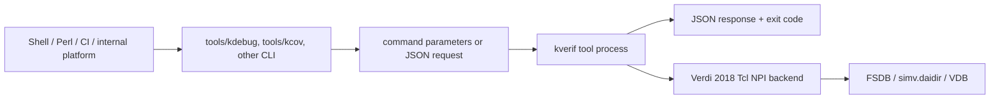
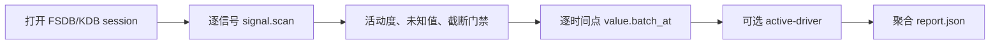

# kverif CLI 二次开发使用指导手册

本文面向需要用 Shell、Perl、Python、Ruby、Go、CI 流水线或内部平台调用
kverif 的验证工程师。二次开发不使用语言 SDK，也不导入 kverif 内部模块。
调用方只需要执行工具命令、传入参数，并解析 `--json` 输出。

典型用途包括：

- 基于 FSDB 编写波形活动度、异常窗口和协议检查脚本。
- 基于 VCS `-kdb` 生成的 `simv.daidir` 追踪模块端口和集成连线。
- 比较多轮 VDB，判断 coverage 增量、平台期和回归准入条件。
- 把 kverif 接入 Makefile、回归脚本、LSF、CI 或公司内部任务系统。
- 在不破坏 Verdi 2018 兼容性的前提下增加新的 kdebug/kcov action。

## 1. 二次开发契约

kverif 对外稳定接口由四部分组成：

| 接口 | 用途 | 示例 |
| --- | --- | --- |
| 可执行命令 | 语言无关的调用入口 | `/home/host/kverif/tools/kdebug` |
| 命令参数 | 常用查询和简单自动化 | `value-at --fsdb ... --signal ... --time ...` |
| JSON request/response | 复杂参数、可重放请求和结构化结果 | `kdebug --json request.json` |
| 退出码 | 流程控制和 CI 判定 | `0` 成功，非 `0` 失败 |

二次开发脚本不应依赖：

- kdebug、kcov 或 MCP 的 Python/C++ 内部模块。
- Tcl backend 的私有 procedure。
- Verdi NPI 动态库或头文件。
- 人类可读 `kout` 文本的列宽、缩进或措辞。

只要命令、参数和 JSON action 契约保持兼容，调用脚本可以使用任何语言。

## 2. 架构与边界



职责边界：

| 层 | 负责 | 不负责 |
| --- | --- | --- |
| 项目脚本 | 项目规则、阈值、报告路径、重试和退出码 | NPI 数据访问 |
| kverif CLI | 参数校验、JSON 契约、session、过滤、导出 | 项目专有准入策略 |
| Tcl backend | 真实 FSDB/KDB/VDB 查询 | 项目流程编排 |
| MCP | AI Agent 工具适配 | 普通外部脚本的必要依赖 |

## 3. 相关目录

```text
kverif/
  tools/                              稳定命令入口
  examples/secondary_development/
    sh/                               Bash 直接调用示例
    csh/                              csh/tcsh 直接调用示例
    perl/                             Perl 直接调用示例
    py/                               Python subprocess 直接调用示例
    fixtures/fsdb_handshake/          RTL、testbench、真实 FSDB 和信号 manifest
    tests/                            无 EDA 的 CLI 合约测试
  kdebug/
    specs/actions/actions.yaml        action catalog
    schemas/v1/actions/               action-specific JSON schema
    examples/requests/                可重放 request
    examples/responses/               response 示例
    tcl_engine/                       Verdi Tcl NPI backend
  kcov/
    kcov/cli.py                       参数式和 JSON CLI
    tcl_engine/kcov_npi.tcl           coverage Tcl NPI backend
  doc/                                用户与二次开发文档
```

## 4. VM 环境准备

以下命令以普通用户 `host` 为例：

```bash
id -un
# 期望: host

export KVERIF_HOME=/home/host/kverif
export PATH="$KVERIF_HOME/tools:$PATH"

export VERDI_HOME=/home/synopsys/verdi/Verdi_O-2018.09-SP2
export VCS_HOME=/home/synopsys/vcs/O-2018.09-SP2
export VCS_TARGET_ARCH=linux64
export PATH="$VERDI_HOME/bin:$VCS_HOME/bin:$PATH"

# tools/kcov 需要 Python，但调用脚本不需要导入任何 kverif Python 包。
export PYTHON=/home/host/kverif/.venv38/bin/python
export KVERIF_JSON_PYTHON=/usr/bin/python3

# license 只由运行环境提供，不要写进脚本、日志或报告。
test -n "${LM_LICENSE_FILE:-}" || echo "LM_LICENSE_FILE is not set"
test -n "${SNPSLMD_LICENSE_FILE:-}" || echo "SNPSLMD_LICENSE_FILE is not set"
```

固定部署时推荐使用绝对路径：

```bash
KDEBUG=/home/host/kverif/tools/kdebug
KCOV=/home/host/kverif/tools/kcov
KBIT=/home/host/kverif/tools/kbit
```

### 4.1 跨设备部署边界

二次开发示例的控制层可复制到仓库外运行。复制时保留完整目录结构：

```text
secondary_development/
  sh/ csh/ perl/ py/
  fixtures/fsdb_handshake/
  json_response.py
```

不要只复制 `sh/regression_triage.sh`，因为它需要同目录的三个子流程；也不要只复制
Bash/csh/Perl 脚本而遗漏 `json_response.py`。这些脚本按自身文件位置找依赖，不按
当前工作目录找依赖，因此可以从项目目录、LSF scratch 目录或 CI workspace 启动。

控制脚本可移植不等于 EDA backend 可省略。真实执行矩阵如下：

| 查询 | 目标设备必须具备 |
| --- | --- |
| FSDB 波形 | 可执行 `kdebug`、兼容 Verdi、真实 FSDB、license |
| KDB 连线 | 可执行 `kdebug`、与本次构建匹配的 `simv.daidir`、兼容 Verdi/VCS、license |
| VDB coverage | 可执行 `kcov`、真实 VDB、兼容 coverage 环境、license |
| 假 CLI 合约 | Bash、Python 3、Perl；csh 用例在安装 csh/tcsh 时执行，不需要 EDA/license |

### 4.2 命令和 helper 发现顺序

所有示例采用一致的覆盖规则：

| 入口 | 从高到低的优先级 |
| --- | --- |
| `kdebug` | `--kdebug-bin`、`KDEBUG_BIN`、`$KVERIF_HOME/tools/kdebug`、仓库相对路径、`PATH` |
| `kcov` | `--kcov-bin`、`KCOV_BIN`、`$KVERIF_HOME/tools/kcov`、仓库相对路径、`PATH` |
| helper Python | `--json-python`、`KVERIF_JSON_PYTHON`、`PYTHON`、PATH 中的 `python3/python` |
| JSON helper | `--json-helper`、`KVERIF_JSON_HELPER`、脚本旁的 `../json_response.py`、`KVERIF_HOME` 下的副本 |

显式选项或对应环境变量一旦给出，就视为用户配置；路径不可执行时直接报错，不会静默
换成另一个工具。`KVERIF_HOME` 和仓库相对候选不存在时才继续查 `PATH`。

### 4.3 随库真实 FSDB fixture

为避免所有示例都依赖用户事先准备 `/data/run/waves.fsdb`，仓库提供：

```text
/home/host/kverif/examples/secondary_development/fixtures/fsdb_handshake/
  rtl/kverif_handshake_dut.sv
  tb/tb_kverif_handshake.sv
  waves.fsdb
  signal_manifest.json
  SHA256SUMS
  build_vcs.sh
```

FSDB 由上述 RTL/testbench 使用 VCS `O-2018.09-1_Full64` 和 Verdi
`Verdi_O-2018.09-SP2` 真实生成，不是空文件或 mock。文件大小为 9,107 字节，SHA-256
为 `f1c50e6e502f84450469932ceb7fe151057a06df02487840911b034134d38fb0`。该哈希只校验随库
预生成文件；重新生成的 FSDB 可能包含不同路径或时间元数据，应按 manifest 检查信号和值。

已验证的完整信号名：

| 信号 | 含义 |
| --- | --- |
| `tb_kverif_handshake.dut.req_valid` | 请求有效 |
| `tb_kverif_handshake.dut.req_ready` | 请求 ready |
| `tb_kverif_handshake.dut.req_fire` | `req_valid && req_ready` |
| `tb_kverif_handshake.dut.req_data` | 请求 payload |
| `tb_kverif_handshake.dut.rsp_valid` | 响应有效 |
| `tb_kverif_handshake.dut.rsp_data` | 变换后的响应数据 |
| `tb_kverif_handshake.dut.accepted_count` | 接收请求计数 |
| `tb_kverif_handshake.dut.state_q` | DUT 状态机 |
| `tb_kverif_handshake.dut.last_accepted_q` | 最近接收的数据 |

直接执行真实查询：

```bash
KVERIF_HOME=/home/host/kverif
FIXTURE=$KVERIF_HOME/examples/secondary_development/fixtures/fsdb_handshake

$KVERIF_HOME/tools/kdebug --json value-batch \
  --fsdb $FIXTURE/waves.fsdb \
  --signal tb_kverif_handshake.dut.req_fire \
  --signal tb_kverif_handshake.dut.rsp_data \
  --signal tb_kverif_handshake.dut.accepted_count \
  --time 95ns --format hex
```

实测应得到 `accepted_count=4`、`rsp_data=ec`。`signal_manifest.json` 还记录了全部 11 个
信号的位宽、变化次数和 45/55/75/95ns 检查点。需要 KDB 时，在目标设备运行
`bash $FIXTURE/build_vcs.sh`，使用生成的 `$FIXTURE/build/simv.daidir`；不要跨机器复用
预编译 daidir。

### 4.4 跨设备调用示例

PATH-only 搬迁示例：

```bash
cp -R /opt/kverif/examples/secondary_development \
  "/work/shared verification/kverif examples"
export PATH="/opt/kverif/tools:$PATH"

cd /work/project-a
bash "/work/shared verification/kverif examples/sh/module_connectivity.sh" \
  --daidir /data/build/simv.daidir \
  --signal tb_top.dut.req_valid --require-edge --require-complete \
  --out "/work/project-a/reports/connectivity result"
```

完全显式的 CI 调用：

```bash
bash "/work/shared verification/kverif examples/sh/regression_triage.sh" \
  --kdebug-bin /opt/kverif/tools/kdebug \
  --kcov-bin /opt/kverif/tools/kcov \
  --json-python /usr/bin/python3 \
  --json-helper "/work/shared verification/kverif examples/json_response.py" \
  --fsdb /data/run/waves.fsdb --daidir /data/run/simv.daidir \
  --vdb /data/run/simv.vdb --signal tb_top.dut.valid \
  --begin 0ns --end 1us --out /data/run/triage
```

## 5. 三种调用方式

### 5.1 参数式命令

适合常用操作，Shell 中最直观：

```bash
/home/host/kverif/tools/kdebug --json value-at \
  --fsdb /data/run/waves.fsdb \
  --signal tb.dut.ready \
  --time 100ns \
  --format hex \
  > /data/run/value-at.json

/home/host/kverif/tools/kcov --json cov-holes \
  --vdb /data/run/simv.vdb \
  --metrics line,toggle,branch \
  --max-items 50 \
  > /data/run/coverage-holes.json
```

参数必须作为独立 argv 传递。不要使用 `eval`，也不要把数据库路径和信号名拼成
一条未经引用的字符串。

### 5.2 原始 JSON request

复杂 action 使用 JSON 文件或 stdin。JSON 是工具参数的结构化表达，不是额外的
波形输入文件；FSDB、daidir 和 VDB 仍然是实际 EDA 数据库。

```json
{
  "api_version": "kdebug.v1",
  "request_id": "project-query-001",
  "action": "signal.scan",
  "target": {"fsdb": "/data/run/waves.fsdb"},
  "args": {
    "signal": "tb.dut.ready",
    "begin": "0ns",
    "end": "1us",
    "format": "hex"
  },
  "limits": {"max_rows": 200},
  "output": {"format": "json", "verbosity": "compact"}
}
```

```bash
/home/host/kverif/tools/kdebug --json /data/run/signal-scan.request.json \
  > /data/run/signal-scan.response.json

printf '%s\n' '{"api_version":"kdebug.v1","action":"actions","args":{}}' \
  | /home/host/kverif/tools/kdebug --json - \
  > /data/run/actions.json
```

使用 runtime schema 确认参数，不要根据字段名猜测：

```bash
kdebug --json actions > /tmp/kdebug-actions.json
kdebug --json schema --action signal.scan --kind request \
  > /tmp/signal-scan-schema.json
kcov --json schema --action cov.holes --kind request \
  > /tmp/cov-holes-schema.json
```

### 5.3 命名 session

多个命令复用同一个大数据库时，先打开 session，再传 `--session` 查询，最后关闭。
session 由工具维护，因此调用方仍然只是执行普通命令。

```bash
KDEBUG=/home/host/kverif/tools/kdebug
SESSION="project_wave_$$"

cleanup() {
  "$KDEBUG" --json session-close --session "$SESSION" \
    > /tmp/kdebug-close.json 2>/tmp/kdebug-close.stderr || true
}
trap cleanup EXIT INT TERM

"$KDEBUG" --json session-open \
  --name "$SESSION" \
  --fsdb /data/run/waves.fsdb \
  > /tmp/kdebug-open.json

"$KDEBUG" --json value-batch \
  --session "$SESSION" \
  --signal tb.dut.valid \
  --signal tb.dut.ready \
  --time 100ns \
  --format hex \
  > /tmp/kdebug-values.json
```

长期服务或高频请求也可直接驱动 `--stdio-loop` JSONL 进程。其 stdout 每行都是
协议消息，首行是 `type:"ready"`，随后请求与响应按 `request_id`/`id` 关联。
Bash/csh/Perl/Python 若不需要长期单进程，优先使用命名 session，生命周期更容易处理。

## 6. 输出与错误处理

### 6.1 不要只看退出码

调用脚本应同时检查：

1. 进程退出码是否为 `0`。
2. stdout 是否为合法 JSON object。
3. JSON 顶层 `.ok` 是否为 `true`。
4. `.warnings`、`.summary.truncated` 或 action-specific 截断字段。

Bash：

```bash
output=/data/run/result.json
stderr_file=/data/run/result.stderr

if ! /home/host/kverif/tools/kdebug --json value-at \
    --fsdb /data/run/waves.fsdb \
    --signal tb.dut.ready --time 100ns \
    >"$output" 2>"$stderr_file"; then
  echo "tool process failed; see $stderr_file" >&2
  exit 1
fi

python3 /home/host/kverif/examples/secondary_development/json_response.py \
  check-ok "$output" || {
  echo "tool returned ok=false; see $output" >&2
  exit 1
}
```

不要用 `grep '"ok": true'` 解析 JSON。字段顺序、空白和 pretty-print 设置都可能变化。

### 6.2 推荐项目退出码

| 退出码 | 建议含义 |
| --- | --- |
| `0` | 查询成功且项目规则通过 |
| `1` | 工具执行或 JSON response 失败 |
| `2` | 调用脚本参数、路径或依赖错误 |
| `3` | 工具查询成功，但 coverage/checker 准入未通过 |
| `130` | 用户中断 |

### 6.3 stdout/stderr

- `--json` 的 stdout 只用于机器结果。
- 日志和诊断写 stderr 或独立日志文件。
- 先写临时文件，再原子移动为最终报告，避免下游读到半个 JSON。
- 大结果使用 `limits`、`--max-items` 或工具导出能力，不要无限扩大 stdout。

## 7. Bash 调用模式

使用 Bash array 保留参数边界：

```bash
cmd=(/home/host/kverif/tools/kdebug --json value-batch --fsdb /data/run/waves.fsdb)
for signal in tb.dut.valid tb.dut.ready tb.dut.data; do
  cmd+=(--signal "$signal")
done
cmd+=(--time 100ns --format hex)
"${cmd[@]}" > /data/run/value-batch.json
```

仓库提供五个完整 Bash 示例：

```text
examples/secondary_development/sh/waveform_window.sh
examples/secondary_development/sh/module_connectivity.sh
examples/secondary_development/sh/coverage_convergence.sh
examples/secondary_development/sh/regression_triage.sh
examples/secondary_development/sh/signal_health.sh
```

它们只使用命令、参数、JSON 和退出码，不导入项目代码。仓库附带的
`json_response.py` 仅以独立进程调用 Python 标准库校验结果，不是可导入 SDK，
也不要求 VM 安装 `jq` 或 CPAN 模块。

## 8. 跨语言调用和结论生成

### 8.1 Perl list-form 调用

Perl 使用 list form 启动命令，避免经过 shell 二次解释：

```perl
my @cmd = (
    '/home/host/kverif/tools/kdebug', '--json', 'value-at',
    '--fsdb', '/home/host/kverif/examples/secondary_development/fixtures/fsdb_handshake/waves.fsdb',
    '--signal', 'tb_kverif_handshake.dut.rsp_data',
    '--time', '95ns',
);

open my $pipe, '-|', @cmd or die "cannot start kdebug: $!\n";
local $/;
my $text = <$pipe>;
close $pipe;
my $rc = $? >> 8;
die "kdebug failed rc=$rc\n" if $rc != 0;

my $output = '/data/run/value-at.json';
open my $fh, '>', $output or die "cannot write $output: $!\n";
print {$fh} $text;
close $fh;

```

完整的 session、清理和多信号示例：

```bash
perl /home/host/kverif/examples/secondary_development/perl/waveform_window.pl \
  --fsdb /home/host/kverif/examples/secondary_development/fixtures/fsdb_handshake/waves.fsdb \
  --signal tb_kverif_handshake.dut.req_valid \
  --signal tb_kverif_handshake.dut.rsp_data \
  --begin 0ns --end 125ns \
  --time 45ns --time 95ns \
  --out /data/run/wave-perl
```

该示例只使用 Perl 核心模块，不需要安装 CPAN 包。需要读取业务字段时，
`signal_health.pl` 会启动仓库内独立的标准库 JSON helper，读取三个 summary 字段，
随后由 Perl 自身比较阈值并生成结论：

```bash
KDEBUG_BIN=/home/host/kverif/tools/kdebug \
KVERIF_JSON_PYTHON=/usr/bin/python3 \
perl /home/host/kverif/examples/secondary_development/perl/signal_health.pl \
  --fsdb /home/host/kverif/examples/secondary_development/fixtures/fsdb_handshake/waves.fsdb \
  --signal tb_kverif_handshake.dut.accepted_count \
  --begin 0ns --end 125ns --min-changes 5 --max-unknown 0 --require-complete \
  --out /data/run/conclusions/perl
```

### 8.2 csh/tcsh 调用

csh 没有可靠的内建 JSON parser，因此脚本不要使用 `grep` 猜字段。示例把完整
response 保存到文件，通过独立 helper 读取 `change_count`、`unknown_count` 和
`truncated`，再由 csh 的 `if/else` 规则得出项目结论：

```csh
setenv KDEBUG_BIN /home/host/kverif/tools/kdebug
setenv KVERIF_JSON_PYTHON /usr/bin/python3

csh /home/host/kverif/examples/secondary_development/csh/signal_health.csh \
  --fsdb /home/host/kverif/examples/secondary_development/fixtures/fsdb_handshake/waves.fsdb \
  --signal tb_kverif_handshake.dut.accepted_count \
  --begin 0ns --end 125ns --min-changes 5 --max-unknown 0 --require-complete \
  --out /data/run/conclusions/csh
```

### 8.3 Python subprocess 调用

Python 示例只使用标准库。`subprocess.run()` 启动 `tools/kdebug`，`json.load()`
读取 response，然后脚本自己的 `classify()` 函数产生结论；它没有导入任何 kverif
内部模块：

```bash
KDEBUG_BIN=/home/host/kverif/tools/kdebug \
/usr/bin/python3 /home/host/kverif/examples/secondary_development/py/signal_health.py \
  --fsdb /home/host/kverif/examples/secondary_development/fixtures/fsdb_handshake/waves.fsdb \
  --signal tb_kverif_handshake.dut.accepted_count \
  --begin 0ns --end 125ns --min-changes 5 --max-unknown 0 --require-complete \
  --out /data/run/conclusions/python
```

### 8.4 四语言统一结论合同

Bash、csh、Perl 和 Python 的 `signal_health` 示例共享同一参数和报告合同：

| 参数 | 默认值 | 作用 |
| --- | --- | --- |
| `--fsdb FILE` | 无 | kdebug 的真实 FSDB 输入 |
| `--signal NAME` | 无 | 需要评价的完整信号层次名 |
| `--begin/--start TIME` | 无 | `signal.scan` 起点 |
| `--end/--stop TIME` | 无 | `signal.scan` 终点 |
| `--max-rows N` | `200` | 工具最大返回行数 |
| `--min-changes N` | `1` | 最少变化次数 |
| `--max-unknown N` | `0` | 最大 X/Z 次数 |
| `--require-complete` | 关闭 | 开启后禁止截断 response |
| `--kdebug-bin CMD` | 自动发现 | 显式指定 kdebug，可用路径或 PATH 中的命令名 |
| `--json-python CMD` | 自动发现 | Bash/csh/Perl：显式指定运行 JSON helper 的 Python 3 |
| `--json-helper FILE` | 脚本相对路径 | Bash/csh/Perl：显式指定独立 JSON helper 文件；Python 示例不接受这两个选项 |
| `--out DIR` | 无 | 原始 response 和派生报告目录 |

处理优先级是 `INCOMPLETE`、`UNKNOWN_VALUES`、`INACTIVE`、`HEALTHY`。每个脚本
保存原始 `tool-response.json`，并生成 `kverif.example.signal-health.v1`
`conclusion.json`。成功结论返回 `0`，工具/JSON 失败返回 `1`，参数错误返回 `2`，
查询成功但派生门禁不通过返回 `3`。

## 9. 四类可复用二次开发工作流

本章示例不是只有一条查询命令的 smoke，而是可以直接拆入项目回归的完整流程。它们都包含：

1. 参数校验和安全的 argv 传递。
2. 原始工具 response 归档。
3. JSON 结构校验和跨查询聚合。
4. 项目门禁、明确退出码和中断清理。
5. 不导入任何 kverif 语言包，只启动 `tools/` 下的命令。

### 9.1 多信号波形窗口与 active-driver 联合分析

脚本：`examples/secondary_development/sh/waveform_window.sh`

处理流程：



| 参数 | 必需 | 含义 |
| --- | --- | --- |
| `--fsdb FILE` | 是 | 原始 FSDB 波形文件，不是 JSON 文件 |
| `--signal NAME` | 是，可重复 | 需要扫描和批量采样的完整信号层次名 |
| `--begin/--start TIME` | 是 | 扫描窗口起点，例如 `0ns` |
| `--end/--stop TIME` | 是 | 扫描窗口终点，例如 `1us` |
| `--time TIME` | 否，可重复 | 在指定时间点执行一次多信号 `value.batch_at` |
| `--daidir DIR` | 条件必需 | active-driver 所需的 VCS `-kdb` elaboration 库 |
| `--active-signal NAME` | 条件必需 | 需要做动态因果分析的信号 |
| `--active-time TIME` | 条件必需 | active-driver 采样时间；必须与 `--active-signal`、`--daidir` 同时使用 |
| `--max-rows N` | 否 | 每个 `signal.scan` 最大返回行数，默认 `200` |
| `--min-changes N` | 否 | 每个信号最少变化次数，低于该值时门禁失败，默认 `0` |
| `--max-unknown N` | 否 | 每个信号允许的最大 X/Z 次数；不传则不检查 |
| `--require-complete` | 否 | 发现 scan 截断时门禁失败 |
| `--kdebug-bin CMD` | 否 | 覆盖 kdebug 自动发现结果 |
| `--json-python CMD`、`--json-helper FILE` | 否 | 覆盖 JSON helper 运行入口和文件 |
| `--out DIR` | 是 | 原始 response、日志和聚合报告目录 |

复杂调用示例：

```bash
export KDEBUG_BIN=/home/host/kverif/tools/kdebug
export KVERIF_JSON_PYTHON=/usr/bin/python3

bash /home/host/kverif/examples/secondary_development/sh/waveform_window.sh \
  --fsdb /data/regress/case_104/waves.fsdb \
  --daidir /data/regress/case_104/simv.daidir \
  --signal tb_top.dut.req_valid \
  --signal tb_top.dut.req_ready \
  --signal tb_top.dut.req_payload \
  --begin 900ns --end 1300ns \
  --time 980ns --time 1040ns --time 1120ns \
  --active-signal tb_top.dut.req_ready --active-time 1040ns \
  --max-rows 2000 --min-changes 1 --max-unknown 0 --require-complete \
  --out /data/regress/case_104/kverif/waveform
```

| 产物 | 内容 |
| --- | --- |
| `session.open.json`、`session.close.json` | session 生命周期证据 |
| `scan.<signal>.json` | 每个信号完整 `signal.scan` response |
| `sample.<time>.json` | 每个采样点的多信号值 |
| `active-driver.json` | 可选的动态 driver、控制条件和 trace |
| `signals.ndjson` | 每行一个信号的活动度摘要，便于流式处理 |
| `gate-errors.txt` | 所有门禁失败原因，不只保留第一个错误 |
| `report.json` | `kverif.cli.waveform-window.v2` 聚合报告 |

工具执行或 JSON 校验失败时退出 `1`；参数错误退出 `2`；查询成功但项目门禁失败退出 `3`。

### 9.2 模块 driver/load/graph 集成连线审计

脚本：`examples/secondary_development/sh/module_connectivity.sh`

该流程对每个信号同时查询静态 driver、可选 load 和依赖图。它用于检查新模块接入、端口重命名、wrapper 连线遗漏，以及综合网表前的 RTL 集成关系。

| 参数 | 必需 | 含义 |
| --- | --- | --- |
| `--daidir DIR` | 是 | VCS 使用 `-kdb` 构建后生成的 `simv.daidir` |
| `--signal NAME` | 是，可重复 | elaboration 后的完整信号层次名 |
| `--max-depth N` | 否 | 依赖图最大追踪深度，默认 `6` |
| `--max-items N` | 否 | driver/load/graph 最大返回项数，默认 `200` |
| `--no-loads` | 否 | 跳过 fanout/load 查询，缩短只查 driver 的任务 |
| `--require-edge` | 否 | 任一信号没有 driver edge 时门禁失败 |
| `--require-complete` | 否 | 任一依赖图被截断时门禁失败 |
| `--kdebug-bin CMD` | 否 | 覆盖 kdebug 自动发现结果 |
| `--json-python CMD`、`--json-helper FILE` | 否 | 覆盖 JSON helper 运行入口和文件 |
| `--out DIR` | 是 | 查询 response 和聚合报告目录 |

复杂调用示例：

```bash
export KDEBUG_BIN=/home/host/kverif/tools/kdebug
export KVERIF_JSON_PYTHON=/usr/bin/python3

bash /home/host/kverif/examples/secondary_development/sh/module_connectivity.sh \
  --daidir /data/build/simv.daidir \
  --signal tb_top.soc.core0.lsu.req_valid \
  --signal tb_top.soc.core0.lsu.req_ready \
  --signal tb_top.soc.core0.lsu.req_bits_addr \
  --max-depth 10 --max-items 1000 \
  --require-edge --require-complete \
  --out /data/build/reports/lsu-connectivity
```

每个信号生成 `driver.*.json`、`load.*.json` 和 `graph.*.json`。`signals.ndjson` 保存每个信号的 driver/load/graph 摘要，`report.json` 使用
`kverif.cli.module-connectivity.v2` schema，`gate-errors.txt` 保存集成门禁失败原因。

此场景必须使用 KDB/daidir。FSDB 只保存随时间变化的波形值，不包含完整静态 elaboration 连接关系。信号应使用 elaboration 后的实例路径，而不是 RTL module type 名称。

### 9.3 多轮 VDB 覆盖率收敛与防回退门禁

脚本：`examples/secondary_development/sh/coverage_convergence.sh`

脚本按 `--run` 顺序比较多轮 VDB，计算 covered/coverable 加权覆盖率、相邻轮增量、平台期和最终 hole 数量。它不仅判断“是否超过 95%”，还可以阻止覆盖率回退或长期无增长。

| 参数 | 必需 | 含义 |
| --- | --- | --- |
| `--run LABEL=VDB` | 是，可重复 | 一轮 coverage 结果；顺序就是趋势时间顺序，label 应唯一 |
| `--metrics LIST` | 否 | 逗号分隔 metric，默认 `line,toggle,branch` |
| `--hole-limit N` | 否 | 每轮归档的 hole 最大数量，默认 `50` |
| `--plateau-epsilon PCT` | 否 | 相邻轮绝对增量不大于该百分点时标记 plateau，默认 `0.01` |
| `--fail-under PCT` | 否 | 最终加权覆盖率最低阈值 |
| `--max-final-holes N` | 否 | 最后一轮最大允许 hole 数 |
| `--max-regression PCT` | 否 | 任一相邻轮允许的最大负向回退百分点 |
| `--require-growth` | 否 | 有多轮数据时，要求至少一轮产生正增量 |
| `--fake` | 否 | 使用 kcov 内置数据做无 EDA 合约测试 |
| `--kcov-bin CMD` | 否 | 覆盖 kcov 自动发现结果 |
| `--json-python CMD`、`--json-helper FILE` | 否 | 覆盖 JSON helper 运行入口和文件 |
| `--out DIR` | 是 | 每轮 response、NDJSON 和收敛报告目录 |

复杂调用示例：

```bash
export KCOV_BIN=/home/host/kverif/tools/kcov
export PYTHON=/home/host/kverif/.venv38/bin/python
export KVERIF_JSON_PYTHON=/usr/bin/python3

bash /home/host/kverif/examples/secondary_development/sh/coverage_convergence.sh \
  --run smoke=/regress/20260714/smoke/simv.vdb \
  --run nightly=/regress/20260715/nightly/simv.vdb \
  --run closure=/regress/20260716/closure/simv.vdb \
  --metrics line,toggle,branch,condition \
  --hole-limit 500 --plateau-epsilon 0.05 \
  --fail-under 95 --max-final-holes 100 \
  --max-regression 0.10 --require-growth \
  --out /regress/reports/coverage-convergence
```

| 产物 | 内容 |
| --- | --- |
| `<label>.summary.json` | 每轮 `cov-summary` 原始 response |
| `<label>.holes.json` | 每轮 `cov-holes` 原始 response |
| `runs.ndjson` | 每轮一行，含覆盖率、delta、plateau、hole 数及原始文件路径 |
| `convergence.json` | `kverif.cli.coverage-convergence.v1` 趋势和全部 gate 配置 |

任一 coverage gate 失败时退出 `3`。无 EDA smoke 可运行：

```bash
bash /home/host/kverif/examples/secondary_development/sh/coverage_convergence.sh \
  --run base=fake --run next=fake --fake \
  --fail-under 0 --max-final-holes 1000 \
  --out /tmp/kverif-coverage-fake
```

### 9.4 FSDB、KDB、VDB 跨工具回归分诊

脚本：`examples/secondary_development/sh/regression_triage.sh`

这个入口把前三类分析组合成一次回归分诊。波形活动度通过后，继续验证静态连线，再检查当前 VDB 准入，最终形成一个可供 CI、邮件机器人或问题单系统消费的统一 JSON。

| 参数 | 必需 | 含义 |
| --- | --- | --- |
| `--fsdb FILE` | 是 | 失败用例 FSDB |
| `--daidir DIR` | 是 | 与该构建对应的 KDB/daidir |
| `--vdb DIR` | 是 | 当前回归 VDB |
| `--signal NAME` | 是，可重复 | 同时参加波形和静态连线检查的信号 |
| `--begin/--start TIME`、`--end/--stop TIME` | 是 | 波形分析窗口 |
| `--time TIME` | 否，可重复 | 需要归档的多信号采样点 |
| `--metrics LIST` | 否 | coverage metric，默认 `line,toggle,branch` |
| `--fail-under PCT` | 否 | 最终 coverage 最低阈值 |
| `--max-final-holes N` | 否 | 最大最终 hole 数 |
| `--min-changes N` | 否 | 波形最少变化次数，默认 `1` |
| `--active-signal NAME`、`--active-time TIME` | 否，成对使用 | 增加 active-driver 动态因果证据 |
| `--kdebug-bin CMD`、`--kcov-bin CMD` | 否 | 覆盖两个工具的自动发现结果，并传给子流程 |
| `--json-python CMD`、`--json-helper FILE` | 否 | 覆盖 helper 配置，并传给子流程 |
| `--out DIR` | 是 | 三个子报告和统一报告目录 |

```bash
export KDEBUG_BIN=/home/host/kverif/tools/kdebug
export KCOV_BIN=/home/host/kverif/tools/kcov
export PYTHON=/home/host/kverif/.venv38/bin/python
export KVERIF_JSON_PYTHON=/usr/bin/python3

bash /home/host/kverif/examples/secondary_development/sh/regression_triage.sh \
  --fsdb /regress/fail_104/waves.fsdb \
  --daidir /regress/fail_104/simv.daidir \
  --vdb /regress/fail_104/simv.vdb \
  --signal tb_top.dut.req_valid \
  --signal tb_top.dut.req_ready \
  --begin 900ns --end 1300ns \
  --time 980ns --time 1040ns --time 1120ns \
  --active-signal tb_top.dut.req_ready --active-time 1040ns \
  --min-changes 1 --metrics line,toggle,branch \
  --fail-under 95 --max-final-holes 100 \
  --out /regress/fail_104/kverif-triage
```

最终目录包含：

```text
kverif-triage/
  waveform/       FSDB scan、采样、active-driver 和波形 gate
  connectivity/   driver/load/graph 和连线 gate
  coverage/       当前 VDB summary、holes 和 coverage gate
  report.json     kverif.cli.regression-triage.v1 统一索引
```

项目二次开发时，可以在统一报告之后继续调用缺陷分类、HTML 渲染、数据库写入或通知命令。应保留前三个子报告作为可追溯证据，不要只保存最终一个布尔值。

## 10. 独立 CLI 参数与功能参考

本章集中列出二次开发会直接调用的公开命令。示例统一把工具变量设置为绝对路径；`"$KDEBUG"` 等写法在 Shell 展开后仍然是绝对路径调用，不依赖当前目录或交互式 `PATH`。

### 10.1 查阅约定

```bash
KVERIF_HOME=/home/host/kverif
KDEBUG="$KVERIF_HOME/tools/kdebug"
KCOV="$KVERIF_HOME/tools/kcov"
KBIT="$KVERIF_HOME/tools/kbit"
KENTRY="$KVERIF_HOME/tools/kentry"
KLOC="$KVERIF_HOME/tools/kloc"
KBERIF="$KVERIF_HOME/tools/kberif"
KSVA="$KVERIF_HOME/tools/ksva"
KEDA_RUNNER="$KVERIF_HOME/tools/keda-runner"
```

| 记号 | 含义 |
| --- | --- |
| `<value>` | 必需位置参数或参数值，调用时不保留尖括号 |
| `[option]` | 可选参数 |
| `可重复` | 参数可以出现多次，每次必须是独立 argv |
| `key=value` | 通用结构化参数；不要用 `eval` 拼接 |
| `--json` | 查询内容不变，只把 stdout 切换为机器可解析 JSON |
| stdout | `--json` 时只保存 response；不要把诊断日志混入该文件 |
| stderr | 诊断、后端日志或调用失败原因 |

`kdebug` 和 `kcov` 的通用 `key=value` 会识别字符串、整数、浮点数、`true`、`false`、`null`；值以 `[` 或 `{` 开头时会尝试解析为 JSON 数组或对象。包含空格、glob、方括号或 SystemVerilog 字面量时，应整体加引号。

### 10.2 kdebug：FSDB 波形和 KDB 静态因果查询

**功能和输入**

| 输入 | 用途 |
| --- | --- |
| `--fsdb FILE` | scope、值、事件、统计、协议和窗口类波形查询 |
| `--daidir DIR` | driver、load、source、graph、FSM 等静态设计查询 |
| `--fsdb + --daidir` | 某个时间点的 active-driver 联合分析 |
| `--session ID` | 复用已经加载的数据库，适合一个脚本内的多次查询 |

默认 stdout 为 kout。增加 `--json` 后，response 顶层通常包含 `ok`、`action`、`request_id`、`summary`、`data`、`warnings`；失败时包含 `error.code`、`error.message` 和可选 detail。工具成功且 `ok=true` 返回 `0`，请求或后端失败返回非零。

**全部快捷参数**

| 参数 | 写入位置 | 功能 |
| --- | --- | --- |
| `--json` | `output.format=json` | 输出完整 JSON response；可放在子命令前或后 |
| `--text/--kout` | 输出选择 | 强制输出 kout 文本 |
| `--session/--session-id ID` | `target.session_id` | 复用命名 session |
| `--name ID` | `args.name` | `session-open` 的 session 名 |
| `--fsdb FILE` | `target.fsdb` | 指定原始 FSDB |
| `--daidir DIR` | `target.daidir` | 指定 `simv.daidir` |
| `--signal NAME` | `args.signal` | 单信号；在 `value-batch` 中可重复并组成 `args.signals` |
| `--signals A,B,C` | `args.signals` | 逗号分隔的多信号列表 |
| `--time/--at TIME` | `args.time` | 波形时间；active-driver 自动写为 `requested_time` |
| `--requested-time TIME` | `args.requested_time` | 显式设置 active-driver 查询时间 |
| `--format/--radix NAME` | `args.format/radix` | 值显示格式，常用 `bin`、`hex`、`dec` |
| `--path PATH` | `args.path` | 层次或源码路径参数 |
| `--scope PATH` | `args.scope` | 查询范围；`scope-list` 中也作为 path |
| `--kind request/response` | `args.kind` | `schema` 返回 request 或 response schema |
| `--action NAME` | `args.action` | `schema` 所查询的 action |
| `--transport uds/tcp/file` | `args.transport` | session transport，普通同机调用优先 `uds` |
| `--host HOST` | `args.host` | TCP 客户端可达地址 |
| `--bind-host HOST` | `args.bind_host` | TCP daemon 监听地址 |
| `--port N` | `args.port` | TCP 端口；`0` 可请求自动分配 |
| `--include-source` | `args.include_source=true` | 返回源码证据 |
| `--include-trace` | `args.include_trace=true` | 返回追踪过程 |
| `--include-control` | `args.include_control=true` | 返回 active-driver 控制条件 |
| `--include-raw` | `args.include_raw=true` | 返回较原始后端字段，结果会明显增大 |
| `--verbosity compact/full/debug` | `output.verbosity` | 控制 response 详细度 |
| `--max-rows N` | `limits.max_rows` | 限制波形行或列表行数 |
| `--max-results/--max-items N` | `limits.max_results/max_items` | 限制返回项数 |
| `--max-depth N` | `limits.max_depth`、`args.max_depth` | 限制图和因果追踪深度 |
| `--timeout-ms N` | `limits.timeout_ms` | 仅在调用方明确需要时设置单请求期限 |
| `--arg KEY=VALUE` | `args` | 通用 action 参数，可重复，支持 dotted key |
| `--target KEY=VALUE` | `target` | 通用资源参数，可重复 |
| `--limit KEY=VALUE` | `limits` | 通用数量/深度限制，可重复 |
| `--output KEY=VALUE` | `output` | 通用输出控制，可重复 |

**子命令、功能和专用参数**

| 子命令 | 功能 | 必需/常用参数 |
| --- | --- | --- |
| `actions` | 列出运行时 action catalog | 无；可选 `--json` |
| `schema` | 返回某 action 的 request/response schema | `--action NAME`；可选 `--kind` |
| `session-open` | 加载 FSDB、KDB 或两者并启动可复用 session | `--name`；至少一个 `--fsdb/--daidir`；可选 transport 参数 |
| `session-list` | 列出当前用户的 debug session | 无 |
| `session-close` | 正常关闭 session | `--session` |
| `session-doctor` | 查询 session、daemon 和 transport 健康状态 | `--session` |
| `session-kill` | 强制终止无法正常关闭的 session | `--session` |
| `session-gc` | 清理陈旧 session | 可用 `--arg` 传 schema 支持的筛选条件 |
| `scope-list` | 列出 FSDB scope 层次 | `--fsdb` 或 `--session`；可选 `--path/--scope`、`--max-rows` |
| `value-at` | 查询一个信号在一个时间点的值 | 资源、`--signal`、`--time`；可选 `--format` |
| `value-batch` | 查询多个信号在同一时间点的值 | 资源、重复 `--signal` 或 `--signals`、`--time` |
| `trace-driver` | 查静态 driver edge | KDB 资源、`--signal`；常用 `--include-source` |
| `trace-graph` | 查 driver 方向依赖图 | KDB 资源、`--signal`；常用 `--max-depth`、`--include-trace` |
| `source-context` | 按源码文件和行号读取上下文 | `--arg file=PATH --arg line=N`；可选设计 session、`--max-rows` |
| `active-driver` | 联合波形时间和静态因果定位生效 driver | FSDB+KDB 或联合 session、`--signal`、`--time` |
| `active-driver-chain` | 递归追踪 active-driver 因果链 | active-driver 参数；常用 `--max-depth` |
| `action NAME` | 调用没有具名快捷命令的任意 action | action 名和对应 `--arg/--target/--limit/--output` |
| `log doctor` | 检查一个 session 的公共/engine 日志是否存在及文件大小 | `--session`；可选 `--json`，且 `log` 必须是第一个参数 |
| `log tail` | 汇总 tail 公共 action、stdio、lifecycle、transport 和 crash 日志 | `--session`；可选 `--lines N`，默认 `40` |
| `log bundle` | 打包 session 日志用于问题单或离线分析 | `--session --out FILE`；可选 `--redact` 生成脱敏 bundle |

**每个快捷子命令的例子**

```bash
KDEBUG=/home/host/kverif/tools/kdebug

"$KDEBUG" --json actions
"$KDEBUG" --json schema --action signal.scan --kind request

"$KDEBUG" --json session-open --name debug_104 \
  --fsdb /data/run/waves.fsdb --daidir /data/run/simv.daidir --transport uds
"$KDEBUG" --json session-list
"$KDEBUG" --json session-doctor --session debug_104

"$KDEBUG" --json scope-list --session debug_104 --path tb_top --max-rows 100
"$KDEBUG" --json value-at --session debug_104 \
  --signal tb_top.clk --time 100ns --format bin
"$KDEBUG" --json value-batch --session debug_104 \
  --signal tb_top.dut.valid --signal tb_top.dut.ready --time 1040ns --format hex
"$KDEBUG" --json trace-driver --session debug_104 \
  --signal tb_top.dut.ready --include-source --max-items 50
"$KDEBUG" --json trace-graph --session debug_104 \
  --signal tb_top.dut.ready --max-depth 8 --include-trace --max-items 200
"$KDEBUG" --json source-context --session debug_104 \
  --arg file=/data/project/rtl/ready_ctrl.sv --arg line=127 --max-rows 40
"$KDEBUG" --json active-driver --session debug_104 \
  --signal tb_top.dut.ready --time 1040ns --include-control --include-trace
"$KDEBUG" --json active-driver-chain --session debug_104 \
  --signal tb_top.dut.ready --time 1040ns --max-depth 6 --include-control

"$KDEBUG" --json action signal.scan --session debug_104 \
  --arg signal=tb_top.dut.valid --arg begin=900ns --arg end=1300ns \
  --arg format=hex --limit max_rows=500 --output verbosity=compact

"$KDEBUG" --json session-close --session debug_104
"$KDEBUG" --json session-kill --session debug_stuck
"$KDEBUG" --json session-gc

"$KDEBUG" log doctor --session debug_104 --json
"$KDEBUG" log tail --session debug_104 --lines 80
"$KDEBUG" log bundle --session debug_104 \
  --out /data/reports/debug_104.logs.tgz --redact
```

`log doctor/tail/bundle` 是本地日志辅助命令，不进入 action dispatcher。其调用顺序固定为
`kdebug log ...`；不能写成 `kdebug --json log doctor ...`。`tail` 输出人类文本，
`doctor --json` 输出结构化结果，`bundle` stdout 返回生成的 archive 路径。

`action NAME` 的字段不是靠文档猜测。先运行：

```bash
"$KDEBUG" --json schema --action signal.scan --kind request \
  > /tmp/signal.scan.request.schema.json
```

再把 schema 中的 `target`、`args`、`limits` 和 `output` 字段分别映射为对应通用参数。仓库内的 `kdebug/examples/requests/` 还提供可回放的复杂 action request。

### 10.3 kcov：VDB coverage 查询、过滤和导出

**功能和 session 行为**

`kcov` 读取 VCS/Verdi VDB。查询可以传 `--session ID` 复用已打开 session，也可以直接传 `--vdb DIR`；后一种写法会自动创建临时 session、执行查询并关闭，适合一次性脚本。`--fake` 只用于无 EDA 测试，不能替代真实回归结论。

默认输出 kout；`--json` 输出包含 `ok`、`action`、`summary`、`data`、`warnings` 或 `error` 的 response。导出命令还会在 summary 中返回 artifact 路径、格式和输出模式。

**公共查询参数**

| 参数 | 功能 |
| --- | --- |
| `--json` | 输出 JSON response；也可作为全局选项放在子命令前 |
| `--session/--session-id ID` | 使用已打开 coverage session |
| `--vdb DIR` | 指定真实 VDB；普通查询会使用临时 session |
| `--fake` | 使用内置 coverage 数据 |
| `--scope PATH` | 限定设计层次 |
| `--test NAME` | 限定 test；默认通常是 merged |
| `--metrics A,B,C` | metric 列表，例如 `line,toggle,branch,condition` |
| `--include GLOB` | include glob，可重复 |
| `--exclude GLOB` | exclude glob，可重复 |
| `--match-field FIELD` | glob 匹配字段，如 `full_name`、`name`、`file` |
| `--case-insensitive` | glob 匹配忽略大小写 |
| `--max-items N` | 最大内联或导出 item 数 |
| `--overflow MODE` | 超限策略：`truncate`、`error`、`to_file`、`summary_only` |
| `--output-mode MODE` | `inline`、`file`、`both` 或 `summary_only` |
| `--output-path PATH` | artifact 路径 |
| `--artifact-format FORMAT` | `json`、`ndjson`、`csv` 或 `md` |
| `--allow-absolute-path` | 允许 `--output-path` 使用绝对路径 |
| `--sort-by FIELD` | 排序字段 |
| `--sort-order asc/desc` | 排序方向 |
| `--arg KEY=VALUE` | 写入 action `args`，可重复并支持 dotted key |
| `--target KEY=VALUE` | 写入 request `target`，可重复 |

**子命令和专用参数**

| 子命令 | 功能 | 专用参数 |
| --- | --- | --- |
| `actions` | 列出 coverage action | 无 |
| `schema` | 返回 action schema | `--action NAME`；`--kind request/response` |
| `open` | 打开命名 VDB session | `--vdb`；可选 `--name`、`--fake`、`--reuse/--no-reuse`、`--reopen` |
| `status` | 查询 session 状态 | 必需 `--session` |
| `close` | 关闭 session | 必需 `--session` |
| `tests` | 列出 VDB 中 tests | session 或 VDB；可选公共过滤参数 |
| `metrics` | 列出可用 metrics | session 或 VDB；可选 `--scope`、`--test` |
| `scope-summary` | 查询一个 scope 的 metric 摘要 | `--scope`、`--metrics` |
| `scope-children` | 查询直接或递归子 scope | `--scope`；可选 `--recursive` |
| `scope-search` | 按 glob 搜索 scope | include/exclude/match/sort/limit 参数 |
| `cov-summary` | 计算 code coverage 汇总 | `--metrics`；可选 `--group-by` |
| `cov-holes` | 返回未覆盖 code objects | `--metrics` 及过滤、排序、限制参数 |
| `object-get` | 精确读取 coverage object | `--object/--name`；可选 `--include-children`、`--max-children` |
| `object-search` | 搜索 coverage object | include/exclude/match/sort/limit 参数 |
| `functional-summary` | functional coverage 汇总 | `--levels`；可选 `--group-by` |
| `functional-holes` | functional holes | `--levels` 及过滤、排序、限制参数 |
| `source-map` | 将源码文件/行映射到 coverage | `--file`、`--line`；可选 `--window` |
| `export-summary` | 导出 code coverage 摘要 | `--metrics`、`--group-by` 和输出参数 |
| `export-holes` | 导出 code coverage holes | `--metrics`、过滤参数和输出参数 |
| `export-scope-tree` | 导出 scope tree | `--recursive/--no-recursive` 和输出参数 |
| `export-functional` | 导出 functional summary 或 holes | `--levels`、`--mode summary/holes` 和输出参数 |
| `query ACTION` | 调用任意 kcov action | action 名和 `--arg/--target` |

`--levels` 支持 `covergroup,coverpoint,cross,bin`。`--group-by` 的含义由 action 决定，常用值包括 `metric`、`scope`、`source_file`、`covergroup`、`coverpoint`、`cross` 和 `bin`；正式接入前应使用 `schema` 确认当前版本。

**每个 kcov 子命令的例子**

```bash
KCOV=/home/host/kverif/tools/kcov
VDB=/data/regress/nightly/simv.vdb

"$KCOV" --json actions
"$KCOV" --json schema --action cov.holes --kind request

"$KCOV" --json open --vdb "$VDB" --name cov_nightly --no-reuse
"$KCOV" --json status --session cov_nightly
"$KCOV" --json tests --session cov_nightly --max-items 50
"$KCOV" --json metrics --session cov_nightly --scope tb_top.dut --test merged

"$KCOV" --json scope-summary --session cov_nightly \
  --scope tb_top.dut --metrics line,toggle,branch
"$KCOV" --json scope-children --session cov_nightly \
  --scope tb_top.dut --recursive --max-items 200
"$KCOV" --json scope-search --session cov_nightly \
  --include '*lsu*' --exclude '*assert*' --match-field full_name --max-items 50

"$KCOV" --json cov-summary --session cov_nightly \
  --metrics line,toggle,branch --group-by metric
"$KCOV" --json cov-holes --session cov_nightly \
  --metrics line,toggle --scope tb_top.dut --max-items 100 \
  --sort-by full_name --sort-order asc
"$KCOV" --json object-get --session cov_nightly \
  --object tb_top.dut.u_fifo.full --include-children --max-children 20
"$KCOV" --json object-search --session cov_nightly \
  --include '*fifo*' --match-field full_name --case-insensitive --max-items 20

"$KCOV" --json functional-summary --session cov_nightly \
  --levels covergroup,coverpoint,cross --group-by covergroup
"$KCOV" --json functional-holes --session cov_nightly \
  --levels coverpoint,cross,bin --include '*protocol*' --max-items 100
"$KCOV" --json source-map --session cov_nightly \
  --file /data/rtl/fifo.sv --line 127 --window 5

"$KCOV" --json export-summary --session cov_nightly \
  --metrics line,toggle,branch --group-by scope \
  --output-mode file --output-path /data/reports/coverage-summary.csv \
  --artifact-format csv --allow-absolute-path
"$KCOV" --json export-holes --session cov_nightly \
  --metrics branch,condition --max-items 1000 \
  --output-mode both --output-path /data/reports/coverage-holes.ndjson \
  --artifact-format ndjson --allow-absolute-path
"$KCOV" --json export-scope-tree --session cov_nightly \
  --scope tb_top.dut --recursive --output-mode file \
  --output-path /data/reports/scope-tree.json --artifact-format json --allow-absolute-path
"$KCOV" --json export-functional --session cov_nightly \
  --levels covergroup,coverpoint,cross,bin --mode holes \
  --output-mode file --output-path /data/reports/functional-holes.md \
  --artifact-format md --allow-absolute-path

"$KCOV" --json query cov.object.search --session cov_nightly \
  --arg 'query.include_patterns=["*arbiter*"]' \
  --arg query.match_field=full_name --max-items 20

"$KCOV" --json close --session cov_nightly
```

一次性查询不必显式管理 session：

```bash
"$KCOV" --json cov-summary --vdb "$VDB" --metrics line,toggle,branch
```

原始 JSON/JSONL transport 参数为 `--request FILE`、位置参数 `FILE` 或 stdin `-`；`--stdio-loop` 启动长驻 JSONL 进程，`--once` 保留单请求 transport 兼容入口。普通外部脚本二次开发优先使用上面的参数式命令和命名 session。

### 10.4 kbit：确定性位运算和条件检查

`kbit` 不读 RTL、FSDB 或 KDB。它负责把调试流程中的 SystemVerilog literal、位切片、拼接、扩展、mask 和布尔条件变成确定性结果，避免 Shell、Perl 或 Agent 手工计算位宽和符号。

| 公共参数 | 功能 |
| --- | --- |
| `--json` | 输出 `kbit.result.v1` 或 `kbit.error.v1` JSON |
| `--pretty` | pretty-print JSON；只在同时使用 `--json` 时有意义 |
| `--state 2/2state` | 默认模式；遇到 X/Z/? 时失败，防止把未知值当确定值 |
| `--state 4/4state` | 保留 4-state literal；不支持的传播运算返回明确错误 |
| `--width N` | `conv/eval` 将结果调整为 N bit |
| `--signed/--unsigned` | `conv/eval` 强制结果符号解释，二者互斥 |

| 子命令 | 参数和功能 |
| --- | --- |
| `conv VALUE` | 解析并规范化 SV literal；支持 `--width` 和符号参数 |
| `eval EXPR` | 计算受限 SV 表达式；`--var NAME=VALUE` 可重复 |
| `slice VALUE MSB LSB` | 提取闭区间 `[MSB:LSB]` |
| `index VALUE BIT` | 提取一个 bit |
| `concat VALUE...` | 按参数顺序拼接多个值 |
| `repeat COUNT VALUE` | 重复拼接 VALUE |
| `trunc VALUE --to N` | 截断到 N bit |
| `zext VALUE --to N` | 零扩展到 N bit |
| `sext VALUE --to N` | 符号扩展到 N bit |
| `reverse VALUE` | 反转 bit 顺序 |
| `mask --width N [--lsb B]` | 从 bit B 开始生成 N bit 连续 mask，B 默认 `0` |
| `align VALUE --to N` | 对齐到 N bit 边界 |
| `popcount VALUE` | 统计置位数 |
| `onehot VALUE` | 检查恰好一位为 1 |
| `onehot0 VALUE` | 检查最多一位为 1 |
| `gray2bin VALUE` | Gray 转 binary |
| `bin2gray VALUE` | binary 转 Gray |
| `check --expr EXPR` | 对 `--var` 或 `--values FILE` 提供的一组值执行条件检查 |
| `agent serve --stdio` | 启动一行请求/一行响应的 stdio agent；普通脚本无需使用 |

每个子命令的例子：

```bash
KBIT=/home/host/kverif/tools/kbit

"$KBIT" conv "8'shff" --width 16 --signed --json
"$KBIT" eval "(addr >> 2) & 8'hff" --var "addr=32'h00001234" --json
"$KBIT" slice "32'hdead_beef" 15 8 --json
"$KBIT" index "8'h80" 7 --json
"$KBIT" concat "4'ha" "4'h5" --json
"$KBIT" repeat 4 "2'b10" --json
"$KBIT" trunc "16'h12ff" --to 8 --json
"$KBIT" zext "8'h80" --to 16 --json
"$KBIT" sext "8'sh80" --to 16 --json
"$KBIT" reverse "8'b1000_0001" --json
"$KBIT" mask --width 13 --lsb 4 --json
"$KBIT" align "13'd17" --to 8 --json
"$KBIT" popcount "32'hdead_beef" --json
"$KBIT" onehot "8'h20" --json
"$KBIT" onehot0 "8'h00" --json
"$KBIT" gray2bin "4'b1110" --json
"$KBIT" bin2gray "4'b1011" --json
"$KBIT" check --expr "valid && ready && data[15:8] == 8'hbe" \
  --var "valid=1'b1" --var "ready=1'b1" --var "data=32'hdead_beef" --json
"$KBIT" check --expr "valid && ready" --values /data/run/compact-values.json --json
"$KBIT" agent serve --stdio
```

`eval/check` 支持 arithmetic、bitwise、logical、comparison、shift、concat/repeat、slice/index 和 ternary；不做宏展开、函数调用、typedef 或 module parameter elaboration。

### 10.5 kentry：多拍 entry 字段解码

`kentry` 将一个逻辑 entry 的多拍 fragments 按配置拼接，再输出字段切片。它适合 cache/TLB/queue entry、分拍总线 payload 和压缩 metadata 的回归分析。

| 文件/字段 | 含义 |
| --- | --- |
| config `name/version/total_bits` | entry 标识、配置版本和总位数 |
| config `fragment_byte_order` | fragment 拼接字节顺序，例如 `msb_first` |
| config `bit_numbering` | 字段 bit 编号规则，例如 `byte_lsb0` |
| config `fields[].name/bits` | 字段名和 `[msb:lsb]` 范围 |
| fragment `seq/data` | 分拍顺序和 SV/hex 数据 |
| fragment `valid_lsb/valid_width` | 该 fragment 中有效 bit 范围 |

| 子命令 | 参数 | 功能 |
| --- | --- | --- |
| `decode` | `--config FILE --input FILE` | 加载 YAML/JSON config 和 JSONL fragments，拼接并解码字段 |
| `explain` | `--config FILE` | 输出字段布局、范围和解释，不需要 fragments |
| `validate` | `--config FILE [--input FILE]` | 校验 config，并可同时校验 fragments |

三个子命令都支持 `--json` 和 `--pretty`。还可以把原始 JSON request 文件作为唯一位置参数，或用 `-` 从 stdin 读取。

```bash
KENTRY=/home/host/kverif/tools/kentry

"$KENTRY" decode \
  --config /data/project/entry.yaml \
  --input /data/run/entry-fragments.jsonl --json --pretty

"$KENTRY" explain --config /data/project/entry.yaml --json

"$KENTRY" validate \
  --config /data/project/entry.yaml \
  --input /data/run/entry-fragments.jsonl --json

"$KENTRY" --json /data/run/kentry.decode.request.json
```

成功 response 返回 raw entry、字段值、位宽和告警；配置、fragment 或位范围非法时返回 `ok=false` 和结构化错误，进程退出非零。

### 10.6 kloc：UVM 日志位置还原和热点统计

`kloc` 消费仿真阶段生成的 sidecar JSONL map，把短 `L_XXXXXXXX` 位置 ID 映射回源文件和行号。它避免在大日志中重复打印长路径，同时保留脚本可定位性。

| 子命令 | 参数 | 功能 |
| --- | --- | --- |
| `resolve LOC_ID` | 必需 `--map FILE`；可选 `--json` | 返回一个位置 ID 的文件和行号 |
| `context LOC_ID` | `--map FILE`；`--before N`、`--after N` 默认各 `20`；可选 `--json` | 返回目标行前后源码 |
| `stats LOG` | 可选 `--map FILE`、`--top N`，N 默认 `20`；可选 `--json` | 统计日志中位置 ID 频率并可补全源码信息 |
| `annotate LOG` | 可选 `--map FILE` | 在人类可读日志中插入位置提示；当前不提供 JSON 输出 |

```bash
KLOC=/home/host/kverif/tools/kloc
MAP=/data/run/sim.log.kloc.jsonl

"$KLOC" resolve L_00000001 --map "$MAP" --json
"$KLOC" context L_00000001 --map "$MAP" --before 8 --after 12 --json
"$KLOC" stats /data/run/sim.log --map "$MAP" --top 30 --json
"$KLOC" annotate /data/run/sim.log --map "$MAP" \
  > /data/run/sim.annotated.log
```

map 每行应至少能提供 `loc_id`、`file` 和 `line`，并可包含 `msg_id` 等附加字段。二次开发脚本不要通过正则猜测源码路径，应优先消费 `--json` response。

### 10.7 ksva：SVA 列表、静态检查、解释和 IR

`ksva` 对 assertion/property 做确定性解析和 lowering。它不启动仿真，适合 review gate、断言迁移、自动文档和二次开发脚本中的语义预处理。

| 子命令 | 参数 | 功能 |
| --- | --- | --- |
| `list` | `--file FILE` | 列出文件中的 property/assertion |
| `scan` | `--file FILE` | 统计 temporal、local variable 等语法构造分布 |
| `lint` | `--file FILE [--property NAME]` | 检查全部或指定 property 的静态规则 |
| `explain` | `--file FILE --property NAME`；可选 `--json`、`--markdown`、`--strict` | 输出自然语言、Markdown 或结构化解释；strict 遇到 unsupported 即失败 |
| `parse` | `--file FILE --property NAME --emit LEVEL` | 输出 `surface-ir`、`sequence-ir` 或 `timeline-ir` JSON |

```bash
KSVA=/home/host/kverif/tools/ksva
SVA=/data/project/assertions/protocol.sv

"$KSVA" list --file "$SVA"
"$KSVA" scan --file "$SVA"
"$KSVA" lint --file "$SVA" --property p_req_eventually_grant
"$KSVA" explain --file "$SVA" \
  --property p_req_eventually_grant --json --strict \
  > /data/reports/p_req_eventually_grant.explain.json
"$KSVA" explain --file "$SVA" \
  --property p_req_eventually_grant --markdown \
  > /data/reports/p_req_eventually_grant.md
"$KSVA" parse --file "$SVA" \
  --property p_req_eventually_grant --emit surface-ir \
  > /data/reports/p_req.surface-ir.json
"$KSVA" parse --file "$SVA" \
  --property p_req_eventually_grant --emit sequence-ir \
  > /data/reports/p_req.sequence-ir.json
"$KSVA" parse --file "$SVA" \
  --property p_req_eventually_grant --emit timeline-ir \
  > /data/reports/p_req.timeline-ir.json
```

`--json` 当前属于 `explain` 的输出开关；`parse` 本身就输出 JSON IR。`list/scan/lint` 是人类文本入口，脚本应同时检查退出码。

### 10.8 kberif：项目上下文 cards 和 brief

`kberif` 以当前工作目录作为项目根目录，维护验证环境的 kind、manifest、cards、details 和短上下文。它适合把项目约定、模块知识和 debug/runbook 信息提供给外部自动化。普通查询可用全局 `--json`，且必须放在子命令前，例如 `kberif --json status`。

| 子命令 | 参数 | 功能 |
| --- | --- | --- |
| `config init` | `--kind KIND`；可选 `--force`、`--merge`、`--dry-run`、`--output DIR` | 创建或合并环境模板；`--output` 指定目标根目录 |
| `init` | `--model MODEL` | 调用配置的 Agent 生成初始 cards/details |
| `validate` | 可选 `--all` | 校验当前项目状态和产物；`--all` 为兼容参数 |
| `status` | 无 | 返回 kind、manifest、card/detail 状态 |
| `repair-catalog` | 无 | 根据磁盘产物修复 card catalog |
| `list-topics` | 无 | 列出可查询 topic |
| `get TOPIC` | 可选 `--detail` | 读取 topic card；`--detail` 直接输出 detail 文本 |
| `detail TOPIC` | 无 | 读取 detail Markdown |
| `detail upsert TOPIC` | 必需 `--stdin` | 从 stdin 写入 detail 文本 |
| `brief` | `--mode MODE` | 生成指定 view 的短 context，例如 `debug` |
| `card upsert` | 必需 `--stdin` | 从 stdin JSON object 创建或更新 card |
| `card append-key-items CARD_ID` | 必需 `--stdin` | 从 stdin JSON list 追加 key items |
| `agent serve` | 必需 `--stdio`；可选 `--write` | 启动 JSON stdio agent；默认只读，`--write` 开启写操作 |
| `bt/it/st/soc TOPIC` | topic 名 | 在对应 namespace 下快速读取 topic |

```bash
KBERIF=/home/host/kverif/tools/kberif
cd /data/project/verification

"$KBERIF" config init --kind bt --dry-run --output /data/project/verification
"$KBERIF" config init --kind bt --merge --output /data/project/verification
"$KBERIF" init --model qwen3.6-35b
"$KBERIF" validate --all
"$KBERIF" --json status
"$KBERIF" --json repair-catalog
"$KBERIF" --json list-topics
"$KBERIF" --json get backpressure
"$KBERIF" get backpressure --detail
"$KBERIF" detail backpressure
"$KBERIF" detail upsert backpressure --stdin \
  < /data/project/context/bt.backpressure.md
"$KBERIF" brief --mode debug

"$KBERIF" card upsert --stdin \
  < /data/project/context/bt.backpressure.card.json
"$KBERIF" card append-key-items bt.backpressure --stdin \
  < /data/project/context/bt.backpressure.key-items.json

"$KBERIF" bt scoreboard
"$KBERIF" it interrupts
"$KBERIF" st reset
"$KBERIF" soc coherency
"$KBERIF" agent serve --stdio
```

`card upsert` 输入必须满足 `kberif.topic_card.v1`，每个 key item 至少包含 `name`、
`one_line`、`confidence` 和 `evidence`；detail 必须包含与 card 一致的 YAML frontmatter
和规定章节。`append-key-items` 输入是同一 key item object 组成的 JSON array。先用
`validate` 检查准备好的文件，不要用缺字段的临时 JSON 绕过合同。

`init --model` 和 Agent 模式需要站点已配置的模型运行环境。API key 只能通过运行时环境变量提供，不能写入 card、日志、命令历史示例或仓库文件。

### 10.9 keda-runner：受控 EDA 命令执行

`keda-runner` 只运行 `.keda-runner.yaml` allowlist 中定义的 action/target/option，适合让二次开发脚本或 Agent 触发编译、仿真和回归，同时保留可审计 argv。它是阻塞式命令，最终退出码沿用被执行程序的退出码。

全局 `--config FILE` 必须放在子命令前；不传时从环境和当前目录查找默认配置。

| 子命令/参数 | 功能 |
| --- | --- |
| `init [--refresh]` | 捕获 EDA 环境快照；`--refresh` 强制重建 |
| `env-info` | 查看快照路径、状态和元数据 |
| `list-actions` | 列出 allowlist action |
| `describe-action --action NAME` | 查看 action 允许的 target、option 和命令模板 |
| `run --action NAME` | 选择 action |
| `run --target VALUE` | 选择该 action 的 target |
| `run --option KEY=VALUE` | 传入 allowlist option，可重复 |
| `run --dry-run` | 完成解析和校验，只打印最终 argv，不执行 |
| `run --quiet` | 抑制 runner header；被执行命令输出不受影响 |

```bash
KEDA_RUNNER=/home/host/kverif/tools/keda-runner
CONFIG=/data/project/.keda-runner.yaml

"$KEDA_RUNNER" --config "$CONFIG" init
"$KEDA_RUNNER" --config "$CONFIG" init --refresh
"$KEDA_RUNNER" --config "$CONFIG" env-info
"$KEDA_RUNNER" --config "$CONFIG" list-actions
"$KEDA_RUNNER" --config "$CONFIG" describe-action --action sim

"$KEDA_RUNNER" --config "$CONFIG" run \
  --action sim --target compile \
  --option TEST=smoke_test --option SEED=123 --dry-run

"$KEDA_RUNNER" --config "$CONFIG" run \
  --action sim --target regression \
  --option TEST=smoke_test --option SEED=123 --quiet
```

二次开发脚本应先执行一次 `--dry-run` 验证配置，再执行真实命令。不要把任意用户字符串变成 shell command；新增能力应通过评审后的 allowlist action 暴露。

### 10.10 kverif-loop-server/client：长驻进程的命令式调用

高频查询不想为每次请求重启 Python/C++ 进程时，可以启动 loop server，再由 Shell、Perl 或其他语言调用 `kverif-loop-client`。这仍然是“命令 + 参数”接口，不要求导入 SDK。

Server 参数：

| 参数 | 功能 |
| --- | --- |
| `--socket PATH` | Unix domain socket 路径 |
| `--backend direct/lsf` | 在本机直接运行，或通过 LSF 启动后端 |

Client 全局参数必须放在子命令前：

| 参数 | 功能 |
| --- | --- |
| `--socket PATH` | server socket |
| `--timeout-sec SEC` | client socket 期限；`0` 或负数表示无限等待 |
| `--pretty` | pretty-print client JSON response |
| `--json OBJECT` | 直接发送一条 JSON-RPC object，和参数式子命令互为替代入口 |

| Client 子命令 | 参数 | 功能 |
| --- | --- | --- |
| `ping` | 无 | 检查 server 存活 |
| `debug-open` | `--name`；可选 `--fsdb`、`--daidir`、`--queue`、`--resource` | 打开 debug loop session |
| `debug-list` | 无 | 列出 debug session |
| `debug-query` | `--session --action`；可重复 `--arg`、`--limit`、`--output`；可选 `--output-format kout/json/envelope` | 转发 kdebug action |
| `debug-close` | `--session/--session-id/--name` | 关闭 debug session |
| `cov-open` | `--name --vdb`；可选 `--queue`、`--resource` | 打开 coverage loop session |
| `cov-list` | 无 | 列出 coverage session |
| `cov-query` | `--session --action`；查询参数同 debug-query | 转发 kcov action |
| `cov-close` | `--session/--session-id/--name` | 关闭 coverage session |

```bash
LOOP_SERVER=/home/host/kverif/tools/kverif-loop-server
LOOP_CLIENT=/home/host/kverif/tools/kverif-loop-client
SOCKET=/tmp/kverif-loop-$USER.sock

"$LOOP_SERVER" --socket "$SOCKET" --backend direct \
  > /tmp/kverif-loop-server.log 2>&1 &
LOOP_PID=$!
trap 'kill "$LOOP_PID" 2>/dev/null || true' EXIT INT TERM

"$LOOP_CLIENT" --socket "$SOCKET" ping
"$LOOP_CLIENT" --socket "$SOCKET" debug-open \
  --name wave0 --fsdb /data/run/waves.fsdb --daidir /data/run/simv.daidir
"$LOOP_CLIENT" --socket "$SOCKET" --pretty debug-query \
  --session wave0 --action value.at \
  --arg signal=tb_top.clk --arg time=100ns --output-format json
"$LOOP_CLIENT" --socket "$SOCKET" debug-list
"$LOOP_CLIENT" --socket "$SOCKET" debug-close --session wave0

"$LOOP_CLIENT" --socket "$SOCKET" cov-open \
  --name cov0 --vdb /data/run/simv.vdb
"$LOOP_CLIENT" --socket "$SOCKET" --timeout-sec 0 cov-query \
  --session cov0 --action cov.holes \
  --arg 'metrics=["line","toggle"]' --limit max_items=20 --output-format json
"$LOOP_CLIENT" --socket "$SOCKET" cov-list
"$LOOP_CLIENT" --socket "$SOCKET" cov-close --session cov0

"$LOOP_CLIENT" --socket "$SOCKET" --json \
  '{"id":"health-1","method":"server.ping","params":{}}'

kill "$LOOP_PID"
wait "$LOOP_PID" 2>/dev/null || true
trap - EXIT INT TERM
```

前台 server 适合调试；回归系统应使用站点已有的进程管理器启动并记录 PID。脚本退出时仍需显式 close session，并检查是否残留 kdebug、kcov、Verdi 或 simv 进程。

### 10.11 kverif-mcp 和 kverif-lsf-doctor：可选 Agent 入口

普通 Bash/csh/Perl/Python 二次开发不需要 MCP，但仓库还提供两个可执行命令用于 Agent 客户端和部署诊断。

`kverif-mcp` 没有业务子命令，启动后通过 stdin/stdout 运行 MCP transport。主要配置来自环境变量：

| 环境变量 | 功能 |
| --- | --- |
| `KVERIF_MCP_BACKEND=direct/lsf` | 选择本机或 LSF backend |
| `KVERIF_MCP_TIMEOUT_SEC` | stateless one-shot 请求期限 |
| `KVERIF_MCP_STARTUP_TIMEOUT_SEC` | stateful session 启动期限 |
| `KVERIF_MCP_REQUEST_TIMEOUT_SEC` | stateful query 期限 |
| `KVERIF_MCP_CLOSE_TIMEOUT_SEC` | session close 期限 |
| `KVERIF_MCP_LOG_DIR` | MCP 结构化日志目录 |
| `KVERIF_MCP_ENABLE_DEBUG/COV/BIT/ENTRY/LOC/CONTEXT/SVA` | 按工具组控制是否暴露，`1` 开启、`0` 关闭 |
| `KVERIF_MCP_ENABLE_CONTEXT_WRITE=1` | 暴露 kberif context 写操作，默认关闭 |

```bash
export PYTHON=/home/host/kverif/.venv38/bin/python
export KVERIF_MCP_BACKEND=direct
export KVERIF_MCP_LOG_DIR=/home/host/.kverif/mcp
/home/host/kverif/tools/kverif-mcp
```

`kverif-lsf-doctor` 检查 Python/MCP 依赖、kdebug 路径、stdio-loop ready、`actions` 请求和 clean quit。命令只提供一个可选参数 `--fake`；真实 direct/LSF 模式由 `KVERIF_MCP_BACKEND` 决定。

```bash
# direct backend 诊断
PYTHON=/home/host/kverif/.venv38/bin/python \
KVERIF_MCP_BACKEND=direct \
  /home/host/kverif/tools/kverif-lsf-doctor

# 不提交真实 LSF job 的协议诊断
PYTHON=/home/host/kverif/.venv38/bin/python \
KVERIF_MCP_FAKE_LSF=1 \
  /home/host/kverif/tools/kverif-lsf-doctor --fake
```

这些入口不会改变二次开发契约。项目脚本仍应优先调用具体工具 CLI；只有真正接入 MCP 客户端或集中式 Agent 服务时才启动 `kverif-mcp`。

### 10.12 参数来源和版本兼容

文档描述的是当前公开 CLI，但 action catalog 可以持续扩展。二次开发代码应在部署或 CI 启动阶段执行以下自检，并归档输出：

```bash
/home/host/kverif/tools/kdebug --json actions > /data/reports/kdebug-actions.json
/home/host/kverif/tools/kcov --json actions > /data/reports/kcov-actions.json
/home/host/kverif/tools/kdebug --json schema \
  --action trace.active_driver --kind request \
  > /data/reports/trace.active_driver.request.schema.json
/home/host/kverif/tools/kcov --json schema \
  --action cov.holes --kind request \
  > /data/reports/cov.holes.request.schema.json
```

对于没有运行时 schema 的工具，以 `<absolute-tool-path> --help`、本章和各工具 README 为准。脚本应固定 kverif Git commit 或发布版本，并把版本标识、完整 argv、response、stderr 和 EDA 数据库标识一起归档。

## 11. 接入 LSF、CI 和内部平台

### LSF

提交的是原始命令和 argv，不需要在计算节点安装语言 SDK：

```bash
bsub -q normal -oo /logs/kdebug.%J.out -eo /logs/kdebug.%J.err \
  /home/host/kverif/tools/kdebug --json value-at \
    --fsdb /data/run/waves.fsdb \
    --signal tb.dut.ready --time 100ns
```

### CI

CI 应归档：

- 命令版本或 Git commit。
- request JSON 或完整 argv。
- response JSON 和 stderr。
- 数据库路径/标识与 EDA 版本。
- 项目 gate 的最终退出码。

### 内部 RPC

RPC adapter 只需把结构化字段映射为 argv 或 kdebug/kcov request JSON，启动命令，
再原样返回 response。不要在 adapter 中复制 action 语义，也不要把工具内部模块链接进
服务进程。

## 12. 新增能力

先判断现有 action 是否已经返回所需事实：

1. 运行 `actions` 查看 action catalog。
2. 运行 `schema` 查看精确请求字段。
3. 检查已有 basic request/response。
4. 只有事实确实缺失时才新增 action。

新增 kdebug action 时应同时更新：

```text
kdebug/specs/actions/actions.yaml
kdebug/schemas/v1/actions/<action>.request.schema.json
kdebug/schemas/v1/actions/<action>.response.schema.json
kdebug/examples/requests/<action>.basic.json
kdebug/examples/responses/<action>.basic.json
```

涉及 FSDB/KDB/VDB 的直接 NPI 调用必须保留在 Tcl backend。不要新增 C++ NPI、
Python NPI binding 或调用 Verdi 2018 不支持的新接口。

## 13. 测试

### 13.1 无 EDA CLI 合约测试

```bash
cd /home/host/kverif
make secondary-examples-test
```

该测试使用假 `kdebug/kcov` 可执行命令，验证：

- Bash/csh/Perl/Python 参数边界、工具进程调用和 JSON 字段处理。
- 四种语言的 `HEALTHY` 成功结论和 `INACTIVE/UNKNOWN_VALUES/INCOMPLETE` 失败结论。
- Perl list-form 进程调用、Python subprocess 和 session 清理。
- coverage 多轮汇总与 gate 退出码。
- coverage 增量计算不依赖额外 Perl 进程。
- 把整个示例树复制到仓库外、路径含空格的目录，从另一个工作目录仅通过 `PATH` 查找工具。
- 示例没有导入任何 kverif 语言包。

### 13.2 Fake coverage

```bash
PYTHON=/home/host/kverif/.venv38/bin/python \
  /home/host/kverif/tools/kcov --json cov-holes \
    --vdb fake --fake --metrics line,toggle,branch --max-items 5
```

### 13.3 真实 FSDB

```bash
/home/host/kverif/tools/kdebug --json value-at \
  --fsdb /home/host/testdata/clkfreq.fsdb \
  --signal tb_clkfreq.clk --time 25ns --format hex
```

### 13.4 真实 XiangShan KDB

```bash
/home/host/kverif/tools/kdebug --json trace-driver \
  --daidir /home/host/testdata/xiangshan_kdb/simv.daidir \
  --signal tb_top.reset --include-source --max-items 20
```

### 13.5 真实 VDB

```bash
PYTHON=/home/host/kverif/.venv38/bin/python \
  /home/host/kverif/tools/kcov --json cov-summary \
    --vdb /home/host/testdata/xcov_no_timeout_smoke_20260714/simv.vdb \
    --metrics line,toggle
```

### 13.6 普通用户完整复杂工作流

下面命令以 VM 普通用户 `host` 运行，不使用 `sudo`。先确认身份并设置运行时环境：

```bash
id -un
# 期望: host

export VERDI_HOME=/home/synopsys/verdi/Verdi_O-2018.09-SP2
export VCS_HOME=/home/synopsys/vcs/O-2018.09-SP2
export VCS_TARGET_ARCH=linux64
export PATH="$VERDI_HOME/bin:$VCS_HOME/bin:$PATH"
export LM_LICENSE_FILE=27000@IC_EDA
export SNPSLMD_LICENSE_FILE=27000@IC_EDA

export KVERIF_HOME=/home/host/kverif
export KDEBUG_BIN=$KVERIF_HOME/tools/kdebug
export KCOV_BIN=$KVERIF_HOME/tools/kcov
export PYTHON=$KVERIF_HOME/.venv38/bin/python
export KVERIF_JSON_PYTHON=/usr/bin/python3
export RUN_OUT=/home/host/testdata/cli_secondary_complex_manual
mkdir -p "$RUN_OUT"
```

真实 FSDB 波形门禁：

```bash
bash $KVERIF_HOME/examples/secondary_development/sh/waveform_window.sh \
  --fsdb /home/host/testdata/clkfreq.fsdb \
  --signal tb_clkfreq.clk \
  --begin 0ns --end 100ns \
  --time 25ns --time 75ns \
  --max-rows 200 --min-changes 1 --max-unknown 0 --require-complete \
  --out "$RUN_OUT/waveform"
```

真实 XiangShan KDB driver/load/graph 门禁：

```bash
bash $KVERIF_HOME/examples/secondary_development/sh/module_connectivity.sh \
  --daidir /home/host/testdata/xiangshan_kdb/simv.daidir \
  --signal tb_top.reset \
  --max-depth 8 --max-items 100 --require-edge --require-complete \
  --out "$RUN_OUT/connectivity"
```

真实 VDB 双轮 plateau、防回退和最终 hole 门禁：

```bash
VDB=/home/host/testdata/xcov_no_timeout_smoke_20260714/simv.vdb
bash $KVERIF_HOME/examples/secondary_development/sh/coverage_convergence.sh \
  --run base="$VDB" --run final="$VDB" \
  --metrics line,toggle --hole-limit 100 --plateau-epsilon 0.01 \
  --fail-under 100 --max-final-holes 0 --max-regression 0 \
  --out "$RUN_OUT/coverage"
```

这里故意用同一 VDB 做两轮，验证 `delta=0`、`plateau=true` 和无回退的确定性路径；真实收敛分析应按时间顺序传入不同回归 VDB。

真实 `regression_triage.sh` 要求 FSDB 与 daidir 来自同一次构建，而且被查信号同时存在于波形和 elaboration 库。不能为了让命令通过而混用不同测试集的数据库。没有匹配数据时，先运行 `make secondary-examples-test` 验证跨工具编排合同，再分别运行上面三项真实数据库测试。

最后检查报告和孤儿进程：

```bash
/usr/bin/python3 -m json.tool "$RUN_OUT/waveform/report.json" >/dev/null
/usr/bin/python3 -m json.tool "$RUN_OUT/connectivity/report.json" >/dev/null
/usr/bin/python3 -m json.tool "$RUN_OUT/coverage/convergence.json" >/dev/null

ps -u host -o pid,ppid,stat,etime,cmd | \
  grep -E 'kdebug|kcov|verdi|simv|vcs' | grep -v grep || true
```

## 14. 并发与可靠性

- 每个并发 worker 使用独立 session 名称和输出目录。
- session 名称建议包含项目、任务 ID 和 PID。
- 始终使用 `trap`、`END` 或等价机制关闭 session。
- 不要让多个 writer 同时覆盖同一个 JSON 文件。
- kcov 大型 VDB 查询默认不限时；需要 CI 保护时显式设置正超时。
- 超时后不要复用无法可靠关联迟到 response 的 stdio-loop 流。
- runner 崩溃、Verdi/license 异常与模型/项目规则失败应分开记录。

## 15. 安全要求

- 不把 API key、license 内容或凭据写进脚本、request、日志和报告。
- 数据库路径和信号名作为 argv 传递，禁止 `eval`。
- 使用 `keda-runner` allowlist 执行受控 EDA 操作，不给自动化系统任意 shell。
- 导出路径使用专用结果目录，拒绝调用方提供的 `..` 路径穿越。
- 项目报告可以引用原始 response，但不要静默丢弃 warnings、truncation 和 evidence。

## 16. 提交检查清单

- [ ] 只调用 `tools/` 命令，没有导入 kverif 内部模块。
- [ ] 所有动态参数以独立 argv 传递，没有 `eval`。
- [ ] 机器消费路径使用 `--json` 和真正的 JSON parser。
- [ ] 同时检查进程退出码和 response `.ok`。
- [ ] session 在成功、失败、中断时都会关闭。
- [ ] request/response/stderr 可归档和重放。
- [ ] 并发任务使用不同 session 与输出目录。
- [ ] 真实 EDA 查询已在目标 Verdi/VCS 版本上验证。
- [ ] NPI 变更只发生在 Tcl backend。
- [ ] 文档不包含凭据、license 内容或客户数据。

## 17. 相关文档

- [CLI 二次开发示例](../examples/secondary_development/README.md)
- [kdebug JSON API](../skill/references/kdebug/json-api.md)
- [kdebug action 示例](../skill/references/kdebug/examples.md)
- [kcov 使用说明](../kcov/README.md)
- [keda-runner 使用说明](../keda_runner/README.md)
