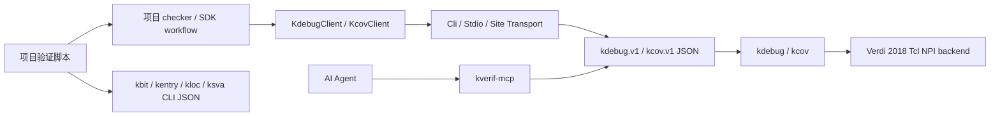
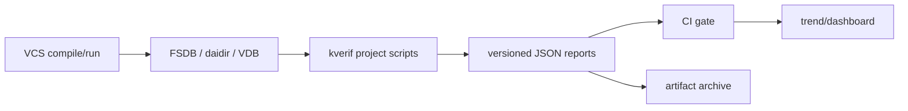

# kverif 二次开发使用指导手册

本文面向需要基于 kverif 开发项目验证脚本、回归分析工具、内部平台适配器或新
action 的验证工程师。阅读后应能够完成以下工作：

- 基于 FSDB 编写波形活动、异常窗口和协议检查脚本。
- 基于 VCS `-kdb` 生成的 daidir 编写模块边界和集成连线检查脚本。
- 基于多轮 VDB 编写 coverage 趋势、平台期和回归准入脚本。
- 将 kverif 接入内部 RPC、LSF、CI 或测试框架。
- 在不破坏 Verdi 2018 兼容性的前提下，为 kdebug 或 kcov 增加能力。

本文以仓库当前的 `kverif_sdk 0.1`、`kdebug.v1` 和 `kcov.v1` 为基线。SDK
速查见 [`../kverif_sdk/README.md`](../kverif_sdk/README.md)，底层 kdebug JSON
契约见 [`../kdebug/docs/JSON_API.md`](../kdebug/docs/JSON_API.md)。

## 1. 先选择正确的扩展入口

kverif 不是要求所有需求都修改工具核心。大多数项目需求应该在 SDK 或稳定 JSON
协议上实现。

| 需求 | 推荐入口 | 是否修改工具核心 |
| --- | --- | --- |
| 分析一批 FSDB 信号 | `KdebugClient` 或 `analyze_wave_window` | 否 |
| 追踪模块端口 driver/graph | `trace_module_connections` | 否 |
| 比较多轮 coverage | `analyze_coverage_convergence` | 否 |
| 调用尚未封装的公开 action | `client.raw_request` | 否 |
| 接公司内部 RPC/LSF | 自定义 transport | 否 |
| 给项目增加 checker/准入规则 | 在 workflow report 上增加规则 | 否 |
| 给 AI Agent 暴露能力 | `kverif_mcp` | 通常否 |
| 新增所有项目都需要的底层查询 | action/schema/Tcl backend | 是 |

基本判断原则：

1. 需求只属于一个项目时，优先写项目脚本。
2. 多个项目反复需要同一组合逻辑时，再加入 `kverif_sdk.workflows`。
3. 只有现有 action 无法取得必要事实时，才新增 kdebug/kcov action。
4. NPI 数据访问只能放在 Tcl backend；不要恢复 C++ NPI 或新增 Python NPI
   binding。

## 2. 架构与边界



各层职责：

| 层 | 负责 | 不负责 |
| --- | --- | --- |
| 项目脚本 | 项目命名、规则、阈值、报告和退出码 | NPI 访问 |
| workflow | 可复用的多 action 编排和稳定汇总 | 项目专有策略 |
| client | request 参数映射、session 生命周期、结构化错误 | 进程通信细节 |
| transport | CLI/JSONL/RPC 通信、超时和进程清理 | action 业务语义 |
| kdebug/kcov | action 路由、过滤、导出和公共协议 | 项目准入策略 |
| Tcl backend | 真实 FSDB/KDB/VDB 和 NPI 查询 | Python 业务编排 |

项目代码只应依赖 `kverif_sdk.__init__` 导出的公共对象。不要导入：

- `kdebug/src/**`
- `kdebug/tcl_engine/kdebug_engine.py` 的内部函数
- `kcov/kcov/backend.py`
- `kverif_mcp` 内部 session manager
- Tcl backend 的私有 procedure

## 3. 仓库中与二次开发有关的目录

```text
kverif/
  tools/                         稳定命令入口
  kverif_sdk/                    公共 Python SDK
    clients.py                   kdebug/kcov client
    transport.py                 CLI、stdio-loop、callback transport
    workflows.py                 三类公共 workflow
    examples/                    可直接运行的示例
    tests/                       不依赖 EDA 的 SDK 测试
  kdebug/
    specs/actions/actions.yaml   action catalog 规格
    schemas/v1/actions/          action-specific JSON schema
    examples/                    request/response 示例
    tcl_engine/                  Verdi Tcl NPI backend 与路由
  kcov/
    kcov/schemas.py              coverage action schema
    kcov/actions.py              coverage action 路由
    tcl_engine/kcov_npi.tcl      coverage Tcl NPI backend
  kverif_mcp/                    Agent/MCP 适配层
  doc/                           面向用户和开发者的长文档
```

## 4. 环境准备

### 4.1 只做本地开发和 mock 测试

本地不需要 Verdi、VCS 或 license：

```bash
cd /path/to/kverif
export KVERIF_HOME="$PWD"
export PYTHONPATH="$PWD:${PYTHONPATH:-}"
python -m pytest kverif_sdk/tests -q
```

SDK 运行时只使用 Python 标准库，支持 Python 3.8+。`pytest` 只在运行测试时需要。

### 4.2 VM 上使用真实 EDA 数据

以普通用户 `host` 运行：

```bash
id -un
# 期望输出: host

export KVERIF_HOME=/home/host/kverif
export PYTHONPATH=/home/host/kverif:${PYTHONPATH:-}
export PYTHON=/home/host/kverif/.venv38/bin/python

export VERDI_HOME=/home/synopsys/verdi/Verdi_O-2018.09-SP2
export VCS_HOME=/home/synopsys/vcs/O-2018.09-SP2
export VCS_TARGET_ARCH=linux64
export PATH="$VERDI_HOME/bin:$VCS_HOME/bin:$PATH"

# license 变量由站点运行环境提供，不要写进项目脚本或报告。
test -n "${LM_LICENSE_FILE:-}" || echo "LM_LICENSE_FILE is not set"
test -n "${SNPSLMD_LICENSE_FILE:-}" || echo "SNPSLMD_LICENSE_FILE is not set"
```

必须导出 `PYTHON`。最外层虽然由 Python 3.8 启动，但 `StdioTransport` 会再启动
`tools/kcov` 子进程；wrapper 通过 `PYTHON` 选择解释器。

### 4.3 输入数据库要求

| 数据 | 用途 | 要求 |
| --- | --- | --- |
| `.fsdb` | 值、变化、事件和窗口分析 | 波形中实际 dump 了目标信号 |
| `simv.daidir` | driver、load、graph 和源码追踪 | VCS 编译时使用 `-kdb` |
| `.vdb` | coverage summary 和 holes | 使用兼容 VCS/Verdi 生成 |

FSDB 本身不包含完整静态 elaboration 关系。只查值时输入 FSDB 即可；追 driver 或
模块连线时需要 KDB/daidir；需要“某时刻哪个 driver 生效”时通常同时需要二者。

## 5. 十分钟快速开始

### 5.1 运行仓库示例

```bash
mkdir -p /home/host/testdata/sdk_reports

$PYTHON -m kverif_sdk.examples.waveform_analysis \
  --tool /home/host/kverif/tools/kdebug \
  --fsdb /home/host/testdata/clkfreq.fsdb \
  --signal tb_clkfreq.clk \
  --start 0ns --end 100ns \
  --sample-time 25ns --sample-time 75ns \
  --output /home/host/testdata/sdk_reports/wave_window.json

$PYTHON -m kverif_sdk.examples.module_connectivity \
  --tool /home/host/kverif/tools/kdebug \
  --daidir /home/host/testdata/xiangshan_kdb/simv.daidir \
  --signal tb_top.sim.clock \
  --signal tb_top.sim.reset \
  --max-depth 6 \
  --output /home/host/testdata/sdk_reports/module_connections.json

$PYTHON -m kverif_sdk.examples.coverage_convergence \
  --tool /home/host/kverif/tools/kcov \
  --run base=fake --run next=fake --fake \
  --output /home/host/testdata/sdk_reports/coverage_convergence_fake.json
```

### 5.2 最小 Python 调用

```python
from kverif_sdk import StdioTransport, KdebugClient, resolve_tool

with StdioTransport(
    resolve_tool("kdebug"),
    protocol="kdebug-stdio-loop",
    api_version="kdebug.v1",
    request_timeout_sec=0,
) as transport:
    client = KdebugClient(transport)
    with client.session("quick_wave", fsdb="/data/run.fsdb"):
        response = client.value_batch_at(
            ["tb.dut.valid", "tb.dut.ready"],
            "100ns",
            value_format="hex",
        )
        print(response["summary"])
```

`with` 会保证 session 和 stdio 子进程在正常结束或异常时都被清理。

## 6. Transport 使用指南

### 6.1 `CliTransport`

每个请求启动一次工具，适合 action catalog、schema、小型 one-shot 查询或调试：

```python
from kverif_sdk import CliTransport, KdebugClient, resolve_tool

client = KdebugClient(CliTransport(resolve_tool("kdebug"), timeout_sec=30))
catalog = client.raw_request({"action": "actions", "args": {}})
```

优点是隔离简单；缺点是每次都要支付进程和 EDA 启动成本。不要用它循环查询几千个
时间点。

### 6.2 `StdioTransport`

维护一个长期 JSONL 进程，适合真实 FSDB/KDB/VDB session：

```python
transport = StdioTransport(
    "/home/host/kverif/tools/kdebug",
    protocol="kdebug-stdio-loop",
    api_version="kdebug.v1",
    startup_timeout_sec=180,
    request_timeout_sec=0,
)
```

参数语义：

| 参数 | 含义 |
| --- | --- |
| `command` | 工具绝对路径或 argv 列表 |
| `protocol` | ready envelope 中期望的协议名 |
| `api_version` | quit/error fallback 使用的 API 版本 |
| `startup_timeout_sec` | 等待 ready；`0/None` 表示无限等待 |
| `request_timeout_sec` | 单次请求；`0/None` 表示无限等待 |
| `env` | 只注入该子进程的环境变量 |
| `cwd` | 子进程工作目录 |

若一次请求超时，transport 会终止整个 stdio 进程。原因是迟到 response 无法安全地
与下一条请求重新关联；调用方应新建 transport/session 后继续。

### 6.3 `CallbackTransport`

用于项目单元测试和内部 handler：

```python
from kverif_sdk import CallbackTransport, KdebugClient

def fake_tool(request):
    return {
        "ok": True,
        "action": request["action"],
        "summary": {"actual_transition_count": 2},
        "data": {"changes": []},
    }

client = KdebugClient(CallbackTransport(fake_tool))
```

`CallbackTransport.requests` 会保存请求的深拷贝，可用于断言 action、target、args 和
limits 是否正确。

## 7. Client API 参考

### 7.1 `KdebugClient`

| 方法 | 关键参数 | 用途 |
| --- | --- | --- |
| `session(name, fsdb=..., daidir=...)` | session 名和资源 | 自动 open/close |
| `value_batch_at(signals, time_value)` | 信号列表、时间、格式 | 同一时刻批量取值 |
| `signal_changes(signal, start, end)` | 时间范围、limit、mode | 跳变和首末变化 |
| `trace_driver(signal)` | source/trace 开关、limits | 直接 driver |
| `trace_graph(signal, max_depth=N)` | 根信号和深度 | 多级依赖图 |
| `request(action, ...)` | target/args/limits/output | 调用任意已知 action |
| `raw_request(request)` | 完整 request object | 透传未来 action 和额外字段 |

资源选择：

```python
with client.session("wave", fsdb="/data/waves.fsdb"):
    ...  # 波形 action

with client.session("design", daidir="/data/simv.daidir"):
    ...  # 设计 action

with client.session(
    "combined", fsdb="/data/waves.fsdb", daidir="/data/simv.daidir"
):
    ...  # active-driver 等联合 action
```

### 7.2 `KcovClient`

| 方法 | 关键参数 | 用途 |
| --- | --- | --- |
| `session(name, vdb, fake=False)` | VDB、别名、fake | 自动 open/close |
| `coverage_summary(metrics=...)` | scope/test/group_by | coverage 汇总 |
| `coverage_holes(metrics=...)` | scope/test/max_items | 未覆盖项和证据 |
| `request/raw_request` | 通用 request | 其他 coverage action |

真实大 VDB 默认不设置请求超时：

```python
with StdioTransport(
    resolve_tool("kcov"),
    protocol="kcov-stdio-loop",
    api_version="kcov.v1",
    startup_timeout_sec=0,
    request_timeout_sec=0,
) as transport:
    cov = KcovClient(transport)
```

## 8. Workflow 输出契约

| Workflow | Schema | 主要稳定字段 |
| --- | --- | --- |
| `analyze_wave_window` | `kverif.sdk.wave-window.v1` | `summary`、`signals`、`samples` |
| `trace_module_connections` | `kverif.sdk.module-connections.v1` | `edges`、`module_scopes`、`traces` |
| `analyze_coverage_convergence` | `kverif.sdk.coverage-convergence.v1` | `summary`、`runs` |

兼容规则：

- 同一 schema 版本可以新增字段。
- 消费方必须忽略不认识的字段。
- 字段删除、类型改变或含义改变时必须发布新 schema 版本。
- workflow 始终保留原始 response，避免高层汇总丢失新证据。
- 项目报告应在顶层使用自己的 schema，不要冒充 SDK schema。

建议的项目报告：

```json
{
  "schema": "company.project.wave-health.v1",
  "decision": "fail",
  "violations": [],
  "kverif_report": {
    "schema": "kverif.sdk.wave-window.v1"
  }
}
```

## 9. 实战一：开发波形活动检查器

下面的脚本检查窗口内是否有信号完全不跳变，并保存完整证据：

```python
#!/usr/bin/env python3
import argparse
import json
from pathlib import Path

from kverif_sdk import (
    StdioTransport,
    KdebugClient,
    analyze_wave_window,
    resolve_tool,
)


def main() -> int:
    parser = argparse.ArgumentParser()
    parser.add_argument("--fsdb", required=True)
    parser.add_argument("--signal", action="append", required=True)
    parser.add_argument("--start", required=True)
    parser.add_argument("--end", required=True)
    parser.add_argument("--output", required=True)
    args = parser.parse_args()

    with StdioTransport(
        resolve_tool("kdebug"),
        protocol="kdebug-stdio-loop",
        api_version="kdebug.v1",
        request_timeout_sec=0,
    ) as transport:
        debug = KdebugClient(transport)
        with debug.session("project_wave_health", fsdb=args.fsdb):
            report = analyze_wave_window(
                debug,
                args.signal,
                start=args.start,
                end=args.end,
                sample_times=[args.start, args.end],
                max_changes=200,
            )

    idle = [
        row["signal"]
        for row in report["signals"]
        if int(row.get("transition_count") or 0) == 0
    ]
    output = {
        "schema": "project.wave-health.v1",
        "ok": not idle,
        "idle_signals": idle,
        "evidence": report,
    }
    path = Path(args.output)
    path.parent.mkdir(parents=True, exist_ok=True)
    path.write_text(json.dumps(output, indent=2), encoding="utf-8")
    return 0 if not idle else 2


if __name__ == "__main__":
    raise SystemExit(main())
```

调用：

```bash
$PYTHON project_wave_health.py \
  --fsdb /project/run/simv.fsdb \
  --signal tb.dut.req_valid \
  --signal tb.dut.req_ready \
  --start 10us --end 11us \
  --output /project/reports/wave_health.json
```

项目可继续增加：

- valid 有活动而 ready 始终不变。
- 状态机进入非法编码。
- counter 在窗口内没有前进。
- 多个接口之间的时间差超过阈值。

先用现有 `signal.changes`、`value.batch_at`、`event.find` 组合；不要为每条项目规则
新增底层 NPI action。

## 10. 实战二：开发模块集成连线审计

KDB 中必须使用 elaboration 后的完整实例名。`SimTop` 是 module type，而
`tb_top.sim` 才是实例路径。

```python
#!/usr/bin/env python3
import argparse
import json
from pathlib import Path

from kverif_sdk import (
    StdioTransport,
    KdebugClient,
    resolve_tool,
    trace_module_connections,
)


def is_named_signal(value: str) -> bool:
    return "." in value and not value.isdigit()


def main() -> int:
    parser = argparse.ArgumentParser()
    parser.add_argument("--daidir", required=True)
    parser.add_argument("--signal", action="append", required=True)
    parser.add_argument("--allow-prefix", action="append", default=[])
    parser.add_argument("--output", required=True)
    args = parser.parse_args()

    with StdioTransport(
        resolve_tool("kdebug"),
        protocol="kdebug-stdio-loop",
        api_version="kdebug.v1",
        request_timeout_sec=0,
    ) as transport:
        debug = KdebugClient(transport)
        with debug.session("project_connectivity", daidir=args.daidir):
            report = trace_module_connections(
                debug, args.signal, max_depth=8, include_source=True
            )

    violations = []
    for edge in report["edges"]:
        endpoints = [edge["from"], edge["to"]]
        named = [value for value in endpoints if is_named_signal(value)]
        if args.allow_prefix and any(
            not any(value.startswith(prefix) for prefix in args.allow_prefix)
            for value in named
        ):
            violations.append(edge)

    result = {
        "schema": "project.connectivity-audit.v1",
        "ok": bool(report["edges"]) and not violations,
        "violations": violations,
        "evidence": report,
    }
    path = Path(args.output)
    path.parent.mkdir(parents=True, exist_ok=True)
    path.write_text(json.dumps(result, indent=2), encoding="utf-8")
    if not report["edges"]:
        return 2
    return 0 if not violations else 3


if __name__ == "__main__":
    raise SystemExit(main())
```

调用：

```bash
$PYTHON project_connectivity.py \
  --daidir /project/build/simv.daidir \
  --signal tb_top.sim.clock \
  --signal tb_top.sim.reset \
  --allow-prefix tb_top \
  --output /project/reports/connectivity.json
```

常见项目规则：

- 接口信号只能来自允许的 subsystem。
- valid、ready、payload 必须都能追到预期模块。
- reset/clock 不允许跨到错误的 domain。
- 数据依赖和控制依赖必须带源码位置。
- 根信号无任何 edge 时直接失败，不能当成“没有问题”。

## 11. 实战三：开发 coverage 回归准入门

```python
#!/usr/bin/env python3
import argparse
import json
from pathlib import Path

from kverif_sdk import (
    CoverageRun,
    StdioTransport,
    KcovClient,
    analyze_coverage_convergence,
    resolve_tool,
)


def parse_run(value: str) -> CoverageRun:
    label, separator, vdb = value.partition("=")
    if not separator or not label or not vdb:
        raise argparse.ArgumentTypeError("run must use LABEL=VDB")
    return CoverageRun(label, vdb)


def main() -> int:
    parser = argparse.ArgumentParser()
    parser.add_argument("--run", action="append", type=parse_run, required=True)
    parser.add_argument("--target", type=float, default=95.0)
    parser.add_argument("--plateau-epsilon", type=float, default=0.02)
    parser.add_argument("--output", required=True)
    args = parser.parse_args()

    with StdioTransport(
        resolve_tool("kcov"),
        protocol="kcov-stdio-loop",
        api_version="kcov.v1",
        startup_timeout_sec=0,
        request_timeout_sec=0,
    ) as transport:
        cov = KcovClient(transport)
        report = analyze_coverage_convergence(
            cov,
            args.run,
            metrics=["line", "toggle", "branch", "condition"],
            hole_limit=100,
            target_pct=args.target,
            plateau_epsilon=args.plateau_epsilon,
        )

    path = Path(args.output)
    path.parent.mkdir(parents=True, exist_ok=True)
    path.write_text(json.dumps(report, indent=2), encoding="utf-8")

    summary = report["summary"]
    if summary["latest_coverage_pct"] is None:
        return 2
    if summary["target_met"]:
        return 0
    if summary["plateau"]:
        return 3
    return 4


if __name__ == "__main__":
    raise SystemExit(main())
```

调用：

```bash
$PYTHON project_coverage_gate.py \
  --run base=/regress/run_001/simv.vdb \
  --run fifo_fix=/regress/run_002/simv.vdb \
  --run nightly=/regress/run_003/merged.vdb \
  --target 95 \
  --plateau-epsilon 0.02 \
  --output /regress/reports/coverage_gate.json
```

推荐退出码：

| 退出码 | 含义 |
| --- | --- |
| `0` | 达到 coverage 目标 |
| `2` | 没有有效 coverage 数据 |
| `3` | 未达标且进入平台期，需要新增 stimulus/checker |
| `4` | 未达标但仍在提升，可继续回归 |

## 12. 使用尚未封装的 action

不要因为 client 暂时没有便利方法就导入内部模块。直接使用 `raw_request`：

```python
response = debug.raw_request({
    "action": "signal.statistics",
    "args": {
        "signal": "tb.dut.busy",
        "time_range": {"start": "0ns", "end": "1us"},
    },
    "limits": {"max_rows": 100},
    "output": {"format": "json", "verbosity": "compact"},
    "trace_id": "nightly-20260715",
})
```

先查询 action 和 schema：

```bash
/home/host/kverif/tools/kdebug actions --json
/home/host/kverif/tools/kdebug schema \
  --action signal.statistics --kind request --json

/home/host/kverif/tools/kcov actions --json
/home/host/kverif/tools/kcov schema \
  --action cov.holes --kind request --json
```

不要根据 README 猜字段；action-specific schema 是机器契约。

## 13. 调用其他 x 系列工具

当前公共 SDK 重点封装 stateful 的 kdebug/kcov。其他工具可直接使用参数式 CLI 的
`--json` 输出：

| 工具 | 二次开发用途 | 示例 |
| --- | --- | --- |
| `kbit` | 位切片、表达式和编码计算 | `kbit conv "8'shff" --json` |
| `kentry` | packed entry 字段解码 | `kentry decode --config ... --input ... --json` |
| `kloc` | 日志位置还原和源码上下文 | `kloc resolve ID --map ... --json` |
| `ksva` | property 结构化解释 | `ksva explain --file ... --property ... --json` |
| `kberif` | 项目上下文卡片 | `kberif --json status` |

通用 Python 调用器：

```python
import json
import subprocess


def run_json_tool(argv):
    process = subprocess.run(
        argv,
        text=True,
        capture_output=True,
        check=False,
    )
    if process.returncode != 0:
        raise RuntimeError(process.stderr[-4000:])
    response = json.loads(process.stdout)
    if isinstance(response, dict) and response.get("ok") is False:
        raise RuntimeError(response.get("error", {}))
    return response


result = run_json_tool([
    "/home/host/kverif/tools/kbit",
    "conv",
    "8'shff",
    "--json",
])
```

不要解析默认 kout 文本；自动化脚本必须请求 JSON。

## 14. 接入内部 RPC、LSF 或任务平台

Transport 最小接口：

```python
from typing import Protocol


class Transport(Protocol):
    def request(self, request: dict, timeout_sec=None) -> dict:
        ...
```

内部 RPC 示例：

```python
class InternalRpcTransport:
    persistent = True

    def __init__(self, rpc, queue="eda_interactive"):
        self.rpc = rpc
        self.queue = queue

    def request(self, request, timeout_sec=None):
        return self.rpc.call(
            service="kverif",
            payload=request,
            queue=self.queue,
            timeout=timeout_sec,
        )
```

约束：

- 返回值必须是 JSON object/dict。
- 不得把日志混入 response。
- 必须原样保留 `request_id`、`error.code` 和未知字段。
- 超时单位和 `0` 的语义必须在适配层写清楚。
- session 必须固定在同一计算节点和同一 backend 进程。
- API key 只通过运行时 credential/environment 注入，不能进入 request、日志或报告。

## 15. 并发、性能与资源管理

### 15.1 一个 transport 内部只能串行

一个 JSONL 流上并发写请求会破坏 request/response 对应关系。并行分析多个 run 时，
每个 worker 创建独立 transport：

```python
from concurrent.futures import ThreadPoolExecutor


def analyze_one(run):
    with StdioTransport(
        resolve_tool("kdebug"),
        protocol="kdebug-stdio-loop",
        api_version="kdebug.v1",
    ) as transport:
        client = KdebugClient(transport)
        with client.session(run.name, fsdb=run.fsdb):
            return analyze_wave_window(
                client, run.signals, start=run.start, end=run.end
            )


with ThreadPoolExecutor(max_workers=4) as pool:
    reports = list(pool.map(analyze_one, runs))
```

并发数必须考虑 Verdi license、CPU、内存和磁盘吞吐，不要默认等于 case 数。

### 15.2 减少大 payload

- 先缩小时间窗口和 scope。
- 先使用 compact 输出。
- `signal.changes` 设置合理 `limit`。
- coverage holes 设置 `max_items`。
- 只有需要审计时才打开 `include_source/include_trace/include_raw`。
- 不要在循环中反复 open/close 同一数据库。

### 15.3 超时策略

- kcov 大 VDB 默认无限等待，`0` 表示不设置超时。
- CI 需要故障保护时显式传正数。
- 超时不是 coverage/model 失败，应区分环境、license 和工具错误。
- session close 和进程清理仍应有有限超时。

## 16. 错误处理

SDK 异常：

| 异常 | 处理建议 |
| --- | --- |
| `ToolInvocationError` | 检查命令、解释器、stderr、EDA 环境 |
| `ProtocolError` | 终止当前 transport，保存日志并重建 session |
| `ToolResponseError` | 按 `error.code` 决定修参数、重试或失败 |

示例：

```python
from kverif_sdk import (
    ProtocolError,
    ToolInvocationError,
    ToolResponseError,
)

try:
    response = debug.trace_driver("tb.dut.ready")
except ToolResponseError as exc:
    if exc.code == "SIGNAL_NOT_FOUND":
        raise SystemExit("use the elaborated full signal path")
    if exc.code in {"RETRY_LATER", "LICENSE_BUSY"}:
        raise SystemExit("environment is temporarily unavailable")
    raise
except ProtocolError:
    # 当前 JSONL 流不再可信，应销毁 transport 后重建。
    raise
except ToolInvocationError as exc:
    print(exc.stderr_tail)
    raise
```

不要匹配人类错误文案；优先使用 `error.code`。

## 17. 单元测试策略

### 17.1 项目 checker 测试

使用 `CallbackTransport` 构造确定性 response：

```python
from kverif_sdk import CallbackTransport, KdebugClient, analyze_wave_window


def fake(request):
    assert request["action"] == "signal.changes"
    return {
        "ok": True,
        "action": "signal.changes",
        "summary": {"actual_transition_count": 3},
        "data": {"changes": []},
    }


transport = CallbackTransport(fake)
report = analyze_wave_window(
    KdebugClient(transport),
    ["tb.clk"],
    start="0ns",
    end="10ns",
)
assert report["signals"][0]["transition_count"] == 3
assert transport.requests[0]["args"]["signal"] == "tb.clk"
```

### 17.2 测试金字塔

| 层 | 输入 | 目标 |
| --- | --- | --- |
| unit | callback/mock | 项目规则和参数映射 |
| contract | schema/examples | action 契约一致性 |
| fake integration | kcov fake backend | session/stdio/过滤/退出码 |
| real smoke | 小 FSDB/KDB/VDB | Verdi 版本、license、真实字段 |
| stress | 大数据库和多 worker | 内存、吞吐、清理和稳定性 |

仓库测试：

```bash
cd /home/host/kverif
make sdk-test PYTHON=/home/host/kverif/.venv38/bin/python
PYTHONPATH=/home/host/kverif/kcov \
  /home/host/kverif/.venv38/bin/python -m pytest kcov/tests -q
```

真实 smoke 后检查孤儿进程：

```bash
ps -u host -o pid=,comm=,args= | grep -E 'kdebug|kcov|verdi|novas' || true
```

## 18. 为工具核心新增 action

只有现有公共 action 无法取得必要事实时才走本节。

### 18.1 kdebug action

1. 在 `kdebug/specs/actions/actions.yaml` 定义 action、类别、状态和资源要求。
2. 增加 `kdebug/schemas/v1/actions/<action>.request.schema.json`。
3. 增加对应 response schema。
4. 增加 `kdebug/examples/requests` 和 `examples/responses` 示例。
5. 在公开 router/dispatcher 增加路由。
6. 真实 NPI 查询只写入 `kdebug/tcl_engine/kdebug_npi.tcl`。
7. Python/C++ 仅做协议、参数、标准化、限制和导出。
8. 跑 schema、contract、unit 和真实 Verdi 2018 smoke。
9. 多项目需要时再给 SDK client 增加便利方法。

### 18.2 kcov action

1. 在 `kcov/kcov/schemas.py` 增加 action-specific schema。
2. 在 action catalog/router 中注册。
3. 在 `kcov/kcov/actions.py` 或 backend 增加协议编排。
4. 真实 coverage NPI 访问只写入 `kcov/tcl_engine/kcov_npi.tcl`。
5. 增加 fake 数据、过滤、limit、错误和真实 VDB 测试。

### 18.3 NPI 约束

- 禁止新增 C++ NPI 查询实现。
- 禁止在 Python 中直接加载 NPI shared library。
- Tcl 输出必须保持 stdout JSON 协议不被诊断文本污染。
- Verdi 2018 不支持的函数要在 Tcl 层做能力检测和兼容回退。
- 环境问题不能伪装成业务失败。

## 19. CI 与回归系统接入

推荐流水线：



CI 约束：

- 每个脚本定义稳定退出码。
- JSON report 与 stdout 日志分离。
- 报告中记录工具版本、schema、输入路径摘要和时间范围。
- 不记录 API key、token、license 内容或客户源码正文。
- 环境失败允许重试，规则失败不盲目重试。
- 保存原始 response 或 evidence，保证结论可审计。
- coverage 多轮比较按明确顺序传入 VDB，不依赖目录遍历顺序。

## 20. 发布与兼容性检查清单

提交项目二次开发脚本前检查：

- [ ] 只依赖公共 SDK/JSON API。
- [ ] 没有解析 kout 或 stderr 文本。
- [ ] 输入使用绝对路径或明确的工作目录。
- [ ] session 使用 context manager 清理。
- [ ] timeout 的 `0` 语义已写清楚。
- [ ] 并发 worker 不共享 `StdioTransport`。
- [ ] 输出有项目自己的版本化 schema。
- [ ] 未知新增字段不会导致解析失败。
- [ ] 错误按 `error.code` 分类。
- [ ] 有 callback unit test。
- [ ] 有 fake integration test。
- [ ] 在目标 Verdi 版本上跑过真实 smoke。
- [ ] 无孤儿 kdebug/kcov/verdi 进程。
- [ ] 没有凭据、license 内容或客户数据进入 Git。

为工具核心新增 action 时额外检查：

- [ ] action spec、request schema、response schema、examples 同步更新。
- [ ] NPI 访问只在 Tcl backend。
- [ ] compact/full 输出和 limits 行为明确。
- [ ] Verdi 2018 兼容路径经过真实测试。
- [ ] README 和本手册中的入口仍然有效。

## 21. 常见问题

### `ModuleNotFoundError: kverif_sdk`

```bash
export KVERIF_HOME=/home/host/kverif
export PYTHONPATH=/home/host/kverif:${PYTHONPATH:-}
```

### `tools/kcov` 使用了 Python 3.6

```bash
export PYTHON=/home/host/kverif/.venv38/bin/python
```

### KDB 返回 `KDB_REQUIRED`

普通 daidir 不一定包含 Verdi static database。重新使用 VCS `-kdb` 构建，并传入
对应 `simv.daidir`。

### `SIGNAL_NOT_FOUND`

- 使用 elaboration 后的完整实例路径。
- 区分 module type 与 instance path。
- 确认 FSDB 实际 dump 了该信号。
- slice 查询失败时先查 base signal。

### kcov 长时间没有返回

大 VDB 和 Verdi 2018 扫描可能很慢。默认无限等待是预期行为；同时检查 license、
CPU、内存、VDB 路径和 Verdi 子进程，而不是立即把它判为 coverage 失败。

### stdio 请求超时后还能继续用原 transport 吗

不能。SDK 会终止该进程，调用方应新建 transport/session。

### 什么时候应该用 MCP

Agent 需要发现工具、调用多种 x 工具或通过 LSF 管理 session 时使用 MCP。普通项目
Python 脚本直接使用 SDK 更简单，也更容易单元测试。

## 22. 相关文档

- [仓库总 README](../README.md)
- [Python SDK 速查](../kverif_sdk/README.md)
- [kdebug 使用说明](../kdebug/README.md)
- [kdebug JSON API](../kdebug/docs/JSON_API.md)
- [kdebug Agent 指南](../kdebug/docs/AGENT_GUIDE.md)
- [kcov 使用说明](../kcov/README.md)
- [kverif-mcp 使用说明](../kverif_mcp/README.md)
- [受控 EDA runner](../keda_runner/README.md)
