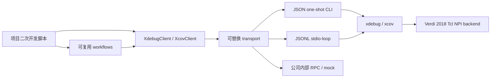

# xverif Python SDK

`xverif_sdk` 是给验证工程师做二次开发的公共 Python 层。它不替代
`xdebug`、`xcov`，也不直接调用 NPI；它把工具现有的 JSON/stdio-loop
协议封装成可组合、可测试的 Python API。

从零建立项目脚本、开发三类 checker、接入内部 RPC/LSF、设计 CI 退出码以及为
工具核心新增 action 的完整流程，见
[`../doc/secondary_development_guide.md`](../doc/secondary_development_guide.md)。

典型用途：

- 基于 FSDB 开发项目自己的波形分析、异常窗口提取或协议检查脚本。
- 基于 VCS/Verdi elaboration database 开发模块集成连线、driver/control
  dependency 检查脚本。
- 基于多个 VDB 开发回归 coverage 趋势、增量、平台期和 holes 收敛脚本。
- 在公司内部 RPC、LSF wrapper 或测试框架中复用 xverif，而不修改工具核心。

SDK 只使用 Python 标准库，支持 Python 3.8+。

## 公共 API 与兼容性约定

- 只把 `xverif_sdk.__init__` 导出的对象视为公共 Python API；以下划线开头的
  helper 和工具内部模块不属于兼容承诺。
- workflow 输出都带版本化 `schema`。兼容新增字段不会更换 schema；删除字段、
  改变字段含义或改变字段类型时必须发布新的 schema 版本。
- client 会保留工具原始 response，项目脚本应忽略不认识的新增字段，并优先按
  `error.code` 处理错误。
- 新 action 可先通过 `raw_request` 使用；确认多个项目都需要后，再增加高层方法，
  避免公共 API 被单一项目参数绑死。
- `StdioTransport` 的单条 JSONL 流保证请求串行。需要并发时，每个 worker 创建
  自己的 transport/session，不能跨线程复用同一个流。

## 设计边界



公共层次：

| 层 | 公共对象 | 用途 |
| --- | --- | --- |
| transport | `CliTransport` | 单次 raw JSON 请求；适合 stateless action、catalog、schema |
| transport | `StdioTransport` | 维护一个长期 `--stdio-loop` 进程；适合 FSDB/daidir/VDB session |
| transport | `CallbackTransport` | 注入 mock 或站点自定义 handler，便于测试和接内部平台 |
| client | `XdebugClient` | session、`value.batch_at`、`signal.changes`、`trace.driver/graph` |
| client | `XcovClient` | coverage session、summary、holes |
| workflow | `analyze_wave_window` | 信号变化统计和可选时间点采样 |
| workflow | `trace_module_connections` | driver、control 和 graph edge 汇总 |
| workflow | `analyze_coverage_convergence` | 多轮 coverage 加权增量和平台期判断 |

不建议二次开发者：

- 导入 `xdebug/src`、`xcov/xcov/backend.py` 或 `xverif_mcp` 内部 session 类。
- 解析给人看的 xout 或 stderr 文本。
- 在项目脚本中直接调用 C/C++ NPI、Python NPI binding 或 Verdi 私有库。
- 假定 response 只有当前这些字段；应允许工具新增字段。

SDK 高层 workflow 会保留原始 response，新增字段不会因为封装被丢弃。

## 环境准备

VM 普通用户 `host`：

```bash
export XVERIF_HOME=/home/host/xverif
export PYTHONPATH=/home/host/xverif:${PYTHONPATH:-}
export PYTHON=/home/host/xverif/.venv38/bin/python

export VERDI_HOME=/home/synopsys/verdi/Verdi_O-2018.09-SP2
export VCS_HOME=/home/synopsys/vcs/O-2018.09-SP2
export VCS_TARGET_ARCH=linux64
export PATH="$VERDI_HOME/bin:$VCS_HOME/bin:$PATH"
export LM_LICENSE_FILE=27000@IC_EDA
export SNPSLMD_LICENSE_FILE=27000@IC_EDA
```

必须实际 `export PYTHON=...`，不能只用该 Python 启动最外层示例。SDK 会再启动
`tools/xcov` 子进程，wrapper 通过 `PYTHON` 环境变量选择解释器；若未导出，旧 VM
可能回退到不支持本项目语法的系统 Python 3.6。

开发机只跑 mock/unit test 时不需要 Verdi、VCS 或 license：

```bash
cd /path/to/xverif
export PYTHONPATH="$PWD"
python -m pytest xverif_sdk/tests -q
```

## 基础调用

### 长期 xdebug session

```python
from xverif_sdk import StdioTransport, XdebugClient, resolve_tool

with StdioTransport(
    resolve_tool("xdebug"),
    protocol="xdebug-stdio-loop",
    api_version="xdebug.v1",
    request_timeout_sec=0,
) as transport:
    debug = XdebugClient(transport)
    with debug.session("my_wave", fsdb="/data/waves.fsdb"):
        values = debug.value_batch_at(
            ["tb.dut.valid", "tb.dut.ready"], "100ns", value_format="hex")
        changes = debug.signal_changes(
            "tb.dut.ready", "0ns", "1us", include_rows=True, limit=50)
```

`request_timeout_sec=0` 表示 SDK 不设置请求超时。一个 `StdioTransport`
内部串行请求；需要并行分析多个回归时，为每个并发 worker 创建独立 transport，
不要让多个线程共享一个 JSONL 流。

### 长期 coverage session

```python
from xverif_sdk import StdioTransport, XcovClient, resolve_tool

with StdioTransport(
    resolve_tool("xcov"),
    protocol="xcov-stdio-loop",
    api_version="xcov.v1",
    startup_timeout_sec=0,
    request_timeout_sec=0,
) as transport:
    cov = XcovClient(transport)
    with cov.session("nightly", "/results/nightly/simv.vdb"):
        summary = cov.coverage_summary(metrics=["line", "toggle", "branch"])
        holes = cov.coverage_holes(metrics=["toggle", "branch"], max_items=50)
```

### 尚未封装的新 action

高层 client 不会限制 action 集。工具新增 action 后可以立即用 `raw_request`：

```python
response = debug.raw_request({
    "action": "site.future.analysis",
    "target": {"session_id": "my_wave"},
    "args": {"site_option": 42},
    "trace_id": "regression-20260715",
})
```

SDK 会补齐 `api_version`、`request_id` 和 JSON output 设置，但保留未知字段。

## 示例一：波形窗口分析

输入真实 FSDB，统计每个信号的变化次数、首末变化，并在指定时间点批量采样：

```bash
/home/host/xverif/.venv38/bin/python -m xverif_sdk.examples.waveform_analysis \
  --tool /home/host/xverif/tools/xdebug \
  --fsdb /home/host/testdata/clkfreq.fsdb \
  --signal tb_clkfreq.clk \
  --start 0ns \
  --end 100ns \
  --sample-time 25ns \
  --sample-time 75ns \
  --max-changes 50 \
  --output /home/host/testdata/sdk_reports/wave_window.json
```

作为库调用：

```python
from xverif_sdk import analyze_wave_window

report = analyze_wave_window(
    debug,
    ["tb.dut.valid", "tb.dut.ready", "tb.dut.state"],
    start="10us",
    end="11us",
    sample_times=["10.2us", "10.8us"],
)
```

输出 `schema` 为 `xverif.sdk.wave-window.v1`。每个信号保留完整
`signal.changes` response，每个采样点保留完整 `value.batch_at` response。

## 示例二：模块信号集成连线

输入 daidir 和模块边界信号，组合 `trace.driver` 与 `trace.graph`，生成去重后的
data/control/dependency edges：

```bash
/home/host/xverif/.venv38/bin/python -m xverif_sdk.examples.module_connectivity \
  --tool /home/host/xverif/tools/xdebug \
  --daidir /home/host/testdata/xiangshan_kdb/simv.daidir \
  --signal tb_top.sim.clock \
  --signal tb_top.sim.reset \
  --max-depth 6 \
  --output /home/host/testdata/sdk_reports/module_connections.json
```

这里的信号名必须是 elaboration 后的完整层次名，不是 RTL module type。
例如 KDB 顶层为 `tb_top`、其中实例名为 `sim` 时，`SimTop` module 的端口
应写成 `tb_top.sim.clock`，不能写成 `SimTop.clock`。

项目脚本通常把 `--signal` 替换成接口边界信号集，例如一组
`valid/ready/bits/id`。输出 `schema` 为
`xverif.sdk.module-connections.v1`，并包含：

- `edges[]`: 标准化后的 `from/to/kind/evidence`。
- `module_scopes[]`: edge 两端推导出的层次集合。
- `traces[]`: 每个根信号的原始 driver/graph response。

在 Verdi 2018 + XiangShan KDB 实测中，上述两个根信号可汇总出 8 条
去重后的 driver 边；例如 `tb_top.core_clock -> tb_top.sim.clock`，同时保留
`top.v` 的文件与行号证据。Verdi 返回的纯数字 constant handle 会保留在
`edges[]` 中，但不会被误列为 `module_scopes[]`。

如果项目要增加 CDC、命名规范或接口完整性检查，应在 `edges[]` 上增加自己的
规则，不要修改 xdebug NPI 后端。

## 示例三：回归 coverage 收敛

按顺序传入多个 VDB。workflow 对 metric rows 做 coverable 加权，而不是简单平均
各 metric 的百分比：

```bash
/home/host/xverif/.venv38/bin/python -m xverif_sdk.examples.coverage_convergence \
  --tool /home/host/xverif/tools/xcov \
  --run base=/results/run_001/simv.vdb \
  --run fixed=/results/run_002/simv.vdb \
  --run nightly=/results/run_003/merged.vdb \
  --metrics line,toggle,branch,condition \
  --hole-limit 50 \
  --target-pct 95 \
  --plateau-epsilon 0.02 \
  --output /results/coverage_convergence.json
```

不依赖 EDA 的 smoke：

```bash
/home/host/xverif/.venv38/bin/python -m xverif_sdk.examples.coverage_convergence \
  --run base=fake \
  --run next=fake \
  --fake
```

作为库调用：

```python
from xverif_sdk import CoverageRun, analyze_coverage_convergence

report = analyze_coverage_convergence(
    cov,
    [
        CoverageRun("base", "/results/base/simv.vdb"),
        CoverageRun("fix_fifo", "/results/fix_fifo/simv.vdb"),
        CoverageRun("nightly", "/results/nightly/merged.vdb"),
    ],
    metrics=["line", "toggle", "branch", "condition"],
    target_pct=95.0,
    plateau_epsilon=0.02,
)
```

输出 `schema` 为 `xverif.sdk.coverage-convergence.v1`：

| 字段 | 含义 |
| --- | --- |
| `runs[].coverage_pct` | 当前 VDB 的 coverable 加权总覆盖率 |
| `runs[].delta_pct` | 相对前一个有效 VDB 的百分点变化 |
| `runs[].plateau` | 增量绝对值是否不超过 `plateau_epsilon` |
| `runs[].holes` | 当前轮受 `hole_limit` 限制的 holes |
| `summary.best_run` | 覆盖率最高的 run label |
| `summary.target_met` | 最新有效 run 是否达到目标 |
| `summary.consecutive_plateau_runs` | 末尾连续平台轮数 |

## 接公司内部 transport

transport 只需实现：

```python
request(request: dict, timeout_sec=None) -> dict
```

例如把请求转发到内部 RPC：

```python
class InternalRpcTransport:
    persistent = True

    def __init__(self, rpc):
        self.rpc = rpc

    def request(self, request, timeout_sec=None):
        return self.rpc.call("xverif", request, timeout=timeout_sec)

debug = XdebugClient(InternalRpcTransport(company_rpc))
```

项目单元测试可直接使用 `CallbackTransport`：

```python
from xverif_sdk import CallbackTransport, XdebugClient

def fake_tool(request):
    return {
        "ok": True,
        "action": request["action"],
        "data": {"items": []},
    }

debug = XdebugClient(CallbackTransport(fake_tool))
```

## 错误处理

| 异常 | 含义 |
| --- | --- |
| `ToolInvocationError` | 进程无法启动、超时或 stdout 不是 JSON |
| `ProtocolError` | ready/envelope/request_id/JSONL 协议不一致 |
| `ToolResponseError` | 工具返回合法的 `ok=false` response |

`ToolResponseError.response` 保留完整错误对象；下游应优先判断
`error.code`，不要匹配错误文案。

## 测试

```bash
cd /home/host/xverif
export PYTHONPATH=/home/host/xverif
/home/host/xverif/.venv38/bin/python -m pytest xverif_sdk/tests -q
```

测试覆盖：

- one-shot JSON 命令、0/正数 timeout 和非 JSON 错误。
- stdio ready、延迟 response、结构化错误、request ID 和 timeout 后清理。
- xdebug/xcov session 自动 open/close 与参数映射。
- future action 的 `raw_request` 透传。
- 波形、连线、coverage convergence 三个 workflow。

真实 EDA 验证应另外运行三个 example，输入项目自己的 FSDB、daidir 和 VDB。

本仓库 VM smoke 的已验证结果：

| 场景 | 输入 | 关键结果 |
| --- | --- | --- |
| 波形窗口 | `clkfreq.fsdb`, `tb_clkfreq.clk`, `0ns..100ns` | 31 个返回值行、30 次实际跳变、2 个采样点 |
| 集成连线 | XiangShan `simv.daidir`, `tb_top.sim.clock/reset` | 8 条去重 driver 边，含源码位置 |
| coverage fake | 两轮 fake VDB | 总覆盖率不变，`plateau=true` |
| coverage real | VCS 2018 `simv.vdb` | line `22/22`、toggle `4/4`、holes `0` |

本次 VM 报告保存在 `/home/host/testdata/sdk_reports/`。这些文件是运行证据，不是
SDK API 固定 fixture；换成项目自己的数据库后，报告路径和原始 response 会不同。
